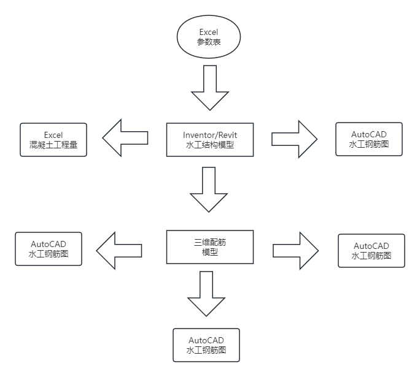

## 水利水电工程BIM数字化应用
- BIM正向设计技术流程图

- 灌区典型建筑物按功能主要分为四类
	- 控制、调节和配水建筑物
		- 泵站
		- 节制闸
		- 进水闸等
	- 交叉建筑物
		- 倒虹吸
		- 农桥
		- 渡槽等
	- 落差建筑物
		- 陡坡
		- 跌水等
	- 量水建筑物
		- 测流桥
		- 量水堰等
- 三维配筋软件Visual F
- 隧洞BIM正向设计技术流程图

- Midas/GTS是一款针对岩土领域研发的通用有限元分析软件，支持线性/非线性静力分析及动态分析、边坡稳定分析、隧洞施工阶段分析等多种分析类型，广泛地适用于水工、隧道、地铁、边坡等各种实际工程的准确建模与分析。