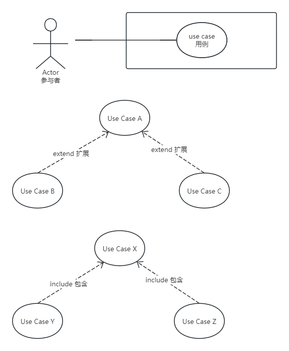

## 第2章 UML表示法概述
- UML图
	- 用例图
	- 类图
	- 对象图
	- 通信图
	- 顺序图
	- 状态机图
	- 活动图
	- 组合结构图
	- 部署图
- 用例图
	- 一个参与者(actor)发起一个用例(use case)。
	- 用例定义了参与者与系统之间的一组交互序列。
	- 在用例图中，参与者用一个人形图标表示，系统则用一个方框来表示，一个用例表示为方框的一个椭圆。
	- 通信关联将参与者与他们参与的用例进行连接。
	- 用例之间的关系通过包含(include)关系和扩展(extend)关系进行定义。
	- UML表示法中的用例图

	
- 类和对象
- 类图
	- UML表示法支持一下三种类之间的主要关系类型
		- 关联(association)
		- 整体/部分关系(whole/part relationship)
		- 泛化/特化(generalization/specialization) 关系
- 交互图
	- 通信图
		- 它展示了合作对象间如何通过发送与接收消息进行动态的交互。
	- 顺序图
		- 顺序图具有两个维度，其中参与交互的对象被描绘在水平方向，而垂直方法代表时间维度。
- 状态图
	- 一个状态转换图被称为状态机图。
	- 在表示状态转换的弧线上，使用事件[条件]/动作(Event[Condition]/Action)进行标记。
	- 事件引起了状态的转换，当时间发生时，为了发生转换，可选的布尔条件(condition)必须为真。可选的动作(action)作为转换的结果被执行。
	- 一个状态可具有以下任意的动作
		- 进入动作(entry action),它在进入状态的时候执行
		- 退出动作(exit action),它在退出状态的时候执行
- 包
	- 在UML中，包是一组建模元素的组合，例如代表一个系统或一个子系统。
	- 包也可能被嵌套在其他包里面。
	- 依赖(dependency)和泛化/特化(generalization/specialization)是包之间可能具有的关系。
	- 包可用于容纳类、对象或者用例。
- 并发通信图
	- 主动对象在描述系统并发视角的并发通信图中描绘。
- 部署图
	- 部署图以物理节点和节点间的物理连接的方式展示了一个系统的物理配置。