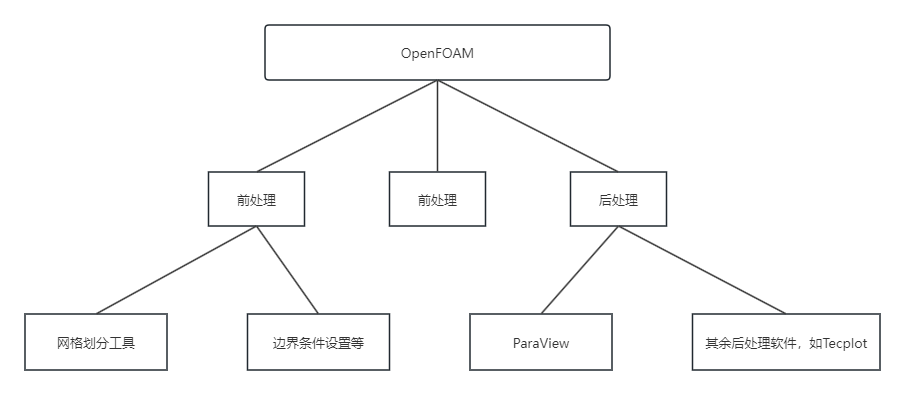

## 第1章 OpenFOAM安装及简要介绍
- OpenFOAM是一款完全由C++编写的面向对象的CFD开源程序，全名为Open Source Field Operation and Manipualation。
- OpenFOAM采用基于非结构网格的有限体积法(Finite Volume Method, FVM)离散偏微分方程，能处理复杂的几何外层，可实现旋转机械、多相流、热、化学反应、多孔介质等各种流动的模拟。
- OpenFOAM结构
 
- 源码说明
	- `applications/utilities`主要包含
		- 网格工具(mesh):用于网格划分、格式转换及操作（移动、镜像、合并等）
		- 前处理工具(preProcessing)：用户边界条件或初始条件的设置
		- 后处理工具(postProcessing)：用户计算应力、噪声、涡量等，以便用户详细分析流场计算结果。
	- `applications/solvers`为求解器。