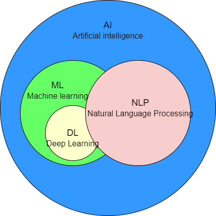
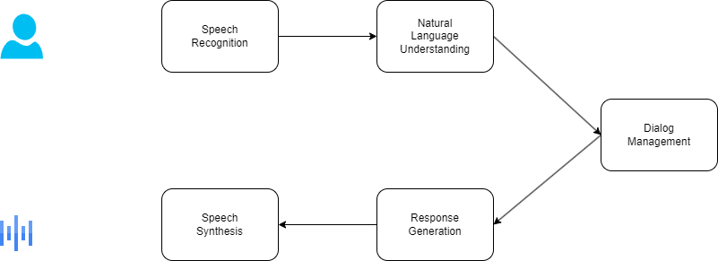

## CHAPTER 1 NLP: A Primer
- NLP Tasks
	- Language modeling
		- This is the task of predicting what the next word in a sentence will be based on the history of previous words. The goal of this task is to learn the probability of a sequence of words appearing in a given language. Language modeling is useful for building solutions for a wide variety of problems, such as speech recognition, optical character recognition, handwriting recognition, machine translation, and spelling correction.
	- Text classification
		- This is the task of bucketing the text into a known set of categories based on its content. Text classification is by far the most popular task in NLP and is used in a variety of tools, from email spam identification to sentiment analysis.
	- Information extraction
		- As the name indicates, this is the task of extracting relevant information from text, such as calendar events from emails or the names of people mentioned in a social media post.
	- Information retrieval
		- This is the task of finding documents relevant to a user query from a large collection. Applications like Google Search are well-known use cases of information retrieval.
	- Conversational agent
		- This is the task of building dialogue systems that can converse in human languages. Alexa, Siri, etc., are some common applications of this task.
	- Text summarization
		- This task aims to create short summaries of longer documents while retaining the core content and preserving the overall meaning of the text.
	- Question answering
		- This is the task of building a system that can automatically answer questions posed in natural language.
	- Machine translation
		- This is the task of converting a piece of text from one language to another. Tools like Google Translate are common applications of this task.
	- Topic modeling
		- This is the task of uncovering the topical structure of a large collection of documents. Topic modeling is a common text-mining tool and is used in a wide range of domains, from literature to bioinformatics.
- How NLP, ML, and DL are related
	- Deep learning refers to the branch of machine learning that is based on artificial neural network architectures.
	
- Approaches to NLP
	- The different approaches used to solve NLP problems commonly fall into three categories: heuristics, machine learning, and deep learning.
	- Heuristics-Based NLP
	- Machine Learning for NLP
		- Any machine learning approach for NLP, supervised or unsupervised, can be described as consisting of three common steps: extracting features from text, using the feature representation to learn a model, and evaluating and improving the model.
		- Naive Bayes（朴素贝叶斯）
		- Support vector machine（支持向量机，SVM）
		- Hidden Markov Model（隐马尔科夫模型，HMM）
		- Conditional random fields（条件随机场，CRF）
	- Deep Learning for NLP
		- Recurrent neural networks（递归神经网络或递归神经网络，RNN）
			- RNNs are powerful and work very well for solving a variety of NLP tasks, such as text classification, named entity recognition, machine translation, etc.
		- Long short-term memory（长短期记忆，LSTM）
			- Long short-term memory networks (LSTMs), a type of RNN, were invented to mitigate this shortcoming of the RNNs.
		- Convolutional neural networks（卷积神经网络，CNN）
			- Convolutional neural networks (CNNs) are very popular and used heavily in computer vision tasks like image classification, video recognition, etc.
			- CNNs have also seen success in NLP, especially in text-classification tasks.
		- Transformers
			- Transformers are the latest entry in the league of deep learning models for NLP. Transformer models have achieved state of the art in almost all major NLP tasks in the past two years.
			- They model the textual context but not in a sequential manner.
		- Autoencoders
			- An autoencoder is a different kind of network that is used mainly for learning compressed vector representation of the input.
- Why Deep Learning Is Not Yet the Silver Bullet for NLP
	- Over the last few years, DL has made amazing advances in NLP. For example, in text classification, LSTM- and CNN-based models have surpassed the performance of standard machine learning techniques such as Naive Bayes and SVM for many classification tasks. Similarly, LSTMs have performed better in sequence-labeling tasks like entity extraction as compared to CRF models. Recently, powerful transformer models have become state of the art in most of these NLP tasks, ranging from classification to sequence labeling. A huge trend right now is to leverage large (in terms of number of parameters) transformer models, train them on huge datasets for generic NLP tasks like language models, then adapt them to smaller downstream tasks. This approach (known as transfer learning) has also been successful in other domains, such as computer vision and speech.
	- Despite such tremendous success, DL is still not the silver bullet for all NLP tasks when it comes to industrial applications. Some of the key reasons for this are as follows:
		- Overfitting on small datasets
		- Few-shot learning and synthetic data generation
		- Domain adaptation
		- Interpretable models
		- Common sense and world knowledge
		- Cost
		- On-device deployment
- An NLP Walkthrough: Conversational Agents
	- Flow of conversation agents
	
	- **Speech recognition and synthesis**: These are the main components of any voicebased conversational agent. Speech recognition involves converting speech signals to their phonemes, which are then transcribed as words. Speech synthesis achieves the reverse process by transforming textual results into spoken language to the user. Both of these techniques have advanced considerably in the last decade, and we recommend using cloud APIs for most standard cases.
	- **Natural language understanding**: This is the next component in the conversational agent pipeline, where the user response received (transcribed as text) is analyzed using a natural language understanding system. This can be broken into many small NLP subtasks, such as:
		- **Sentiment analysis**: Here, we analyze the sentiment of the user response. 
		- **Named entity recognition**: Here, we identify all the important entities the user mentioned in their response. 
		- **Coreference resolution**: Here, we find out the references of the extracted entities from the conversation history. For example, a user may say “Avengers Endgame was awesome” and later refer back to the movie, saying “The movie’s special effects were great.” In this case, we would want to link that “movie” is referring to Avengers Endgame. 
	- **Dialog management**: Once we’ve extracted the useful information from the user’s response, we may want to understand the user’s intent—i.e., if they’re asking a factual question like “What is the weather today?” or giving a command like “Play Mozart songs.” We can use a text-classification system to classify the user response as one of the pre-defined intents. This helps the conversational agent know what’s being asked.
	- **Response generation**: Finally, the conversational agent generates a suitable action to perform based on a semantic interpretation of the user’s intent and additional inputs from the dialogue with the user. As mentioned earlier, the agent can retrieve information from the knowledge base and generate responses using a pre-defined template. For example, it might respond by saying, “Now playing Symphony No. 25” or “The lights have been dimmed.” In certain scenarios, it can also generate a completely new response.