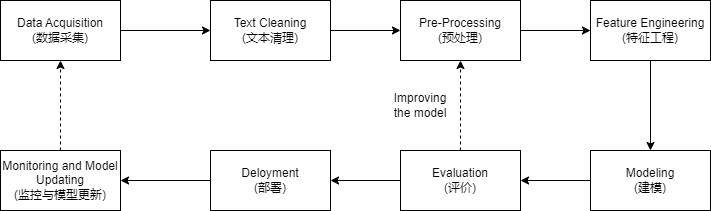

## CHAPTER 2 NLP Pipeline
- Generic NLP pipeline
	- The first step in the process of developing any NLP system is to **collect data** relevant to the given task. Even if we’re building a rule-based system, we still need some data to design and test our rules. The data we get is seldom clean, and this is where **text cleaning** comes into play. After cleaning, text data often has a lot of variations and needs to be converted into a canonical form. This is done in the **pre-processing** step. This is followed by **feature engineering**, where we carve out indicators that are most suitable for the task at hand. These indicators are converted into a format that is understandable by modeling algorithms. Then comes the **modeling** and **evaluation** phase, where we build one or more models and compare and contrast them using a relevant evaluation metric(s). Once the best model among the ones evaluated is chosen, we move toward **deploying** this model in production. Finally, we regularly **monitor the performance of the model** and, if need be, update it to keep up its performance.
	
- Data Acquisition
	- Use a public dataset
	- Scrape data
	- Product intervention
	- Data augmentation
		- Synonym replacement
		- Back translation
		- TF-IDF–based word replacement
		- Bigram flipping
		- Replacing entities
		- Adding noise to data
		- Advanced techniques
			- Snorkel
			- Easy Data Augmentation (EDA) and NLPAug
			- Active learning
- Text Extraction and Cleanup
	- HTML Parsing and Cleanup
	- Unicode Normalization
	- Spelling Correction
	- System-Specic Error Correction
- Pre-Processing
	- Preliminaries
		- Sentence segmentation and word tokenization.
	- Frequent steps
		- Stop word removal, stemming and lemmatization, removing digits/punctuation, lowercasing, etc.
	- Other steps
		- Normalization, language detection, code mixing, transliteration, etc.
	- Advanced processing
		- POS tagging, parsing, coreference resolution, etc.