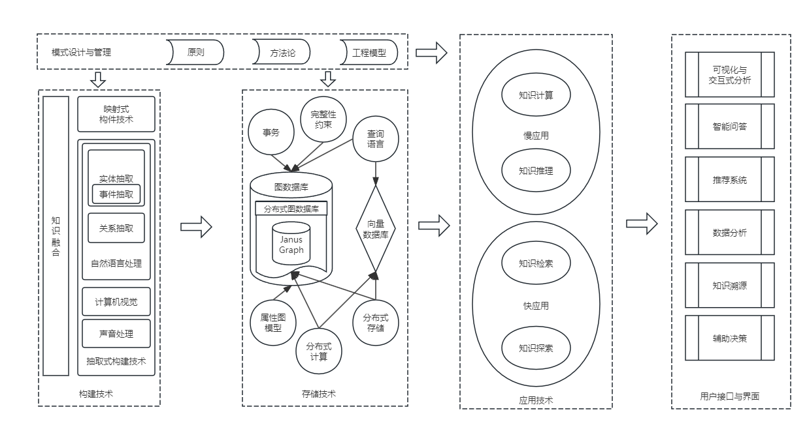

## 第1章 知识图谱概述
- 知识图谱就是一种对知识间的关联进行建模的方法，目的是将这些关联关系的逻辑显式地表示出来。
- 三元组正式知识图谱的基本元素。
	- "<实体，关系，实体>"
- DIKW金字塔模型
	- 数据(Data)
	- 信息(Information)
	- 知识(Knowledge)
	- 智慧(Wisdom)
- 知识图谱的内涵
	- 由实体及实体间的关系所组成的网状的图，表示的是知识本身。
	- 包括所有由实体及其属性组成的知识点，以及由关系及其属性组成的知识点之间的关联关系的总和。
- 知识图谱的外延
	- 即生产知识（知识图谱构件）、表示知识（知识图谱存储）和应用知识（知识图谱应用）有关的方法、技术、模型、算法、应用程序、流程等的总和。
- 知识图谱技术体系

