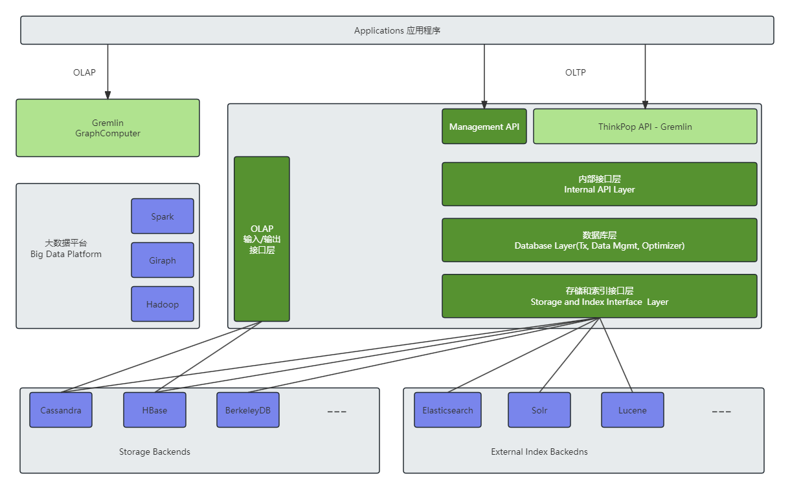

## 第5章 知识存储
- 属性图模型
	- 属性图模型是一种有向带标签的多重图(Directed Labelled Multi-Graphs)模型，因其顶点和边都包含由一系列键值对组成的属性而得名。
- 完整性约束
	- 数据库的完整性约束是指定义一组一致的数据库状态或状态变化的规则，确保授权用户对数据库的更改不会导致数据一致性的丢失。
	- 与图相关的完整性约束通常包括如下两种
		- 模式实例一致性约束：即通过属性图模式对数据库中的数据进行约束，确保数据库中添加或更改的数据符合属性图模式。
		- 额外的完整性约束：除属性图模式之外的约束，比如属性值的可选范围约束、属性值的基数约束、边的多重性约束等。
- ACID是
	- 原子性(Atomicity)
	- 一致性(Consistency)
	- 隔离性(Isolation)
	- 持久性(Durability)
- BASE属性是基本可用(Basically Available)、软状态(Soft state)、最终一致性(Eventual consistency)的缩写，它因分布式存储系统要实现ACID代价过高而产生。
- 查询语言
	- 常见的图数据库查询语言有
		- Gremline
		- SPARQL
		- Cypher
		- OpenCypher
- JanusGraph 分布式图数据库
	- 由Java语言开发，是可以同时支持联机事物处理(On-Line Transaction Processing, OLTP)和联机分析处理(On-Line Analytical Processing, OLAP)的属性图模型的开源分布式图数据库，支持存储和实时查询超过千亿节点和边。
	- JanusGraph深度集成了Apache TinkerPop，使用Gremlin语言来操作数据库，在机器许可的条件下，支持毫秒级的图查询和遍历操作。
	- JanusGraph整体架构图
	
	
	- JanusGraph设计了巧妙的存储结构，支持无模式、可选模式和强制模式约束的属性图数据的存储。
- 图查询语言Gremlin
	- JanusGraph采用Gremlin作为查询语言，用于从图中检索、遍历、查询和更改数据。
	- Gremlin是一种函数式编程语言(Functional Programming Language)，也是一种数据流(Data Flow)语言，并且是图灵弯背语言。
- Neo4j
	- 社区版是单机的，不支持高可用性和高可靠性，适用于实验或测试环境，不建议在生产环境中使用；商业版则更为强大，支持并行、多集群和高可用等特性，较为成熟，并具备很强竞争力。
- Dgraph
	- Dgraph是一个由Go语言开发的开源分布式图数据库，以GraphQL为查询语言。
	- Dgraph通过快照隔离技术支持分布式事务，相比于JanusGraph使用分布式锁来实现，Dgraph的性能更好。
	- Dgraph并不是真正意义上的属性图数据库，更偏向于RDF存储数据库。
- NebulaGraph
	- NebulaGraph是一个开源的图模型的分布式图数据库，由C++语言开发。
	- NebulaGraph使用nGQL查询语言，具有很高的查询性能和较短的查询响应时间。
	- 在NebulaGraph中，属性图模式是强制的，即所有的图必须依赖于预先定义好的属性图模式。