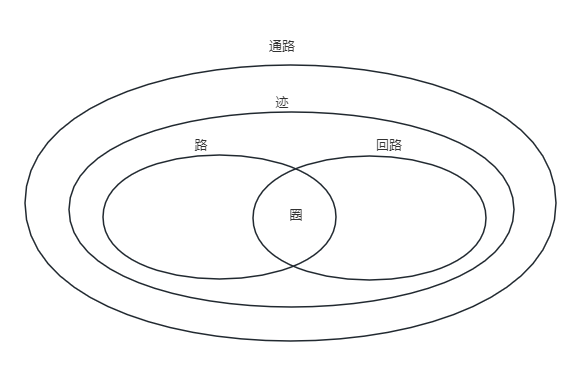

## 第1章 图的基础知识
- 在离散数学和计算机科学等领域，“图”往往指的是由多个点以及连接这些点的线所构成的对象。
- 这些点称为**顶点**(vertex)或者**节点**。
- 连接各点的线称为**边**(edge)。
- 从同一对顶点之间的多条边称为**平行边**(parallel edges)。
- 从同一个顶点连接到自己的边称为**自环边**(self-loop)。
- 没有平行边也有没有自环边的图称为**简单图**(simple graph)。
- 有些顶点可能和图中其他顶点都不相连，这样的顶点称为**孤立顶点**(isolated vertex)，这种没有连成一个整体的图称为**非连通图**(disconnected graph)。与之相对，连成一个整体的图叫作**连通图**(connected graph)。
- 最大程度保持连通性的部分称为**连通分支**(connected component)。
- 赋权图(weighted graph)
	- 在赋权图中，每条边都会被赋予一个非负整数值，这个非负数值称为边的**权值**(weight)。
- 图的正式定义如下所示

		G = (V, E)
	- 其中，V是顶点的集合，E是边的集合。
	- 我们通常用n表示图的顶点数，用m表示图的边数，即`n=|V|`及`m=|E|`。
- 在计算机程序中表示图的主要方式有**邻接矩阵**(adjacency matrix)、**关联矩阵**(incidence matrix)和**邻接表**(addjacency list)。
- 图论术语
	- 与顶点v关联的边的条数称为顶点v的**度**(degree)，记为d(v)。
	- **通路**(walk)是指图的顶点和边交错排列的序列，其中首尾为顶点，前后连续出现的顶点和边之间是关联的。
		- 从顶点出发，沿着图的边从一点到另一点移动，最后到达某个顶点。这里，允许多次通过同一条边或者同一个顶点。
		- 通路的**长度**(length)定义为通路中所含的边的条数。如果多次经过某条边，则没经过一次就计入一次。
	- **迹**(trail)是边不重复出现的通路。不过顶点允许重复出现。
	- **回路**(circuit)是首尾顶点相同的迹。
	- **路**(path)是顶点不重复出现的迹，作为特例，允许首尾顶点相同。
	- **圈**(cycle)是首尾顶点相同的路。
	- 它们之间的关系如下图：

	
- 几类特殊的图
	- 连通且不含圈的图称为**树**(tree)。
	- 在平面上画图时，能够使边之间没有交叉，这样的图就成为**可平面图**(planar graph)。
	- 二部图、完全二部图、k部图
	- 正则图
	- 所有顶点之间都有边相连的图称为**完全图**(complete graph或clique)
- 图的**度序列**是指对G中各顶点的度降序排列所得到的序列。