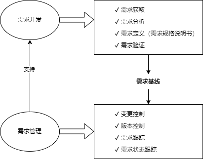

## 十、软件工程基础知识
#### 软件工程
- 软件开发生命周期
	- 软件系统的文档
		- **用户文档**：主要描述系统功能和使用方法，并不关心这些功能是怎样实现的；
		- **系统文档**：描述系统设计、实现和测试等各方面的内容。
	- 软件工程过程是指为获得软件产品，在软件工具的支持下由软件工程师完整的一系列软件工程活动，包括以下4个方面
		- (1) P(Plan) -- 软件规格说明。规定软件的功能及其运行时的限制。
		- (2) D(Do) -- 软件开发。开发出满足规格说明的软件。
		- (3) C(Check) -- 软件确认。确认开发的软件能够满足用户的需求。
		- (4) A(Action) -- 软件演进。软件在运行过程中不断改进以满足客户新的需求。
- 软件需求

	