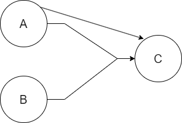
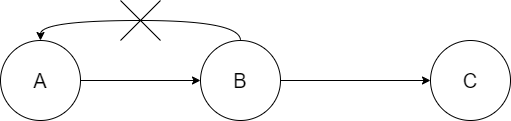

## 三、数据库系统
- 函数依赖
	- 给定一个X，能唯一确定一个Y，就称X确定Y，或者说Y依赖于X。
	- **部分函数依赖**：A可确定C，(A,B)也可确定C，(A,B)中的一部分（即A）可以确定C，称为部分函数依赖。
	
	- **传递函数依赖**：当A和B不等价时，A可确定B，B可确定C，则A可确定C，是传递函数依赖；若A和B等价，则不存在传递，直接就可确定C。
	
- 约束
	- 实体完整性约束：即主键约束，主键值不能为空，也不能重复。
	- 参照完整性约束：即外键约束，外键必须是其他表中已经存在的主键的值，或者为空。
	- 用户自定义完整性约束：自定义表达式约束。如设定年龄属性值必须在0-150之间。
- 事务管理
	- 事务：由一系列操作组成，这些操作，要么全做，要么全不做，拥有四种特性：
		- **（操作）原子性**：要么全做，要么全不做。
		- **（数据）一致性**：事务发生后数据是一致的，例如银行转账，不会存在A账户转出，但B账户没收到的情况。
		- **（执行）隔离性**：任一事务的更新操作直到其成功提交的整个过程对其他事务都是不可见的，不同事务之间是隔离的，互不干涉。
		- **（改变）持续性**：事务操作的结果是持续性的。
- 数据故障与备份
	- 安全措施
	<table>
		<tr>
			<th>措施</th>
			<th>说明</th>
		</tr>
		<tr>
			<td>用户标识和鉴定</td>
			<td>最外层的安全保护措施，可以使用用户账户、口令及随机数检验等方式</td>
		</tr>
		<tr>
			<td>存取控制</td>
			<td>对用户进行授权，包括操作类型（如查找、插入、删除、修改等动作）和数据对象（主要是数据范围）的权限</td>
		</tr>
		<tr>
			<td>密码存储和传输</td>
			<td>对远程终端信息用户密码传输</td>
		</tr>
		<tr>
			<td>视图的保护</td>
			<td>对视图进行授权</td>
		</tr>
		<tr>
			<td>审计</td>
			<td>使用一个专用文件或数据库，自动将用户对数据库的所有操作记录下来</td>
		</tr>

- 数据挖掘的分析方法
	- 关联分析
	- 序列分析
	- 分类分析
	- 聚类分析
- 商业智能BI
	- 四个主要阶段
		- **数据预处理**是整合企业原始数据的第一步，它包括数据的抽取(Extraction)、转换(Transformation)和加载(Load)三个过程（ETL过程）。
		- **建立数据仓库**则是处理海量数据的基础。
		- **数据分析**是体现系统智能的关键，一般采用联机分析处理（OLAP）和数据挖掘两大技术。
			- 联机分析处理不仅进行数据汇总/聚集，同时还提供切片、切块、上卷和旋转等数据分析功能，用户可以方便地对海量数据进行多维分析。
			- 数据挖掘的目标则是挖掘数据背后隐藏的知识，通过关联分析、聚类和分类等方法建立分析模型，预测企业未来发展趋势和将要面临的问题。
			- 在海量数据和分析手段增多的情况下，**数据展现**则主要保障系统分析结果的可视化。