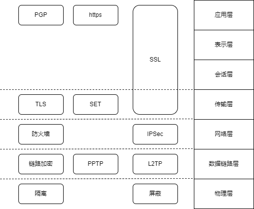

## 九、系统安全
#### 信息安全基础知识
- 信息安全包括5个基本要素
	- （1）**机密性**：确保信息不暴露给未授权的实体或进程。
	- （2）**完整性**：只有得到允许的人才能修改数据，并且能判别出数据是否已被篡改。
	- （3）**可用性**：得到授权的实体在需要时可访问数据，即攻击者不能占用所有的资源而阻碍授权者的工作。
	- （4）**可控性**：可以控制授权范围内的信息流及行为方式。
	- （5）**可审查性**：对出现的信息安全问题提供调查的依据和手段。
- 信息安全的范围包括：设备安全、数据安全、内容安全和行为安全。
	- （1）信息系统**设备的安全**是信息系统安全的首要问题，是信息系统安全的物质基础，它包括3个方面：设备的稳定性、可靠性、可用性。
	- （2）**数据安全**即采取措施确保数据免受未授权的泄露、篡改和损坏，包括3个方面：数据的秘密性、完整性、可用性。
	- （3）**内容安全**是信息安全在政治、法律、道德层次上的要求，包括3个方面：信息内容政治上健康、符合国家法律法律规、符合道德规范。
	- （4）信息信息的服务功能是指最终通过行为提供给用户，确保信息系统的**行为安全**，才能最终确保系统的信息安全。行为安全的特性包括：行为的秘密性、完整性、可控性。
- 信息的存储安全包括信息的使用安全、系统安全监控、计算机病毒防治、数据的加密和防治非法的攻击等。
	- （1）信息使用的安全。包括用户的标识与验证、用户存取权限限制。
	- （2）系统安全监控。系统必须建立一套安全监控系统，全面监控系统的活动，并随时检查系统的使用情况，一旦有非法入侵者进入系统，能及时发现并采取相应措施，确定和填补安全及保密的漏洞。还应当建立完善的审计系统和日志管理系统，利用日志和审计功能对系统进行安全监控。
	- （3）计算机网络服务器必须加装网络病毒自动监测系统，以保护网络系统的安全，防范病毒的侵袭，并且必须定期更新网络病毒监测系统。
- 网络安全
	- 网络安全隐患体现在：
		- 物理安全性
		- 软件安全漏洞
		- 不兼容使用安全漏洞
		- 选择合适的安全哲理
	- 网络安全威胁：
		- 非授权的访问
		- 信息泄露或丢失
		- 破坏数据完整性
		- 拒绝服务攻击
		- 利用网络传播病毒
	- 安全措施的目标：
		- 访问控制
		- 认证
		- 完整性
		- 审计
		- 保密

#### 信息安全系统的组成框架
- 技术体系：
	- （1）**基础设备安全**包括密码芯片、加密卡、身份识别卡等，此外还涵盖运用到物理安全的物理环境保障技术，建筑物、机房条件及硬件设备条件满足信息系统的机械防护安全，通过对电力供应设备以及信息系统组件的抗电磁干扰和电磁泄露性能的选择性措施达到相应的安全目的。
	- （2）**计算机网络安全**指信息在网络传输过程中的安全防范，用于防止和监控未经授权破坏、更改和盗取数据的行为。通常涉及物理隔离，防火墙及访问控制，加密传输、认证、数字签名、摘要，隧道及VPN技术，病毒防范及上网行为管理，安全审计等实现技术。
	- （3）**操作系统安全**是指操作系统的无错误配置、无漏洞、无后门、无特洛伊木马等，能防止非法用户对计算机资源的非法存取，一般用来表达对操作系统的安全需求。操作系统的安全机制包括标识与鉴别机制、访问控制机制、最小特权管理、可信通路机制、允许保障机制、存储保护机制、文件保护机制、安全审计机制，等等。
	- （4）**数据库安全**可粗略划分为数据库管理系统安全和数据库应用系统安全两个部分，主要设计物理数据库的完整性、逻辑数据库的完整性、元素安全性、可审计性、访问控制、身份认证、可用性、推理控制、多级保护及消除隐通道等相关技术。
	- （5）**终端设备安全**：终端安全设备从电信网终端设备的角度分为电话密码机、传真密码机、异步数据密码机等。

#### 信息安全技术
- 访问控制的实现技术
	- （1）访问控制矩阵(Access Control Matrix, ACM)。是通过矩阵形式表示访问控制规则和授权用户权限的方法。
	- （2）访问控制表(Access Control Lists, ACL)。目前最流行、使用最多的访问控制实现技术。每个客体有一个访问控制表，是系统中每一个有权访问这个客体的主体的信息。这种实现技术实际上是按列保存访问矩阵。
	- （3）能力表(Cpapbilities)。按行（即主体）保存访问矩阵。
	- （4）授权关系表(Authorization Relations)。每一行（或者说元组）就是访问矩阵中的一个非空元素，是某一个主题对应于某一个客体的访问权限信息。
- 风险评估的基本要素为脆弱性、资产、威胁、风险和安全措施。
	- 风险计算的过程如下：
		- （1）对信息资产进行识别，并对资产赋值。
		- （2）对威胁进行分析，并对威胁发生的可能性赋值。
		- （3）识别信息资产的脆弱性，并对弱点的严重程度赋值。
		- （4）根据威胁和脆弱性计算安全事件发生的可能性。
		- （5）结合信息资产的重要性和发生安全事件的可能性，计算信息资产的风险值。

#### 网络安全协议

