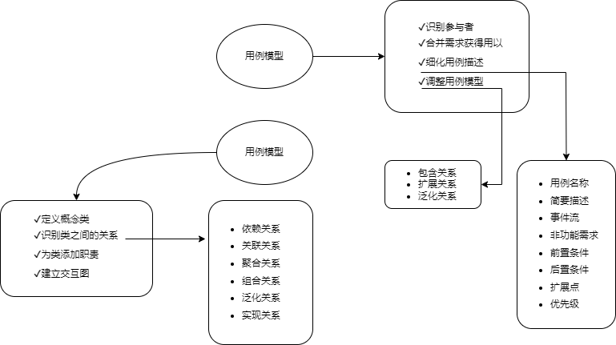
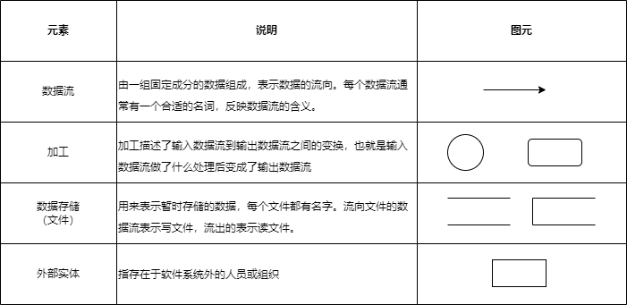

## 2 系统开发基础
#### 结构化
- 结构化的特点：
	- 自顶向下
	- 逐步分解
	- 面向数据
- 三大模型
	- 功能模型（数据流图，DFD）
	- 行为模型（状态转换图）
	- 数据模型（E-R图）以及数据字典（数据元素、数据结构、数据流、数据存储、加工逻辑、外部实体）
- 数据字典
	- 数据字典是在DFD的基础上，对DFD中出现的所有命名元素都加以定义，使得每个图形元素的名字都有一个确切的解释。
	- DFD和数据字典等工具相配合，就可以从图形和文字两个方面对系统的逻辑模型进行完整的描述。
	- 数据字典中一般有6类条目，分别是数据元素、数据结构、数据流、数据存储、加工逻辑和外部实体。
	- 不同类型的条目有不同的属性需要描述。
#### 用例建模

- 用例图：静态图，展现了一组用例、参与者以及它们之间的关系。用例图中的参与者是人、硬件或其他系统可以扮演的角色；用例是参与者完成的一系列操作。
- 类图：静态图，为系统的静态设计视图，展现一组对象、接口、协作和它们之间的关系。UML关系：依赖、关联、泛化、实现、组合、聚合。
- 状态图：动态图，展现了一个状态机，描述单个对象在多个用例中的行为，包括简单状态和组合状态。转换可以通过事件触发器出发，事件发出后相应的监护条件会进行检查。
- 活动图：动态图，是一种特殊的状态图，展现了在系统内从一个活动到另一个活动的流程。用来描述操作的行为，也用于描述用例和对象内部的工作过程。
- 序列图：即顺序图，动态图，是场景的图形化表示，描述了以时间顺序组织的对象之间的交互活动。
- 数据流图

	

#### 进度管理
- PERT（项目评估与评审技术）图是一种图形化的网络模型，描述一个项目中任务和任务之间的关系，每个节点表示一个任务，通常包括任务编号、名称、开始和结束时间、持续时间和松弛时间。
- Gantt图是一种简单的水平条形图，它以一个日历为基准描述项目任务，横坐标表示时间，纵坐标表示任务，图中的水平线段表示对一个任务的进度安排，线段的起点和终点对应在横坐标上的时间分别表示该任务的开始时间和结束时间，线段的长度表示完成该任务所需的时间。
- PERT图主要描述不同任务之间的**依赖**关系；Gantt图主要描述不同任务之间的**重叠**关系。