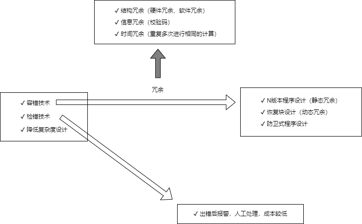

## 4 嵌入式系统
#### 相关概念
- **系统可靠性**是系统在规定的时间内及规定的环境条件下，完成规定功能的能力，也就是系统无故障运行的概率。
- **系统可用性**是指在某个给定时间点上系统能够按照需求执行的概率。
- **可靠度**就是系统在规定的条件下、规定的时间内不发生失效的概率。
- **失效率**又称**风险函数**，也可以称为条件失效强度，是指运行至此刻系统未出现失效的情况下，单位时间系统出现失效的概率。

#### 软件可靠性和硬件可靠性区别
- 复杂性：软件复杂性比硬件高，大部分失效来自于软件失效。
- 物理退化：硬件失效主要是物理退化所致，软件不存在物理退化。
- 唯一性：软件是唯一的，每个COPY版本都一样，而两个硬件不可能完全一样。
- 版本更新周期：硬件较慢，软件较快。

#### 可靠性指标
- 平均无故障时间

		MTTF = 1 / 失效率
- 平均故障修复时间

		MTTR = 1 / 修复率
- 平均故障间隔时间

		MTBF = MTTF + MTTR
- 系统可用性

		MTTF / (MTTF+MTTR) * 100%

#### 可靠性设计

#### 可维护性的评价指标
- （1）易分析性。软件产品诊断软件中的缺陷或失效原因或识别待修改部分的能力。
- （2）易改变性。软件产品使指定的修改可以被实现的能力，实现包括编码、设计和文档的更改。
- （3）稳定性。软件产品避免由于软件修改而造成意外结果的能力。
- （4）易测试性。软件产品使已修改软件能被确认的能力。
- （5）维护性的依从性。软件产品遵循与维护性相关的标准或约定的能力。

#### 软件维护的分类
- （1）改正性维护。为了识别和纠正软件错误、改正软件性能上的缺陷、排除实施中的误使用，应当进行的争端和改正错误的过程就称为改正性维护。
- （2）适应性维护。在使用过程中，外部环境（新的硬、软件配置）、数据环境（数据库、数据格式、数据输入/输出方式、数据存储介质）可能发生变化。为使软件适应这种变化，而去修改软件的过程就称为适应性维护。
- （3）完善性维护。在软件的使用过程中，用户往往会对软件提出新的功能与性能要求。为了满足这些要求，需要修改或再开发软件，以扩充软件功能、增强软件性能、改进加工效率、提高软件的可维护性。
- （4）预防性维护。这是预先提高软件的可维护性、可靠性等，为以后进一步改进软件打下良好基础。也就是说，采用先进的软件工程方法对需要维护的软件或软件中某一部分（重新）进行设计、编码和测试。