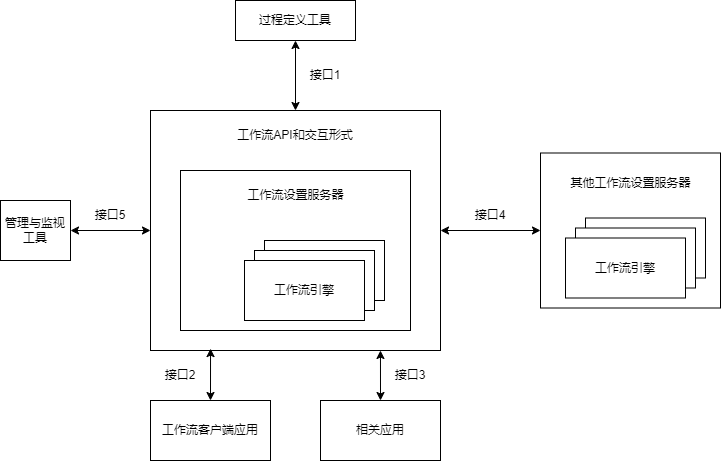

## 2 层次式架构设计
#### 层次式架构概述
- 层次式体系结构设计是将系统组成一个层次架构，每一层为上层服务，并作为下层客户。
	- 在一些层次系统中，除了一些精心挑选的输出函数外，内部的层接口值对相邻层可见。
	- 连接件通过决定层间如何交互的协议来定义，拓扑约束包括对相邻层间交互的约束。
- 层次式体系结构是最通用的架构，也被叫作N层架构模式。
	- 大部分的应用会分成表现层（或称为展示层）、中间层（或称为业务层）、数据访问层（或称为持久层）和数据层。

#### 表现层框架设计
- MVC、MVP、MVVM架构
- 使用XML设计表现层
	- UIP提供了一个扩展的框架，用于简化用户界面与商业逻辑代码的分离方法，可以用它来写复杂的用户界面导航和工作流处理，并且它能够复用在不同的场景，并可以随着应用的增加而进行扩展。

#### 中间层架构设计
- 组件设计
	- 业务逻辑组件分为接口和实现类两个部分。
	- 接口用于定义业务逻辑组件，定义业务逻辑组件必须实现的方法是整个系统运行的核心。
	- 增加业务逻辑组件的接口，是为了提供更好的解耦，控制器无须与具体的业务逻辑组件耦合，而是面向接口编程。
- 工作流设计
	- 工作流定义为：业务流程的全部或部分自动化，在此过程中，文档、信息或任务按照一定的过程规则流转，实现组织成员间的协调工作以达到业务的整体目标。
	- 工作流参考模型

	

#### 数据访问层设计
- 5中数据访问模式
	- 在线访问
	- DataAccess Object
	- DataTransfer Object
	- 离线数据模式
	- 对象/关系映射(Object/Relation Mapping)

####  数据架构规划与设计
- 基于文件的存储方式
- 数据库存储方式

#### 物联网层次架构设计
- 物联网可以分为三个层次：
	- 底层是用来感知数据的**感知层**，即利用传感器、二维码、RFID等设备随时随地获取物体的信息。
	- 第二层是数据传输处理的**网络层**，即通过各种传感网络与互联网的融合，将对象当前的信息实时准确地传递出去。
	- 第三层则是与行业需求结合的**应用层**，即通过智能计算、云计算等将对象进行智能化控制。