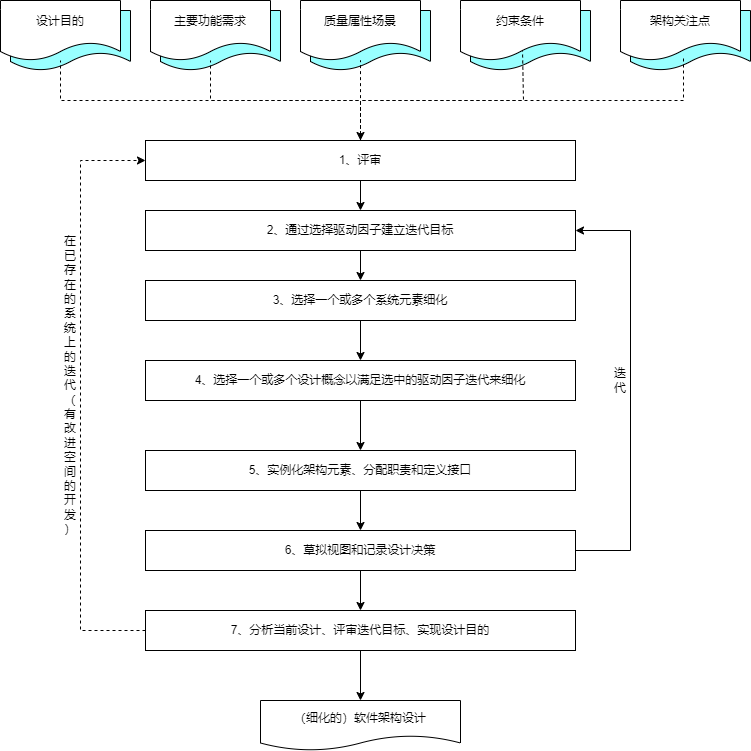

## 5 嵌入式系统架构设计
#### 嵌入式系统的典型架构
- **层次化模式架构**
	- 位于高层的抽象概念与低层的更加具体的概念之间存在着依赖关系。
	- 层次化模式架构主要设计思想是：
		- （1）当一个系统存在高层次的抽象，这些抽象的表现形式是一个个的抽象概念，而这些抽象概念需要具体的低层概念进行实现时，就可采用层次化模式。
		- （2）分层模式架构只包含了一个主要的元素（域包）和它的接口，以及用来说明模式结构的约束条件。
		- （3）层次化模式可以分为两种；封闭型和开放型。
			- 封闭型的特征是：一层中的对象只能调用同一层或下一层的对象提供的方法。
			- 开放型：一层中的对象可以调用同一层或低于该层的任意一层的对象提供的方法。
- **递归模式架构**
	- 递归模式解决的问题是：需要将一个非常复杂的系统进行分解，并且还要确保分解过程是可扩展的，即只要有必要，该分解过程就可以持续下去。
	- 在创建这种模式的实例时，通常使用两种相反的工作流程
		- 自顶向下：自顶向下的工作流从系统层级开始并标识结构对象，这些对象提供实现协作的服务。
			- 在实时系统和嵌入式系统中，大多数情况下是基于某个标准方法，将系统分层一个个子系统。当开发人员逐步降低抽象层级，向下推进时，容易确保开发者的工作没有偏离用例中所规定的需求。
		- 自底向上：自底向上专注于域的构造--首先确定域中的关键类和关系。
			- 这种方法之所以可行是因为：开发者以往有丰富的开发经验，并能将其他领域所获得的知识映射到当前开发所在的域中。通过这种方法，最终开发者会到达子系统级的抽象。

#### 嵌入式操作系统（EOS）
- 嵌入式操作系统（EOS）是指用于嵌入式系统的操作系统。
	- 通常包括与硬件相关的底层驱动软件、系统内核、设备驱动接口、通信协议、图形界面、标准化浏览器等。
- 嵌入式操作系统特点
	- 可裁剪性
	- 可移植性
	- 强实时性
	- 强紧凑性
	- 高质量代码
	- 强定制性
	- 标准接口
	- 强稳定性
	- 弱交互性
	- 强确定性
	- 操作简洁方便
	- 较强的硬件适应性
	- 可固化性
- 从嵌入式操作系统体系架构看，主要存在4种结构
	- 整体结构
	- 层次结构
	- 客户/服务器结构
	- 面向对象结构
- 典型的强实时调度算法
	- （1）最早截止时间优先（Earliest Deadline First，EDF）算法。根据任务的开始截止时间来确定任务的优先级。截止时间愈早，其优先级愈高。
	- （2）最低松弛度优先（Least Laxity First， LLF）算法。根据任务紧急（或松弛）的程度，来确定任务的优先级。
	- （3）单调速率调度算法（Rate Monotonic Scheduling，RMS）。是一种静态优先级调度算法，是经典的周期性任务调度算法。RMS的基本思路是任务的优先级与它的周期表现为单调函数的关系，任务周期越短，优先级越高；任务周期越长，优先级越低。
- 操作系统任务之间一般存在以下关系：相互独立、竞争、同步、通信。
	- 要实现多任务间的协同工作，操作系统必须提供任务间的通信手段。嵌入式操作系统一般都会提供多任务间通信的方法，方勇的通信方式包括：
		- 共享内存：数据的简单共享。多任务访问同一地址空间。
		- 信号量：基本的互斥和同步。最优，主要手段，任务间快速通信。
		- 消息队列：同一CPU内多任务间消息传递。类似于缓冲区的对象，像一个管段接收发送者消息等待接收者读取。
		- Socket和远程调用：任务间透明的网络通信，不同计算机之间通信。
		- Signals（信号）：用于异常处理。通知进程发生了异步事件，是对中断机制的一种模拟。
- 与传统数据库相比，嵌入式数据库系统有一下几个主要特点：
	- 嵌入式
	- 实时性
	- 移动性
	- 伸缩性
- 嵌入式数据库按存储位置的不同可分为三类：
	- 基于内存方式
		- 基于内存的数据库系统（MMDB）是实时系统和数据库系统的有机结合。内存数据库是支持实时事务的最佳技术，其本质特征是以其“主拷贝”或“工作版本”常驻内存，即活动事务只与实时内存数据库的内存拷贝打交道。
		- 典型产品是eXtremeDB嵌入式数据库。
		- eXtremeDB主要特点：
			- 最小化支持持久数据所必需的资源：实质上就是将内存资源减到最小。
			- 保持极小的必要堆空间：在某些配置上eXtremeDB只需要不到1kb的堆空间。
			- 维持极小的代码体积。
			- 通过紧密的集成持久存储和宿主应用程序语言消除额外的代码层。
			- 提供对动态数据结构的本地支持：例如变长字符串、链表和树。
	- 基于文件方式
		- 基于文件的数据库（FDB）系统就是以文件方式存储数据库数据，即数据按照一定格式储存在磁盘中。使用时由因公程序通过相应的驱动程序甚至直接对数据文件进行读写。
		- 典型产品是SQLite，它由公共接口、编译器系统、虚拟机和后端四个子系统组成。
		- SQLite主要特点：
			- SQLite是一个开源的、内嵌式的关系型数据库。
			- SQLite数据库服务器就在你的数据库应用程序中，其好处是不需要网络配置和管理，也不需要通过设置数据源访问数据库服务器。
			- SQLite数据库的服务器和客户端运行在同一进程中。这样可以减少网络访问的消耗，简化数据库管理，使你的程序部署起来更容易。
			- SQLite在处理数据类型时与其他的数据库不同。区别在于它所支持的类型以及这些类型是如何存储、比较、强化（enforce）和指派（assign）。
	- 基于网络方式
		- 基于网络的数据库（NDB）系统是基于手机4G/5G的移动通信基础之上的数据库系统，在逻辑商可以把嵌入式设备看作远程服务器的一个客户端。
- 数据库服务器和嵌入式数据库对比如下：
	- （1）数据库服务器通常允许非开发人员对数据库进行操作，而在嵌入式数据中通常只允许应用程序对其访问和控制。
	- （2）数据库服务器将数据与程序分离，便于对数据库的访问控制。而嵌入式数据库则将数据的访问控制完全交给应用程序，由应用程序来进行控制。
	- （3）数据库服务器需要独立的安装、部署和管理，而嵌入式数据通常和应用程序一起发布，不需要单独地部署一个数据库服务器，具有程序携带性的特点。
- 嵌入式数据库有其自身的特殊需要，它应具备的功能包括以下4点：
	- 足够高效的数据存储机制；
	- 数据安全控制（锁机制）；
	- 实时事务管理机制；
	- 数据库恢复机制（历史数据存储）。

#### 鸿蒙操作系统
- 鸿蒙操作系统架构具有4个技术特性：
	- （1）分布式架构首次用于终端OS，实现跨终端无缝协同体验。
	- （2）确定时延引擎和高性能IPC技术实现系统天生流畅。
	- （3）基于微内核架构重塑终端设备可信安全。
	- （4）通过统一IDE支撑一次开发，多端部署，实现跨终端生态共享。

 
 
 
 
 
 
 
 
 
 
 
 
 
 
 
 

#### 嵌入式系统软件架构设计方法
- 在嵌入式系统中，其设计通常采用了自顶向下的设计方法，**基于架构的软件设计（ABSD）**可适应于嵌入式的软件设计方法。
- **属性驱动的软件设计（ADD）**是把一组质量属性场景作为输入，利用质量数据实现与架构设计之间的关系的了解（如体系风格、质量战术等）对软件架构进行设计的一种方法。
	- 采用ADD方法进行软件开发时，需要经历评审、选择驱动因子、选择系统元素、选择设计概念、实体化元素和定义接口、草拟视图和分析评价等七个阶段，如图所示：

	

- **实时系统设计方法（DARTS）**主要是将试试系统分解为多个并发任务，并定义这些任务之间的接口。提供了一些分解规则和一套处理并发任务的设计步骤，还提供了一套把实时系统建造成并发任务的标准和定时并发任务间接口的指南。

