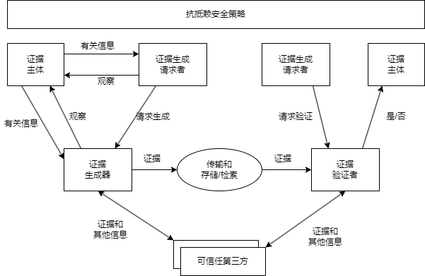

## 7 安全架构设计
#### 安全架构概述
- 对于信息系统来说，威胁可以是针对物理环境、通信链路、网络系统、操作系统、应用系统以及管理系统等方面。
- 常见的安全威胁有以下几种：
	- （1）**信息泄露**：信息被泄露或透露给某个非授权的实体。
	- （2）**破坏信息的完整性**：数据被非授权地进行增删、修改或破坏而受到损失。
	- （3）**拒绝服务**：对信息或其他资源的合法访问被无条件地阻止。
	- （4）**非法使用（非授权访问）**：某一资源被某个非授权的人或以非授权的方式使用。
	- （5）**窃听**：用各种可能的合法或非法的手段窃取系统中的信息资源和敏感信息。
	- （6）**业务流分析**：通过对系统进行长期监听，利用统计分析方法诸如通信频度、通信的信息流向、通信总量的变化等态势进行研究，从而发现有价值的信息和规律。
	- （7）**假冒**：通过欺骗通信系统（或用户）达到非法用户冒充成为合法用户，或者特权小的用户冒充称为特权大的用户的目的。黑客大多数是采用假冒进行攻击。
	- （8）**旁路控制**：攻击者利用系统的安全缺陷或安全性上的脆弱之处获得非授权的权利或特权。
	- （9）**授权侵犯**：被授权以某一目的使用某一系统或资源的某个人，却将权限用于其他非授权的目的，也称作“内部攻击”。
	- （10）**特洛伊木马**：软件中含有一个察觉不出的或者无害的程序段，当它被执行时，会破坏用户的安全。
	- （11）**陷阱门**：在某个系统或某个部件中设置了“机关”，使得当提供特定的输入数据时，允许违反安全策略。
	- （12）**抵赖**：这是一种来自用户的攻击，例如，否认自己曾经发布过的某条消息，伪造一份对方来信等。
	- （13）**重放**：所截获的某次合法的通信数据备份，出于非法的目的而被重新发送。
	- （14）**计算机病毒**：所谓计算机病毒，是一种在计算机系统运行过程中能够实现传染和侵害的功能程序。一种病毒通常含有两个功能：一种功能是对其他程序产生“感染”；另外一种或者是引发损坏功能或者是一种植入攻击的能力。
	- （15）**人员渎职**：一个授权的人为了钱或利益、或由于粗心，将信息泄露给一个非授权的人。
	- （16）**媒体废弃**：信息被从废弃的磁盘或打印过的存储介质中获得。
	- （17）**物理侵入**：侵入者通过绕过物理控制而获得系统的访问。
	- （18）**窃取**：重要的安全物品，如令牌或身份卡被盗。
	- （19）**业务欺骗**：某一伪系统或系统部件欺骗合法的用户或系统自愿地放弃敏感信息。
- 安全架构是架构面向安全性方向上的一种细分，通常的产品安全架构、安全技术体系架构和审计架构可组成三道安全防线。
	- （1）**产品安全架构**：构建产品安全质量属性的主要组成部分以及它们之间的关系。产品安全架构的目标是如何在不依赖外部防御系统的情况下，从源头打造自身安全的产品。
	- （2）**安全技术体系架构**：构建安全技术体系的主要组成部分以及它们之间的关系。安全技术体系架构的任务是构建通用的安全技术基础设施，包括安全基础设施、安全工具和技术、安全组件与支持系统等，系统性地增强各产品的安全防御能力。
	- （3）**审计架构**：独立的审计部门或其所能提供的风险发现能力，审计的范围主要包括安全风险在内的所有风险。

 

#### 安全模型
- 信息系统的安全目标是控制和管理主体（含用户和进程）对客体（含数据和程序）的访问。
- 安全模型是准确地描述安全的重要方面及其与系统行为的关系，安全策略是从安全角度为系统整体和构成它的组件提出基本目标。
	- 安全模型提供了实现目标应该做什么，不应该做什么，具有实践指导意义，它给出了策略的形式。
	- 安全模型的分类
		- 基本模型：HRU。HRU模型是计算机安全的访问控制模型，通过使用保护矩阵和访问控制规则来描述和控制系统中对资源的访问。它主要解决了系统访问请求的安全性和合法性问题。
		- 机密性
			- 访问控制
				- DAC自主。自主访问控制模型（Discretionary Access Control，DAC）是最常见的一类模型，基于客体--主题之前的所属关系，并根据这种关系限制主题对客体的访问。其基本思想是将用户作为客体的拥有者，并有权自主地决定哪些用户可以访问他所拥有的客体。
				- MAC强制。强制访问控制模型（Mandatory Access Control， MAC）是指在DAC的基础上提出的、能够为数据提供较高强度保护的一类安全模型。是根据客体中信息的敏感程度和访问敏感信息的主题的安全级别，对客体的访问实行限制的一种方法。
					- Bell-LaPadula，BLP。使用主题、客体、访问操作（读、写、读/写）以及安全级别这些概念，当主题和客体位于不同的安全级别时，主题对客体就存在一定的访问限制。
					- Chinese Wall，是应用在多边安全系统中的安全模型。也就是说，是指通过行政规定和划分、内部监控、IT系统等手段防止各部门之间出现有损客户利益的利益冲突事件。
				- RBAC角色。核心思想是将权限与角色联系起来，在系统中根据应用的需求为不同的工作岗位创建相应的决策，同时根据用户职责指派合适的角色，用户通过所指派的角色获取相应的权限，实现对文件的访问。
			- 信息流
		- 完整性。完整性的三个目标：保护数据不被未授权用户更改；保护数据不被授权用户越权修改（未授权更改）；维持数据内部和外部的一致性。
			- Biba。它的访问控制不是建立在安全级别上，而是建立在完整性级别上。
			- Clark-Wilson，一种将完整性目标、策略和机制融为一体的模型。

#### 系统安全体系架构规划框架
- **安全技术体系架构**是对组织机构信息技术系统的安全体系结构的整体描述。安全技术体系架构的目标是建立可持续改进的安全技术体系架构的能力。
- **信息系统安全体系**主要是由技术体系、组织机构体系和管理体系三部分共同构成的。
	- **技术体系**是全面提供信息系统安全保护的技术保障系统，该体系由物理安全技术和系统安全技术两大类构成。
	- **组织体系**是信息系统的组织保障系统，由机构、岗位和人事三个模块构成。
	- **管理体系**由法律管理、制度管理和培训管理三部分组成。
- 信息系统安全规划框架

#### 信息安全整体架构设计
- WPDRRC(Waring/Protect/Detect/React/Restore/Counterattack)模型有6个环节和3大要素。
	- 6个环节包括：预警、保护、检测、响应、恢复和反击，它们具有较强的时序性和动态性，能够较好地反映出信息系统安全保障体系的预警能力、保护能力、检测能力、响应能力、恢复能力和反击能力。
	- 3个要素包括：人员、策略和技术。人员是核心，策略是桥梁，技术是保证。
- 信息系统安全设计重点考虑两个方面：
	- 1.**系统安全保障体系**：是由安全服务、协议层次和系统单元等三个层面组成，且每个层都涵盖了安全管理的内容。
		- （1）安全区域策略的确定：根据安全区域的划分，主管部门应制定针对性的安全策略。如定时审计评估、安装入侵检测系统、统一授权、认证等；
		- （2）统一配置和管理防病毒系统：主管部门应当建立整体防御策略，以实现统一的配置和管理。网络防病毒的策略应满足全面性、易用性、实时性和可扩展性等方面要求；
		- （3）网络安全管理：在网络安全中，除了采用一些技术措施之外，加强网络安全管理，制定有关规章制度。
	- 2.**信息安全体系架构**：具体在安全控制系统，我们可以从物理安全、系统安全、网络安全、应用安全和管理安全等5个方面开展分析和设计工作。
		- （1）物理安全：保证计算机信息系统各种设备的物理安全是保障整个网络系统安全的前提。包括：环境安全、设备安全、媒体安全等。
		- （2）系统安全：主要是指对信息系统组成中各个部件的安全要求。系统安全是系统整体安全的基础。它主要包括：网络结构安全、操作系统安全和应用系统安全。
		- （3）网络安全：是整个安全解决方案的关键。它主要包括：访问控制、通信保密、入侵检测、网络安全扫码系统和防病毒等。
		- （4）应用安全：主要是指多个用户使用网络系统时，对共享资源和信息存储所带来的安全问题。它主要包括资源共享和信息存储两个方面。
		- （5）安全管理：主要体现在三个方面。其一是制定健全的安全管理体制；其二是构建安全管理平台；其三是增强人员的安全防范意识。

 

#### 网络安全体系架构设计
- OSI定义分层多点安全技术体系架构，也称为深度防御安全技术体系架构，它通过以下三种方式将防御能力分布至整个信息系统中。
	- （1）多点技术防御：在对手可以从内部或外部多点攻击一个目标的前提下，多点技术防御通过对网络和基础设施、边界、计算环境这三个防御核心区域的防御达到低于所有方式的攻击目的。
	- （2）分层技术防御：即使最好的可得到的信息保障产品也有弱点，其最终结果将使对手能找到一个可探查的脆弱性，一个有效的措施是在对手和目标间使用多个防御机制。
	- （3）支撑性基础设施：为网络、边界和计算环境中信息保障机制运行基础的支撑性基础设施，包括公钥基础设施以及检测和响应基础设施。
- OSI开放系统互联安全体系的5类安全服务：
	-（1）**鉴别（Authentication）**的基本目的是防止其他实体占用和独立操作被鉴别实体的身份。鉴别有两种重要的关系背景：一是实体由申请者来代表，申请者与验证者之间存在着特点的通信关系（如实体鉴别）；二是实体为验证者提供数据项来源。
	-（2）**访问控制（Access Control）**决定开放系统环境中允许使用哪些资源、在什么地方适合组织未授权访问的过程。
	-（3）**数据的机密性**可以依赖于所驻留和传输的媒体。因此，存储数据的机密性能通过使用隐藏数据语义（如加密）或将数据分片的机制来保证。数据在传输中的机密性能通过禁止访问的机制、通过隐藏数据语义的机制或通过分散数据的机制得以保证（如跳频等）。
	-（4）**完整性框架**。对于不同的媒体，数据完整性保护机制是有区别的，可以概况为以下两种情况。
		- 阻止对媒体访问的机制。包括物理隔离的不受干扰的信道、路由控制、访问控制。
		- 用以探测对数据或数据项序列的非授权修改的机制。未授权修改包括未授权数据创建、数据删除以及数据重复。而相应的完整性机制包括密封、数字签名、数据重复（作为对抗其他类型违规的手段）、与密码变换相结合的数字指纹和消息序列号。
	-（5）**抗抵赖服务**。包括证据的生成、验证和记录，以及在解决纠纷时随即进行的证据恢复和再次验证。

		

#### 数据库系统的安全设计
- 数据库完整性是指数据库中的数据的正确性和相容性。
- 在实施数据库完整性设计时，需要把握一下基本原则：
	- （1）根据数据库完整性约束的类型确定实现的系统层次和方式，并提前考虑对系统性能的影响。一般情况下，静态约束应尽量包含在数据库模式中，而动态约束由应用程序实现。
	- （2）实体完整性约束、引用完整性约束是关系数据库最重要的完整性约束，在不影响系统关键性能的前提下需尽量应用。用一定的时间和空间来换取系统的易用性是值得的。
	- （3）要慎用目前主要DBMS都支持的触发器功能，一方面由于触发器的性能开销较大；另一方面，触发器的多级触发难以控制，容易发生错误，非用不可时，最好使用Before型语句级触发器。
	- （4）在需求分析阶段就必须制定完整性约束的命名规范，尽量使用有意义的英文单词、缩写词、表名、列名及下划线等组合，使其易于识别和记忆。
	- （5）要根据业务规则对数据库完整性进行细致的测试，以尽早排除隐含的完整性约束间的冲突和对性能的影响。
	- （6）要有专职的数据库设计小组，自始至终负责数据库的分析、设计、测试、实施以及早期维护。
	- （7）应采用合适的CASE工具来降低数据库设计各阶段的工作量。
- 数据库完整性的作用：
	- （1）数据库完整性约束能够防止合法用户使用数据库时向数据库中添加不合语义的数据。
	- （2）利用基于DBMS的完整性控制机制来实现业务规则，易于定义，容易理解，而且可以降低应用程序的复杂性，提高应用程序的运行效率。
	- （3）合理的数据库完整性设计，能够同时兼顾数据库的完整性和系统的效能。
	- （4）在应用软件的功能测试中，完善的数据库完整性有助于尽早发现应用软件的错误。
	- （5）数据库完整性约束可以分6类：
		- 列级静态约束
		- 元组级静态约束
		- 关系级静态约束
		- 列级动态约束
		- 元组级动态约束
		- 关系级动态约束
- 一个好的数据库完整性设计，
	- 首先需要在需求分析阶段确定要通过数据库完整性约束实现的业务规则。
	- 然后在充分了解特点DBMS提供的完整性控制机制的基础上，依据整个系统的体系结构和性能要求，遵照数据库设计方法和应用软件设计方法，合理选择每个业务规则的实现方式。
	- 最后，认证测试，排除隐含的约束冲突和性能问题。

#### 系统架构的脆弱性分析
- 脆弱性分析：主要是分析信息系统中产生脆弱性的根源、脆弱性可能造成的影响、如何利用脆弱性进行攻击、如何修补脆弱性、如何防止脆弱性被利用、如何探测目标系统的脆弱性、如何预测新的脆弱性的存在等一系列问题。
- 从技术角度而言，漏洞的来源主要有一下几个方面：
	- 软件设计时的瑕疵
	- 软件实现中的弱点
	- 软件本身的瑕疵
	- 系统和网络的错误配置
- 软件脆弱性有其自身的特点，主要包括4个方面：
	- （1）脆弱性是软件系统中隐藏的一个弱点，本身不会引起危害，但被利用后会产生严重的安全后果；
	- （2）在软件开发过程中，自觉或不自觉引入的逻辑错误是大多数脆弱性的根本来源；
	- （3）与具体的系统环境密切相关，系统环境的任何差异都有可能导致不同的脆弱性问题；
	- （4）旧的脆弱性得到修补或纠正的同时可能引入新的脆弱性，因此脆弱性问题会长期存在。
- 软件脆弱性的生命周期
	- 脆弱性的引入阶段：引入软件脆弱性的原因有：
		- （1）输入验证错误；
		- （2）权限检查错误；
		- （3）操作序列化错误；
		- （4）边界检出错误；
		- （5）软件设计时的缺陷；
		- （6）其他错误。
	- 产生破坏效果阶段：主要包括：
		- （1）非法执行代码；
		- （2）非法修改目标对象；
		- （3）访问数据对象；
		- （4）拒绝服务攻击。
	- 修补阶段。主要包括：
		- （1）删除伪造实体（如IP伪造、名字伪造等）；
		- （2）增加新的实体；
		- （3）写该实体不正确的位置；
		- （4）其他情况。
- 软件脆弱性分析可从三个方面考虑：
	- （1）分析软件故障现象，分析故障的技术本质、总结脆弱性模式；
	- （2）分析软件开发，发现安全管理和技术的薄弱软件，提高软件安全性；
	- （3）分析软件使用，发现其脆弱性，采取相应措施，避免脆弱性转换为安全故障。
- 软件脆弱性分析授权要明确分析对象，脆弱性分析对象可以分为两类：脆弱性数据和软件系统。
	- 由于软件本身具有自身的性质和特点，针对软件的脆弱性分析，我们也需要考虑软件本身的各种特点。主要考虑软件结构和实现技术两个方面。

#### 典型软件架构的脆弱性分析
- 1.**分层架构**的脆弱性主要表现在两个方面：
	- （1）层间的脆弱性。一个某个底层发生错误，那么整个程序将会无法正常运行。
	- （2）层间通信的脆弱性。将系统隔离为多个相对独立的层，这就要求在层与层之间引入通信机制。本来“直来直去”的操作现在要层层传递，势必造成性能下降。
- 2.**C/S架构**的脆弱性主要表现在一下几个方面：
	- （1）客户端软件的脆弱性。因为在用户计算机上安装了客户端软件，所以这个系统就面临着程序被分析、数据被截取的安全隐患。
	- （2）网络开发性的脆弱性。目前很多传统的C/S系统还是采用二层结构，也就是说所有的客户端直接读取服务器端中的数据，在客户端包括了数据的用户名、密码等致命的信息，这样会给系统带来安全隐患。
	- （3）网络协议的脆弱性。C/S架构不便于随时与用户交流（主要是不便于数据包共享），并且C/S架构软件在保护数据的安全性方面有着先天的弊端。由于C/S架构软件的数据分布特性，客户端所发生的火灾、盗抢、地震、病毒等都将称为可怕的数据杀手。
- 3.**B/S架构**的脆弱性主要表现在：系统如果使用HTTP协议，B/S架构相对C/S架构而言更容易被病毒入侵，虽然最新的HTTP协议在安全性方面有所提升，但还是弱于C/S。
- 4.**事件驱动架构**的脆弱性主要表现在：
	- （1）组件的脆弱性。组件削弱了自身对系统的控制能力，一个组件触发事件，并不能确定响应该事件的其他组件及各组件的执行顺序。
	- （2）组件间交换数据的脆弱性。组件不能很好地解决数据交换问题，事件触发时，一个组件有可能需要将参数传递给另一个组件，而数据量很大的时候，如何有效传递是一个脆弱性问题。
	- （3）组件间逻辑关系的脆弱性。事件架构使系统中各组件的逻辑关系变得更加复杂。
	- （4）事件驱动容易进入死循环，这是由编程逻辑决定的。
	- （5）高并发的脆弱性。虽然事件驱动可实现有效利用CPU资源，但是存在高并发事件处理造成系统响应问题，而且，高并发容易导致系统数据不正确、丢失数据等现象。
	- （6）固定流程的脆弱性。因为事件驱动的可响应流程基本都是固定的，如果操作不当，容易引发安全问题。
- 5.**MVC架构**的脆弱性主要表现在：
	- （1）MVC架构的复杂性带来脆弱性。MVC架构增加了系统结构和实现的复杂性。比如说一个简单的界面，如果严格遵循MVC方式，使得模型、视图与控制器分离，会增加结构的复杂性，并可能产生过多的更新操作，降低运行效率。
	- （2）视图与控制器间紧密连接的脆弱性。视图与控制器是相互分离但确是联系紧密的部件，没有控制器的存在，视图应用是很有限的。反之亦然，这样就妨碍了它们的独立重用。
	- （3）视图对模型数据的低效率访问的脆弱性。依据模型操作接口的不同，视图可能需要多次调用才能获得足够的显示数据。对未变化数据的不必要的频繁访问也将损害操作性能。
- 6.**微内核架构**的脆弱性主要表现在：
	- （1）微内核架构难以进行良好的整体化优化。由于微内核系统的核心态只实现了最基本的系统操作，这样内核以外的外部程序之间的独立运行使得系统难以进行良好的整体优化。
	- （2）微内核系统的进程间通信开销也较单一内核系统要大得多。从整体上看，在当前硬件条件下，微内核在效率上的损失小于其在结构上获得的收益。
	- （3）通信损失率高。微内核把系统分为各个小的功能模块，从而降低了设计难度，系统的维护与修改也容易，但通信带来的效率损失是一个问题。
- 7.**微服务架构**的脆弱性主要表现在：
	- （1）开发人员需要处理分布式系统的复杂结构。
	- （2）开发人员要设计服务之间的通信机制，通过写代码来处理消息传递中速度过慢或者不可用等局部失效问题。
	- （3）服务管理的复杂性，在生产环境中要管理多个不同的服务实例，这意味着开发团队需要全局统筹。

