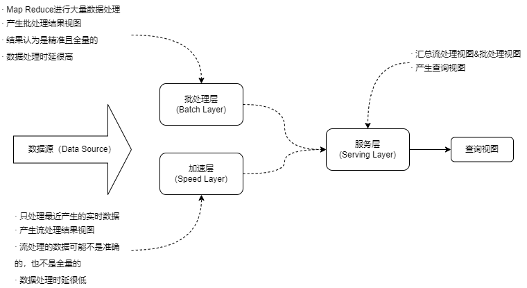
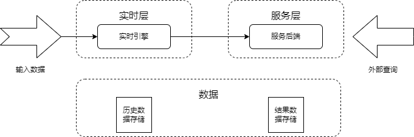

## 8 大数据架构设计
#### 大户数据处理系统架构分析
- 大数据带来的三大挑战
	- 1.如何利用信息技术等手段处理非结构化和半结构化数据
	- 2.如何探索大数据复杂性、不确定性特征描述的刻画方法及大数据的系统建模
	- 3.数据异构性与决策异构性的关系对大数据知识发现与管理决策的影响
- 大数据处理系统架构特征：
	- 1.鲁棒性和容错性
	- 2.低延迟读取和更新能力
	- 3.横向扩容
	- 4.通用性
	- 5.延展性
	- 6.即席查询能力
	- 7.最少维护能力
	- 8.可调试性

#### Lambda架构
- Lambda架构设计目的在于提供一个满足大数据系统关键特性的架构，包括高容错、低延迟、可扩展等。其整合离线计算与实时计算，融合不可变性、读写分离和复杂性隔离等原则。
	- Lambda是用于同事处理离线和实时数据的，可容错的，可扩展的分布式系统。它具备强鲁棒性，提供低延迟和持续更新。
- Lambda架构应用场景：
	- 机器学习
	- 物联网
	- 流处理
- Lambda架构可分解为三层：
	- （1）批处理层（Batch Layer）：存储数据集，Batch Layer在数据集上预先计算查询函数，并构建查询所对应的View。Batch Layer可以很好地处理离线数据，但有很多场景数据不断实时生成，并且需要实时查询处理。Speed Layer正式用来处理增量的实时数据。
	- （2）加速层（Speed Layer）：Batch Layer处理的是全体数据集，而Speed Layer处理的是最近的增量数据流。Speed Layer为了效率，在接收到新的数据后会不断更新Real-time View，而Batch Layer是根据全体离线数据集直接得到Batch View。
	- （3）服务层（Serving Layer）：Serving Layer用于合并Batch View和Real-time View中结果数据集到最终数据集。用于响应用户的查询请求。

	
- Hadoop是被设计成适合运行在通用硬件上的分布式文件系统。
	- HDFS是一个具有高度容错性的系统，能提供高吞吐量的数据访问，非常合适再大规模数据集上的应用。HDFS放宽了一些约束，以达到流式读取文件系统数据的目的。
	- Apache Spark是专为大规模数据处理而设计的快速通用计算引擎。Spark中间输入结果可以保存在内存中，从而不再需要读写HDFS，因此SPark能更好地适用于数据挖掘与机器学习等需要迭代的Map Reduce算法。
	- HBase-Hadoop Database，是一个高可靠性、高性能、面向列、可伸缩的分布式存储系统，利用HBase技术可在廉价PC Server上搭建起大规模结构化存储集群。
- Lambda架构
	- 优点：
		- 容错性好
		- 查询灵活度高
		- 易伸缩
		- 易扩展
	- 缺点：
		- 全场景覆盖带来的编码开销
		- 针对具体场景重新离线训练一遍益处不大
		- 重新部署和迁移成本好高
- Lambda架构中，数据的修改通过批处理和流处理实现，通过写操作将数据转换成查询时所对应的View。在Lambda架构中，对数据进行查询时，实际上是通过读取View直接得到结果，读出所需的内容。这实际上是一种形式的读写分离。

#### Kappa架构
- Kappa架构的原理就是：
	- 在Lambda的基础上进行了优化，删除了Batch Layer的架构，将数据通道以消息队列进行替代。
	- 因此对于Kappa架构来说，依旧以流处理为主，但是数据却在 数据湖层面进行了存储，当需要进行离线分析或再次计算的时候，则将数据湖的数据再次经过消息队列重播一次则可。

	
- 从使用场景上来看，Kappa架构与Lambda相比，主要有两点区别：
	- （1）Kappa不是Lambda的替代架构，而是其简化版本，Kappa放弃了对批处理的支持，更擅长业务本身为增量数据写入场景的分析需求；
	- （2）Lambda直接支持批处理，因此更适合对历史数据分析查询的场景。
- Kappa架构的有点：
	- 将实时和离线代码统一起来，方便维护而且统一了数据口径的问题，避免了Lambda架构中与离线数据合并的问题，查询历史数据的时候只需要重放存储的历史数据即可。
- Kappa的缺点：
	- （1）消息中间件缓存的数据量和回溯数据有性能瓶颈。通常算法需要过去180天的数据，如果都存在消息中间件，无疑有非常大的压力。同时，一次性回溯订正180天级别的数据，对实时计算的资源消耗也非常大。
	- （2）在实时数据处理时，遇到大量不同的实时流进行关联时，非常依赖实时计算系统的能力，跟可能因为数据流先后顺序的问题，导致数据丢失。
	- （3）Kappa在抛弃了离线数据处理模块的时候，同时抛弃了离线计算更加稳定可靠的特点。Lambda虽然保证了离线计算的稳定性，但双系统的维护成本高且两套代码带来后期运维困难。

#### Lambda架构与Kappa架构的对比和设计选择
<table>
	<tr>
		<th>对比内容</th>
		<th>Lambda架构</th>
		<th>Kappa架构</th>
	</tr>
	<tr>
		<td>复杂度与开发、维护成本</td>
		<td>需要维护两套系统（引擎），复杂度高，开发、维护成本高</td>
		<td>只需要维护一套系统（引擎），复杂度低，开发、维护成本低</td>
	</tr>
	<tr>
		<td>计算开销</td>
		<td>需要一直运行批处理和实时计算，计算开销大</td>
		<td>必要时进行全量计算，计算开销相对较小</td>
	</tr>
	<tr>
		<td>实时性</td>
		<td>满足实时性</td>
		<td>满足实时性</td>
	</tr>
	<tr>
		<td>历史数据处理能力</td>
		<td>批式全量处理，吞吐量大，历史数据处理能力强</td>
		<td>流式全量处理，吞吐量相对较低，历史数据处理能力相对较弱</td>
	</tr>
</table>