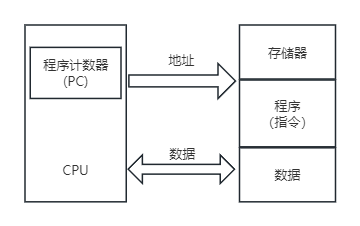
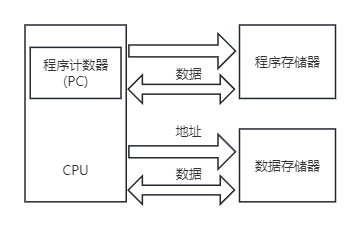

## 第10章 嵌入式技术
- 冯·诺依曼结构

- 哈佛结构

- 根据用途分类
	- 微控制器(MCU)的典型代表是单片机，其片上外设资源比较丰富，适合于控制。
		- 和嵌入式微处理器相比，微控制器的最大特点是单片化，体积大大减少，从而使功耗和成本下降、可靠性提高，其片上外设资源一般较丰富，适合于控制，是嵌入式系统工业的主流。
	- 嵌入式微处理器(MPU)由通用计算机中的CPU演变而来。
		- 它的特征是具有32位以上的处理器，具有较高的性能，当然其价格也相应较高。
		- 但与计算机处理器不同的是，在实际嵌入式应用中，只保留和嵌入式应用紧密相关的功能硬件，去除其他的冗余功能部分，这样就以最低的功耗和资源实现嵌入式应用的特殊要求。
		- 与工业控制计算机相比，嵌入式微处理器具有体积小、重量轻、成本低、可靠性高的优点。
	- 嵌入式数字信号处理器(DSP)是专门用于信号处理方面的处理器
		- 其在系统结构和指令算法方面进行了特殊设计，具有很高的编译效率和指令的执行速度。
		- DSP的特点如下：
			- 多总线结构
			- 哈佛体系结构
			- 字信号处理的运算特点
			- DSP设置了硬件乘法/累加器
	- 嵌入式片上系统(SOC)是追求产品系统最大包容的集成器件。
		- SOC最大的特点是成果实现了软硬件无缝结合，直接在处理器片内嵌入操作系统的代码模块。
		- 是一个有专用目标的集成电路，其中包含完整系统并有嵌入软件的全部内容。
- 设备驱动层
	- 设备驱动层又称为板级支持包(Board Support Package, BSP)，包含了嵌入式系统中的所有与硬件相关的代码，直接与硬件打交道，对硬件进行管理和控制，并为上层软件提供所需的驱动支持。
	- 板级支持包一般包含相关底层硬件的初始化、数据的输入/输出操作和硬件设备的配置等功能，它主要具有以下两个特点：
		- 硬件相关性
		- 操作系统相关性
	- 一般来说，BSP主要包括两方面的内容
		- 引导加载程序BootLoader
		- 设备驱动
- 嵌入式操作系统的特点
	- 系统内核小
	- 专业性强
	- 系统精简
	- 高实时性
	- 多任务操作系统
- 实时操作系统的特征
	- 高精度计时系统
	- 多级中断机制
	- 实时调度机制