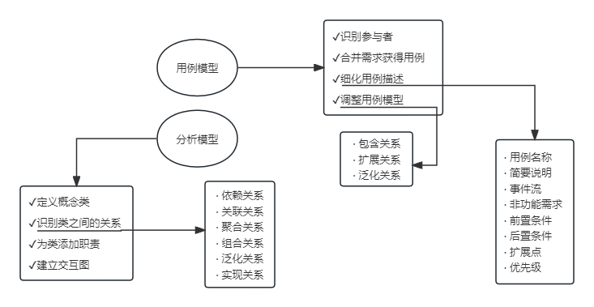
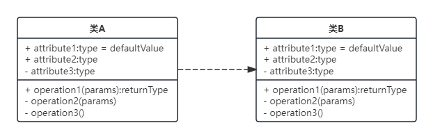
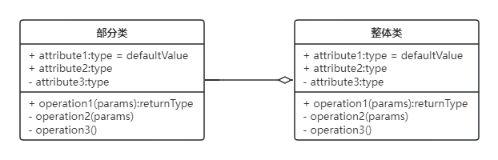
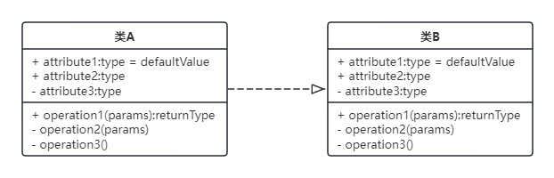
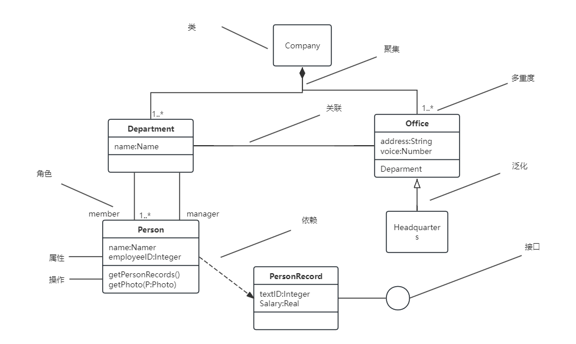
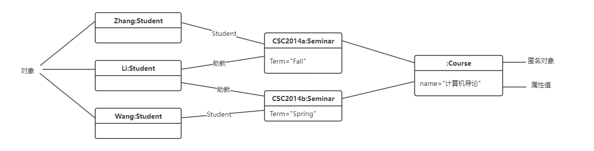
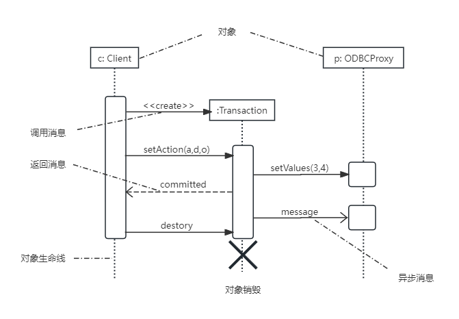

## 第9章 UML建模和设计模式
- 面向对象的分析是为了确定问题域，理解问题。包含5个活动：认定对象、组织对象、描述对象间的相互作用、确定对象的的操作、定义对象的内部信息。
- 面向对象需求建模过程

- 关系UML图形代号
	- 关联关系
		
		
	- 依赖关系
	
		
	- 泛化关系
	
		
	- 聚合关系
	
		
	- 组合关系
	
		
	- 实现关系
	
		
#### 图
- 类图：静态图，为系统的静态设计视图，展现一组对象、接口、协作和它们之间的关系。

	
- 对象图：静态图，展现某一时刻一组对象及它们之间的关系，为类图的某一快照。在没有类图的前提下，对象图就是静态设计视图

	
- 用例图：静态图，展现了一组用例、参与者以及它们之间的关系。用例图中的参与者是人、硬件或其他系统可以扮演的角色；用例是参与者完成的一系列操作，用例之间的关系有扩展、包含、泛化。

	
- 序列图：即顺序图，动态图，是场景化的图形化表示，描述了以时间顺序组织的对象之间的交互活动。
	- 同步消息：进行阻塞调用，调用者中止执行，等待控制权返回，需要等待返回消息，用实心三角箭头表示
	- 异步消息：发出消息后继续执行，不引起调用者阻塞，也不等待返回消息，由空心箭头表示
	- 返回消息：由右到左的虚线箭头表示

	
- 通信图：动态图，即协作图，强调参加交互的对象的组织。