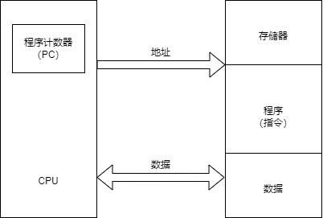
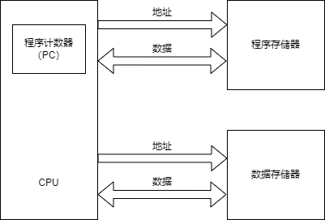
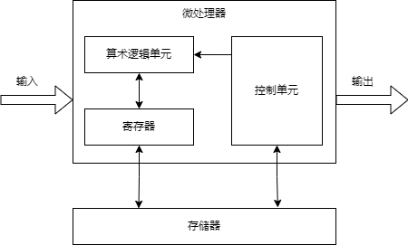
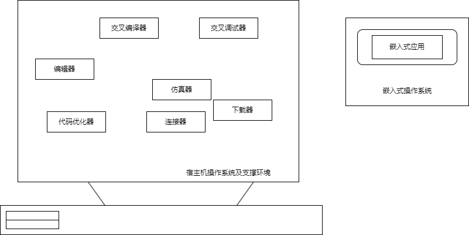

## 第10章 嵌入式技术
#### 嵌入式系统概述
- 嵌入式系统是以应用为中心、以计算机技术为基础，并将可配置与可裁剪的软、硬件集成与一体的专用计算机系统，需要满足应用对功能、可靠性、成本、体积和功耗等方面的严格要求。
- 一般嵌入式系统由嵌入式处理器、相关支持硬件、嵌入式操作系统、支持软件以及应用软件组成。
	- （1）**嵌入式处理器**。由于嵌入式系统一般是在恶劣的环境条件下工作，与一般处理器相比，嵌入式处理器应可抵抗恶劣环境的影响，比如高温、寒冷、电磁、加速度等环境因素。为适应恶劣环境，嵌入式处理器芯片除满足低功耗、体积小等需求外，根据不同环境需求，其工艺可分为民用、工业和军用三个档次。
	- （2）**相关支持硬件**。相关支撑硬件是指除嵌入式处理器以外的构成系统的其他硬件，包括存储器、定时器、总线、IO接口以及相关专用硬件。
	- （3）**嵌入式操作系统**。嵌入式操作系统是指运行在嵌入式系统中的基础软件，主要用于管理计算机资源和应用软件。与通用操作系统不同，嵌入式操作系统应具备实时性、可裁剪性和安全性等特征。
	- （4）**支撑软件**。支撑软件是指为应用软件开发与运行提供公共服务、软件开发、调试能力的软件，支撑软件的公共服务通常运行在操作系统之上，以库的方式被应用软件所引用。
	- （5）**应用软件**。应用软件是指为完成嵌入式系统的某一特点目标所开发的软件。
- 嵌入式系统应具备以下特性：
	- （1）**专业性强**。嵌入式系统面向特定应用需求，能够把通用CPU中许多由卡板完成的任务吉成在芯片内部，从而有利于嵌入式系统的小型化。
	- （2）**技术融合**。嵌入式系统将先进的计算机技术、通信技术、半导体技术和电子技术与各个行业的具体应用相结合，是一个技术密集、资金密集、高度分散、不断创新的知识集成系统。
	- （3）**软硬一体软件为主**。软件是嵌入式系统的主体，有IP核。嵌入式系统的硬件和软件都可以高效地设计，量体裁衣，去除冗余，可以在同样的硅片面积上实现更高的性能。
	- （4）**比通用计算机资源少**。由于嵌入式系统通常只完成少数几个任务。设计时考虑到其经济性，不能使用通用CPU，这就意味着管理的资源少，成本低，结构更简单。
	- （5）**程序代码固化在非易失存储器中**。为了提供执行速度和系统可靠性，嵌入式系统中的软件一般都固化在存储器芯片或单片机本身中，而不是存在磁盘中。
	- （6）**需要专门开发工具和环境**。嵌入式系统本身不具备开发能力，即使设计完成以后，用户通常也不能对其中的程序功能进行修改，必须有一套开发工具和环境才能进行开发。
	- （7）**体积小、价格低、工艺先进、性能价格比高、系统配置要求低、实时性强**。
	- （8）**对安全性和可靠性的要求高**。
#### 嵌入式系统分类
- 根据不同的用途可分为
	- 嵌入式实时系统
		- 强实时系统
		- 弱实时系统
	- 嵌入式非实时系统
- 从安全性要求看
	- 安全攸关系统
	- 非安全攸关系统
- 嵌入式系统分为五层：
	- （1）**硬件层**。硬件层主要是为嵌入式系统提供运行支撑的硬件环境，其核心是微处理器、存储器（ROM、SDRAM、Flash等）、I/O接口(A/D、D/A、I/O等)和通用设备以及总线、电源、时钟等。
	- （2）**抽象层**。在硬件层和软件层之间为抽象层，主要实现对硬件层的硬件进行抽象，为上层应用（操作系统）提供虚拟的硬件资源：板级支持包(Board Support Package, BSP)是一种硬件驱动软件，它是面向硬件层的硬件芯片或电路进行驱动，为上层操作系统对硬件进行管理提供支持。
	- （3）**操作系统层**。操作系统层主要由嵌入式操作系统、文件系统、图形用户接口、网络系统和通用组件等可配置模块组成。
	- （4）**中间件层**。中间件层一般位于操作系统之上，管理计算机资源和网络通信，中间件层是连接两个独立应用的桥梁。
	- （5）**应用层**。应用层指嵌入式系统的具体应用，主要包括不同的应用软件。
- 嵌入式软件的主要特点如下：
	- （1）**可裁剪性**。嵌入式软件能够根据系统功能需求，通过工具进行适应性功能的加或减，删除点系统不需要的软件模块，使得系统更加紧凑。
	- （2）**可配置性**。嵌入式软件需要具备根据系统运行功能或性能需要而被配置的能力，使得嵌入式软件能够根据系统的不同状态、不同容量和不同流程，对软件工作状况进行能力的扩展、变更和增量服务。
	- （3）**强实时性**。嵌入式系统中的大多数都属于强实时性系统，要求任务必须在规定的时限内处理完成，因此，嵌入式软件采用的算法优劣是影响实时性的主要原因。
	- （4）**安全性**。安全性是指系统在规定的条件下和规定的时间内不发生事故的能力。
	- （5）**可靠性**。可靠性是指系统在规定的条件下和规定的时间周期内程序执行所要求的功能的能力。
	- （6）**高确定性**。嵌入式系统的运行时间、状态和行为是预先设计规划好的，其行为不能随时间、状态的变化而变化。

#### 嵌入式微处理器体系结构
- 冯诺依曼结构

- 哈佛结构

#### 嵌入式微处理器分类
- 嵌入式硬件系统基本结构

- 根据用途分类
	- **微控制器(MCU)**的典型代表是单片机，其片上外设资源比较丰富，适合于控制。MCU芯片内部集成ROM/EPROM、RAM、总线、总线逻辑、定时/计数器、看门狗、I/O、串行口、脉宽调制输出、A/D、D/A、Flash RAM、EEPROM等各种必要功能和外设。
		- 和嵌入式微处理器相比，微控制器最大特点是单片化，从而使功耗和成本下降、可靠性提高，其片上外设资源一般较丰富，适合于控制，是嵌入式系统工业的主流。
	- **嵌入式微处理器(MPU)**由通用计算机中的CPU演变而来。它的特征是具有32位以上的处理器，具有较高的性能，当然其价格也相应较高。
		- 但与计算机处理器不同的是，在实际嵌入式应用中，只保留和嵌入式应用紧密相关的功能硬件，去除其他的冗余功能部分，这样就以最低的功耗和资源实现嵌入式应用的特殊要求。
		- 与工业控制计算机相比，嵌入式微处理器具有体积小、重量轻、成本低、可靠性高的特点。
		- 目前常见的有ARM、MIPS、POWER PC等。
	- **嵌入式数字信号处理器(DSP)**是专门用于信号处理方面的处理器，其在系统结构和指令算法方面进行了特殊设计，具有很高的编译效率和指令的执行速度。
		- 采用哈佛结构，流水线处理，其处理速度比最快的CPU还快10~50倍。
		- 在数字滤波、FFT、谱分析等各种仪器上DSP获得了大规模的应用。
	- **嵌入式片上系统(SOC)**是追求产品系统最大包容的集成器件。SOC最大的特点是成功实现了软硬件无缝结合，直接在处理器片内嵌入操作系统的代码模块。
		- 是一个专用目标的集成电路，其中包含完整系统并有嵌入软件的全部内容。
#### 多核处理器结构
- 多核指多个微处理器内核，是将两个或更多的微处理器封装在一起，集成在一个电路中。
	- 多核处理器是单枚芯片，能够直接插入单一的处理器插槽中。
	- 多核与多CPU相比，很好地降低了计算机系统的功耗和体积。

#### 嵌入式软件与操作系统
- 嵌入式软件分类
	- **系统软件**：控制和管理嵌入式系统资源，为嵌入式应用提供支持的各种软件，如设备的驱动程序、嵌入式操作系统、嵌入式中间件等。
	- **应用软件**：嵌入式系统中的上层软件，定义了嵌入式设备的主要功能和用途，并负责与用户交互，一般面向特定的应用领域，如飞行控制软件、手机软件、地图等。
	- **支撑软件**：辅助软件开发的工具软件，如系统分析设计工具、在线仿真工具、交叉编译器等。
- 设备驱动层
	- 设备驱动层又称为板级支持包（BSP），包含了嵌入式系统中所有与硬件相关的代码，直接与硬件打交道，对硬件进行管理和控制，并为上层软件提供所需的驱动支持。
	- BSP主要功能为屏蔽硬件，提供操作系统及硬件驱动，具体功能包括：
		- （1）单板硬件初始化，主要是CPU的初始化，为整个软件系统提供底层硬件支持。
		- （2）为报错系统提供设备驱动程序和系统终端服务程序。
		- （3）定制操作系统的功能，为软件系统提供一个实时多任务的运行环境。
		- （4）初始化操作系统，为操作系统的正常运行做好准备。
- 嵌入式操作系统的特点
	- （1）**系统内核小**。由于嵌入式系统一般是应用小型电子装置，系统资源相对有限，所以内核较之传统的操作系统要小很多。
	- （2）**专业性强**。嵌入式系统的个性化很强，其中的软件系统和硬件的结合非常紧密，一般要针对硬件进行系统的移植，即使在同一个品牌、同一系列的产品中也需要根据系统硬件的变化和增减不对进行修改。同时针对不同的任务，往往需要对系统进行较大更改，程序的编译下载吆喝系统相结合，这种修改和通用软件的“升级”完全是两个概念。
	- （3）**系统精简**。嵌入式系统一般没有软件系统和应用软件的明显区分，不要求其功能设计及实现上过于复杂，这样一方面利于控制系统成本，同时也利于实现系统安全。
	- （4）**高实时性**。高实时性的系统软件是嵌入式软件的基本要求，而且软件要求固态存储，以提高速度；软件代码要求高质量和高可靠性。
	- （5）**多任务的操作系统**。嵌入式软件开发需要使用多任务的操作系统。嵌入式系统的应用程序可以没有操作系统，直接在芯片上运行。但是为了合理地调度多任务，利用系统资源、系统函数以及和专用库函数接口，用户必须自行选配操作系统开发平台，这样才能保证整型执行的实时性、可靠性，并减少开发时间，保障软件质量。
- 嵌入式实时操作系统
	- 嵌入式实时操作系统是一种完全嵌入受控器件内部，为特定应用而设计的专用计算机系统。
	- 在嵌入式实时系统中，要求**系统在投入运行前即具有可预测性和确定性**。
- 实时操作系统（RTOS）的特点
	- 当外界事件或数据产生时，能够接受并以足够快的速度予以处理，其处理的结果又能在规定的时间之内来控制生产过程或堆处理系统做出快速响应，并控制所有实时任务协调一致运行。因而，提供**及时响应和高可靠性**是其主要特点。
	- 实时操作系统的特征
		- （1）高精度计时系统
		- （2）多级中断机制
		- （3）实时调度机制
#### 嵌入式软件设计
