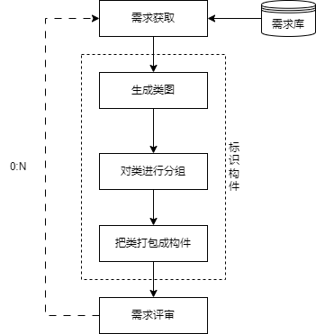
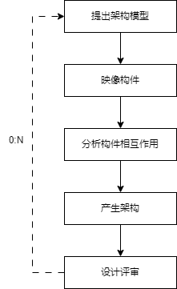
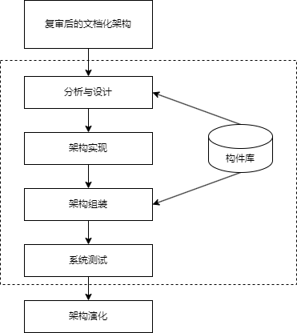
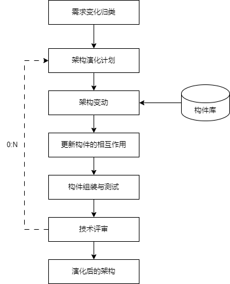
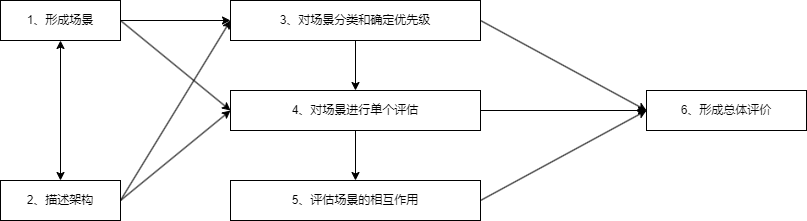
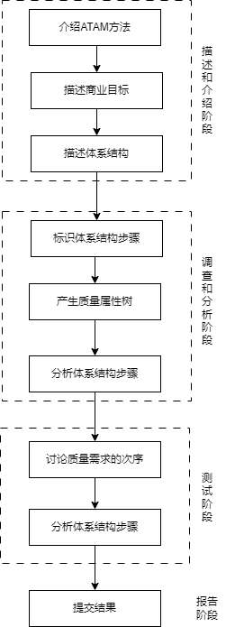

## 第11章 软件架构设计
#### 软件架构的概念
- 一个程序和计算机系统软件体系结构是指系统的一个或者多个结构。结构中包括软件的构件，构件的外部可见属性以及它们之间的相互关系。
- 软件体系结构设计的两个层次：
	- **数据设计**：体现传统系统中的体系结构的数据构件和面向对象系统中类的定义（封装了属性和操作）
	- **体系结构设计**：主要关注软件构件的结构、属性和交互作用。
- 软件架构设计与生命周期
	- （1）**需求分析阶段**。需求分析和SA（Software Architecture：软件架构）设计面临的是不同的对象：一个是问题空间；另一个是解空间。
	- （2）**设计阶段**。是SA研究关注的最早和最多的阶段，这一阶段的SA研究主要包括：SA模型的描述、SA模型的设计与分析方法，以及对SA设计经验的总结与复用等。
	- （3）**实现阶段**。最初SA研究往往只关注较高层次的系统设计、描述和验证。为了有效实现SA设计向实现的转换，实现阶段的体系结构研究表现在以下几个方面。
		- 1）研究基于SA的开发过程支持，如项目组织结构、配置管理等。
		- 2）寻求从SA向实现过渡的途径，如将程序设计语言元素引入SA阶段、模型映射、构件组装、复用中间件平台等。
	- （4）**构件组装阶段**。在SA设计模型的指导下，可复用构件的组装可以在较高层次上实现系统，并能够提高系统实现的效率。在构件组装的过程中，SA设计模型起到了系统蓝图的作用。研究内容包括如下两个方面：
		- 1）如何支持可复用构件互联，即对SA设计模型中的规约的连接子的实现提供支持。
		- 2）在组装过程中，如何检测并消除体系结构失配问题。
	- （5）**部署阶段**。SA对软件部署的作用如下：
		- 1）提供高层的体系结构视图来描述部署阶段的软硬件模型。
		- 2）基于SA模型可以分析部署方案的质量属性，从而选择合理的部署方案。
	- （6）**后开发阶段**。是指软件部署安装之后的阶段。这一阶段的SA研究主要围绕维护、演化、复用等方面来进行。典型的研究方向包括动态软件体系结构、体系结构恢复与重建等。
- 架构描述语言
	- 架构描述语言(Architecture Description Language, ADL)是一种形式化语言，在底层语义模型的支持下，为软件系统的概念体系结构建模提供了具体语法和概念框架。

#### 构件
- 构件是一个独立可交付的功能单元，外界通过接口访问其提供的服务。
- 构件的特征：
	- ①独立部署单元
	- ②作为第三方的组装单元
	- ③没有（外部的）可见状态
- 构件技术
	- 国际上常用的构件标准主要有三大流派
		- EJB(Enterprise Java Bean)
		- COM/DCOM/COM+
		- CORBA

#### 软件架构风格
- 软件体系结构风格是描述某一特定领域中系统组装方式的惯用模式。
- 架构风格汇总

<table>
	<tr>
		<th colspan="2">架构风格名</th>
		<th>常考关键字及实例</th>
		<th>简介</th>
	</tr>
	<tr>
		<td rowspan="2">数据流</td>
		<td>批处理</td>
		<td rowspan="2">传统编译器，每个阶段产生的结果作为下一阶段的输入，区别在于整体</td>
		<td>一个接一个，以整体为单位</td>
	</tr>
	<tr>
		<td>管道-过滤器</td>
		<td>一个接一个，前一个的输出是后一个的输入</td>
	</tr>
	<tr>
		<td  rowspan="3">调用/返回</td>
		<td>主程序/子程序</td>
		<td></td>
		<td>显式调用，主程序直接调用子程序</td>
	</tr>
	<tr>
		<td>面向对象</td>
		<td></td>
		<td>对象是构件，通过对象调用封装的方法和属性</td>
	</tr>
	<tr>
		<td>层次结构</td>
		<td></td>
		<td>分层，每层最多影响其上下两层，有调用关系</td>
	</tr>
	<tr>
		<td rowspan="2">独立构件</td>
		<td>进程通信</td>
		<td></td>
		<td>进程间独立的消息传递，同步和异步方式</td>
	</tr>
	<tr>
		<td>事件驱动（隐式调用）</td>
		<td>事件触发推动动作，如程序语法的语法高亮、语法错误提示</td>
		<td>不直接调用，通过事件驱动</td>
	</tr>
	<tr>
		<td rowspan="2">虚拟机</td>
		<td>解释器</td>
		<td rowspan="2">自定义流程，按流程执行，规则随时改变，灵活定义，业务灵活组合机器人</td>
		<td>解释自定义的规则，解释引擎、存储区、数据结构</td>
	</tr>
	<tr>
		<td>规则系统</td>
		<td>规则集、规则解释器、选择器和工作内存，用于决策支持系统(DSS)和人工智能、专家系统</td>
	</tr>
	<tr>
		<td rowspan="3">仓库</td>
		<td>数据库</td>
		<td rowspan="3">现代编译器的集成开发环境（IDE），以数据为中心。又称为数据共享风格</td>
		<td>中央共享数据源，独立处理单元</td>
	</tr>
	<tr>
		<td>超文本</td>
		<td>网状链接，多用于互联网</td>
	</tr>
	<tr>
		<td>黑板</td>
		<td>语音识别、知识推理等问题复杂、解空间很大、求解过程不确定的这一类软件系统，黑板、知识源、控制</td>
	</tr>
	<tr>
		<td>闭环</td>
		<td>过程控制</td>
		<td>汽车巡航定速，空调温度调节，设定参数，并不断调整</td>
		<td>发出控制命令并接受反馈，循环往复达到平衡</td>
	</tr>
	<tr>
		<td colspan="2">C2</td>
		<td>构件和连接件、顶部和底部</td>
		<td>通过连接件绑定在一起按照一组规则运作的并行构件网络</td>
	</tr>
</table>

#### 特定领域软件架构
- 特定领域软件架构(Domain Specific Software Architecture, DSSA)就是专用于一类特定类型的任务（领域）的、在整个领域中能有效地使用的、为成功构造应用系统限定了标准的组合结构的软件构件的集合。
- DSSA就是一个特定的问题领域中支持一组应用的领域模型、参考需求、参考架构等组成的开发基础，其目标就是支持在一个特定领域中多个应用的生成。
	- 垂直域：在一个特定领域中的通用的软件架构，是一个完整的架构。
	- 水平域：在多个不同的特定领域之间的相同的部分小工具。
- DSSA的三个基本活动
	- （1）**领域分析**：这个阶段的主要目标是获得领域模型（领域需求）。识别信息源，即整个领域工程过程中信息的来源，可能的信息源包括现存系统、技术文献、问题域和系统开发的专家、用户调查和市场分析、领域演化的历史记录等，在此基础上就可以分析领域中系统的需求，确定哪些需求是领域中的系统广泛共享的，从而建立领域模型。
	- （2）**领域设计**：这个阶段的目标是获得DSSA。DSSA描述在领域模型中表示的需求的解决方案，它不是单个系统的表示，而是能够适应领域中多个系统的需求的一个高层次设计。建立了领域模型之后，就可以派生出满足这些被建模的领域需求DSSA。
	- （3）**领域实现**：这个阶段的主要目标是依据领域模型和DSSA开发和组织可重用信息。这些可重用信息可能从现有系统中提取得到，也可能需要通过新的开发得到。
	- 以上过程是一个反复的、逐渐求精的过程。在实施领域工程的每个阶段中，都可能返回到以前的步骤，对以前的步骤得到的结果进行修改和完善，再回到当前步骤，在新的基础上进行本阶段的活动。
- 参与DSSA的四种角色
	- （1）领域专家：包括该领域中系统的有经验的用户、从事该领域中系统的需求分析、设计、实现以及项目管理的有经验的软件工程师等。提供关于领域中系统的需求规约和实现的知识，帮助组织规范的、一致的领域字典，帮助选择样本系统作为领域工程的依据，复审领域模型、DSSA等领域工程产品等。
	- （2）领域分析人员：由具有知识工程背景的有经验的系统分析员来担任。控制整个领域分析过程，进行知识获取，将获取的知识组织到领域模型中。
	- （3）领域设计人员：由有经验的软件设计人员来担任。根据领域模型和现有系统开发出DSSA、并对DSSA的准确性和一致性进行验证。
	- （4）领域实现人员：由有经验的程序设计人员来担任。根据领域模型和DSSA，开发构件。
- 建立DSSA的过程
	- **定义领域范围**：领域中的应用要满足用户一系列的需求。
	- **定义领域特定的元素**：建立领域的字典，归纳领域中的术语，识别出领域中相同和不相同的元素。
	- **定义领域特定的设计和实现需求的约束**：识别领域中所有约束，这些约束对领域的设计和实现会造成什么后果。
	- **定义领域模型和架构**：产生一般的架构，并描述其构件说明。
	- **产生、搜集可复用的产品单元**：为DSSA增加复用构件，使可用于新的系统。
	- 以上的过程是并发的、递归的、反复的、螺旋的。
- DSSA三层次模型
	- （1）领域开发环境：领域架构师决定核心架构，产出参考架构、参考需求、架构、领域模型、开发工具。
	- （2）领域特定的应用开发环境：应用工程师根据具体环境来将核心架构实例化。
	- （3）应用执行环境：操作员实现实例化后的架构。
	
	

#### 基于架构的软件开发方法
- 基于架构的软件开发（Architecture-Base Software Development, ABSD）方法是架构驱动，强调由业务、质量 和功能需求的组合驱动架构设计。
	- 它强调采用视角和视图来描述软件架构，采用用例和质量属性场景来描述需求。进一步来说，用例描述的是功能需求，质量属性场景描述的是质量需求（或侧重于非功能需求）。
- ABSD方法有三个基础：
	- 第一个基础是功能的分解，使用已有的基于模块的内聚和耦合技术；
	- 第二个是通过选择架构风格来实现质量和业务需求；
	- 第三个基础是软件模板的使用，软件模板利用了一些软件系统的结构。
- ABSD方法是递归的，且迭代的每一个步骤都是清晰定义的。因此，不管设计是否完成，架构总是清晰的，有助于降低架构设计的随意性。
- 开发过程
	- 架构设计是在需求分析之后，概要设计之前，是为了解决需求分析和软件设计之间的鸿沟问题。
	- 基于架构的软件开发过程可以分为以下六步：
		- （1）架构需求。重在掌握标识构件的三步：生成类图、对类进行分组、把类打包成构件。

		
		- （2）架构设计。将需求阶段的标识构件映像成构件进行分析。
		
		
		- （3）架构（体系结构）文档化。主要产出两种文档，即架构（体系结构）规格说明，测试架构（体系结构）需求的质量设计说明书。文档是至关重要的，是所有人员通信的手段，关系开发的成败。
		- （4）架构复审。由外部人员（独立于开发组织之外的人，如用户代表和领域专家等）参加的复审，复审架构是否满足需求、质量问题、构件划分合理性等。若复审不过，则返回架构设计阶段进行重新设计、文档化，再复审。
		- （5）架构实现。用实体来显示出架构。实现构件组装成系统。
		
		
		- （6）对架构进行改变，按需求增删构件，使架构可复用。
		
		

#### 软件架构评估
- 质量属性
	- 性能：指系统的响应能力，即要经过多长时间才能对某个事件作出响应，或者在某段时间内系统所能处理的事件的个数。
		- 如响应时间、吞吐量，
		- 设计策略有优先级队列、增加计算资源、减少计算开销、引入并发机制、采用资源调度等。
	- 可靠性：是软件系统在应用或系统错误面前，在意外或错误使用的情况下维持软件系统的功能特性的基本能力。
		- 如MTTF、MTBF。
		- 设计策略有心跳、Ping/Echo、冗余、选举。
	- 安全性：是指系统在向合法用户提供服务的同时能够阻止非授权用户使用的企图或拒绝服务的能力。
		- 如保密性、完整性、不可抵赖性、可控性。
		- 设计策略有入侵检测、用户认证、用户授权、追踪审计。
	- 可修改性：指能够快速地以较高的性能价格比对系统进行变更的能力。通常以某些具体的变更为基准，通过考查这些变更的代价衡量。
		- 设计策略有接口-实现分类、抽象、信息隐藏。
	- 功能性：是系统所能完成所期望的工作的能力。
		- 一项任务的完成需要系统中许多或大多数构件的相互协作。
	- 可变性：指体系结构经扩充或变更而成为新体系结构的能力。
		- 这种新体系结构应该符合预先定义的规则，在某些具体方面不同于原有体系结构。
		- 当要将某个体系结构作为一系列相关产品的基础时，可变性是很重要的。
	- 互操作性：作为系统组成部分的软件不是独立存在的，经常与其他系统或自身环境相互作用。
		- 为了支持互操作性，软件体系结构必须为外部可视的功能特性和数据结构提供精心审计的软件入口。
		- 程序和用其他编程语言编写的软件系统的交互组作用就是互操作性的问题，也影响应用的软件体系结构。
- 架构评估方式
	- 敏感点：是指为了实现某种特定的质量属性，一个或多个构件所具有的特性。
	- 权衡点：是影响多个质量属性的特性，是多个质量属性的敏感点。
	- 风险点与非风险点不是以标准专业术语形式出现的，只是一个常规概念，即可能引起风险的因素，可称为风险点。
		- 某个做法如果有隐患，有可能导致一些问题，则为风险点；
		- 而如果某件事是可行的、可接受的，则为非风险点。
- 3种常用的评估方式
	- 基于调查问卷（检查表）的方式：类似于需求获取中的问卷调查方式，只不过是架构方面的问卷，要求评估人员对领域熟悉。
		- 评估的目的是为了评估所采用的架构是否能解决软件系统需求。
	- 基于度量的方式：指定一些定量来度量架构，如代码行数等，
		- 要制订质量属性和度量结构之间的映射，要求评估人员对架构熟悉。
	- 基于场景的方式：主要方法。
		- 首先要确定应用领域的功能和软件架构的结构之间的映射，然后要设计用于体现待评估质量属性的场景（即4+1视图中的场景），最后分析软件架构对场景的支持程度。
		- 要求评估人员即对领域熟悉，也对架构熟悉。
		-其中，基于场景的方式是主流，其有三种具体评估方法：
			- （1）软件架构分析方法(Scenarios-Based Architecture Analysis Method, SAAM) 是一种非功能质量属性的架构分析方法，是最早形成文档并得到广泛应用的软件架构分析方法。
				
			- （2）架构权衡评估方法(Architecture Tradeoff Analysis Method, ATAM)让架构师明确如何权衡多个质量目标，参与者有评估小组、项目决策者和其他项目相关人。
				- ATAM被分为四个主要的活动领域，分别是场景和需求收集、体系结构视图和场景实现、属性模型构造和分析、折中。整个评估过程强调以属性作为架构评估的核心概念。主要针对性能、可用性、安全性和可修改性，在系统开发之前，对这些质量属性进行评价和折中。
					
			- （3）成本效益分析法(Cost Benefit Analysus Method, CBAM)用来对架构建立的成本进行设计和建模，让决策者根据投资收益率来选择合适的架构，可以看作对ATAM的补充，在ATAM确定质量合理的基础上，再对效益进行分析。有下列步骤：
				- 1）整理场景（确定场景，并确定优先级，选择三分之一优先级最高的场景进行分析）。
				- 2）对场景进行细化（对每个场景详细分析，确定最好、最坏的情况）
				- 3）确定场景的优先级（项目干系人对场景投票，根据投票结果确定优先级）
				- 4）分配效用（对场景响应级别确定效用表，建立策略、场景、响应级别的表格）
				- 5）形成“策略-场景-响应级别的对应关系”
				- 6）确定期望的质量属性响应级别的效用（根据效用表确定所对应的具体场景的效用表）
				- 7）计算各架构策略的总收益
				- 8）根据受成本限制影响的投资报酬率选择架构策略（估算成本，用上一步的收益减去成本，得出收益，并选择收益最高的架构策略）