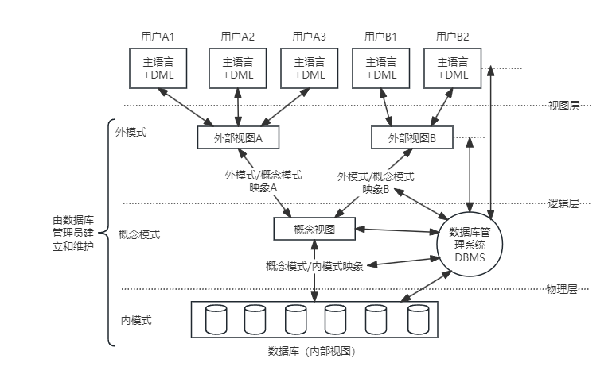
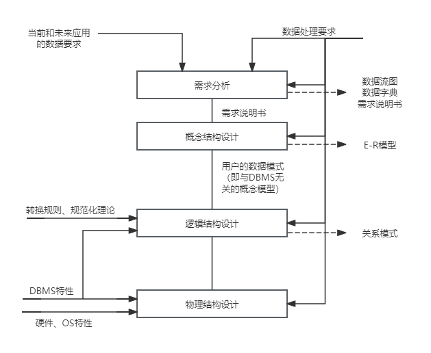

## 第4章 数据库技术基础
- 数据库管理系统(DBMS)的功能
	- 数据定义
	- 数据库操作
	- 数据库运行管理
	- 数据的存储管理
	- 数据库的建立和维护
- DBMS的分类：
	- 关系数据库(RDBS)
	- 面向对象的数据库系统(OODBS)
	- 对象关系数据库系统(ORDBS)
- 数据库系统的体系结构
	- 集中式数据库系统（所有东西集中在DBMS电脑上）
	- 客户端/服务器体系结构（客户端负责请求和数据表示，服务器负责数据库服务）
	- 并行数据库系统（多个物理上在一起的CPU）
	- 分布式数据库系统（物理上分布在不同地方的计算机）
- 数据库分层结构设计
	- **内模式**：管理如何存储**物理的数据**，对数据的存储方式、优化、存放等。
	- **模式**：又称为概念模式，就是通常使用**表**这个级别，根据应用、需求将物理数据划分成一张表。
	- **外模式**：对应数据库中的**视图**这个级别，将表进行一定的处理后再提供给用户使用。
	- **外模式--模式映象**：是表和视图之间的映象，存在于概念级和外部级之间，若表中数据发生了修改，值需要修改此映象，而无须修改应用程序。
	- **模式--内模式映象**：是表和数据的物理存储之间的映象，存在于概念级和内部级之间，若修改了数据存储方式，只需要修改此映像，而不需要去修改应用程序。

- 数据库的设计阶段分为以下几种
	- （1）**需求分析**。
		- 即分析数据存储的要求，产出物有数据流图、数据字典、需求说明书。
		- 获得用户对系统的三个要求：信息要求、处理要求、系统要求。
	- （2）**概念结构设计**。
		- 就是设计E-R图，也即实体-联系图，与物理实现无关，就是说明有哪些实体，实体有哪些属性。
		- 工作步骤包括：选择局域应用、逐一设计分E-R图、E-R图合并。
		- 分E-R图进行合并时，它们之间存在的冲突主要有以下三类。
			- 属性冲突。同一属性可能会存在于不同的分E-R图中，由于设计人员不同或是出发点不同，属性的类型、取值范围、数据单位等可能会不一致。
			- 命名冲突。相同意义的属性，在不同的分E-R图上有着不同的命名，或是名称相同的属性在不同的分E-R图中代表着不同的意义。
			- 结构冲突。同一实体在不同的分E-R图中有不同的属性，同一对象在某一分E-R图中被抽象为实体，而在另一分E-R图中又被抽象为属性。
	- （3）**逻辑结构设计**。
		- 将E-R图转换成关系模式，也即转换成实际的表和表中的列属性，这里要考虑很多规范化的东西。
		- 工作步骤包括：
			- 确定数据模型
			- 将E-R图转换成指定的数据模型
			- 确定完整性约束
			- 确定用户视图
	- （4）**物理设计**。
		- 根据生成的表等概念，生成物理数据库。
		- 工作步骤包括：
			- 确定数据分布
			- 存储结构
			- 访问方式
	- （5）**数据库实施阶段**。
		- 数据库设计人员根据逻辑设计和物理设计阶段的结构建立数据库，编制与调试应用程序，组织数据入库，并进行试运行。
	- （6）**数据库运行和维护阶段**。
		- 数据库应用系统经过试运行即可投入运行，但该阶段需要不断地对系统进行评价、调整与修改。

	
	
