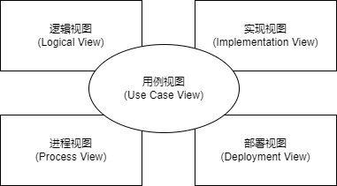
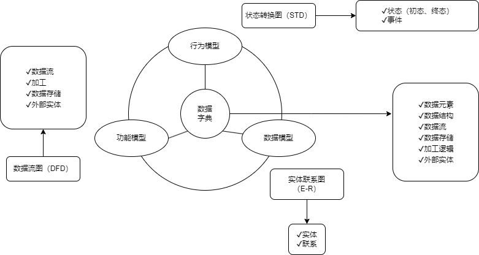
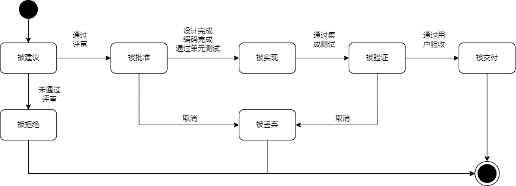
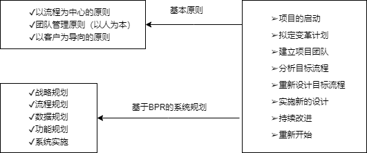

## 第7章 软件工程基础知识
- 软件开发生命周期
	- **软件定义时期**：包括可行性研究和详细需求分析过程，任务是确定软件开发工程必须是完整的总目标，具体可分成问题定义、可行性研究、需求分析等。
	- **软件开发时期**：就是软件的设计与实现，可分成概要设计、详细设计、编码、测试等。
	- **软件运行和维护**：就是把软件产品移交给用户使用。
- CMMI阶段式模型成熟度级别
	- 初始级
	- 已管理级
	- 已定义级
	- 定量管理
	- 优化级
- 软件过程模型
	- **瀑布模型(SDLC)**：结构化方法中的模式，是结构化的开发，开发流程如同瀑布一般，一步一步走下去，知道最后完成项目开发，只适用于需求明确或者二次开发（需求稳定），当需求不明确时，最终开发的项目会有错误，有很大的缺陷。
	- **原型模型**：与瀑布模型相反，原型针对的就是需求不明确的情况，首先快速构造一个功能模型，演示给用户看，并按用户要求及时修改，中间再通过不断地演示与用户沟通，最终设计出项目，就不会出现与用户要求不符合的情况，采用的是迭代的思想。不适合超大项目开发。
	- **增量模型**：首先开发核心模块功能，而后与用户确认，之后再开发核心模块的功能，即每次开发一部功能，并与用户需求确认，最终完成项目开发，优先级高的服务最先交付，但由于并不是从系统整体角度规划各个模块，因此不利于模块划分。难点在于如何将客户需求划分为多个增量。与原型不同的是增量模型的每一次增量版本都可作为独立可操作性的作品，而原型的构造一般是为了演示。
	- **螺旋模型**：是多种模型的混合，针对需求不明确的项目，与原型类似，但是增加了风险分析，这也是其最大的特点。适合大型项目开发。
	- **V模型**：特点是增加了很多轮测试，并且这些测试贯穿于软件开发的各个阶段，不像其他模型都是软件开发完再测试，很大程度上保证了项目的准确的。
	- **喷泉模型**：特点是面向对象的模型，而上述其他的模型都是结构化的模型，使用了迭代思想和无间隙开发。
	- **基于构件的开发模型（CBSD）**：特点是增强了可复用性，在系统开发过程中，会构件一个构件库，供其他系统复用，因此可以提高可靠性，节省时间和成本。
	- **形式化方法模型**：建立在严格的数学基础上的一种软件开发方法，主要活动是生成计算机软件形式化的数学规格说明。
- 敏捷模型
	- 敏捷方法区别于其他方法的两个特点：
		- 是“适应性”而非“预设性”
		- 是“面向人的”而非“面向过程的”
	- 敏捷方法的核心思想
		- 敏捷方法是适应型。而非可预测。拥抱变化，适应变化。
		- 敏捷方法是以人为本，而非以过程为本、发挥人的特性。
		- 迭代增量式的开发过程。以原型开发思想为基础，采用迭代增量式开发，发行版本小型化。
	- 主要敏捷方法
		- **极限编程（XP）**。基础和价值是交流、不俗、反馈和勇气，即任何一个软件项目都可以 从加强交流、从简单做起、寻求反馈、勇于实事求是四个方面入手进行改善。
			- XP是一种近螺旋式的开发方法，它将复杂的开发过程分解为一个相对比较简单的小周期：通过积极的交流、反馈以及其他一系列的方法，开发人员和客户可以非常清楚开发进度、变化、待解决的问题和潜在的困难等，并根据实际情况及时地调整开发过程。
			- XP提倡测试先行，为了将以后出现bug的概率降到最低。
		- **水晶系列方法**。与XP方法一样，都以人为中心的理念，但实践上有所不同。其目的是发展一种提倡“机动性的”方法，包含具有共性的核心元素，每个都含有独特的角色、过程模式、工作产品和实践。
		- **并列争球法（Scrum）**。是一种迭代的增量化过程，把每段实践（如30天）一次的迭代称为一个“冲刺”（Sprint），并按需求的有限级别来实现产品，多个自组织和自治的小组并行地递增实现产品。
		- **特性驱动开发方法（FDD）**。是一个迭代的开发模型。认为有效的软件开发需要三个要素：人、过程和技术。
			- 有五个核心过程：开发整体对象模型、构造特征列表、计划特征开发、特征设计和特征构建。其中，计划特征开发根据构造出的特征列表、特征间的依赖关系进行计划，设计出包含特征设计和特征构建过程组成的多次迭代。
- 统一过程模型（RUP）
	- RUP描述了如何有效地利用商业的、可靠的方法开发和部署软件，是一种重量级过程。RUP类似一个在线的指导者，它可以为所有方面和层次的程序开发提供指导方针、模板以及事例支持。
	- RUP软件开发生命周期是一个二维的软件开发模型。
	- RUP中有九个核心工作流
		- **业务建模**：理解待开发系统所在的机构及其商业运作，确保所有参与人员对待开发系统所在的机构有共同的认识，评估待开发系统对所在机构的影响。
		- **需求**：定义系统功能及用户界面，使客户知道系统的功能，使开发人员理解系统的需求，为项目预算及计划提供基础。
		- **分析与设计**：把需求分析的结果转化为分析与设计的模型。
		- **实现**：把设计模型转换为实现结果，对开发的代码做单元测试，将不同实现人员开发的模块集成为可执行系统。
		- **测试**：检查各子系统之间的交互、集成，验证所有需求是否均被正确实现，对发现的软件质量上的缺陷进行归档，对软件质量提出改进建议。
		- **部署**：打包、分发、安装软件，升级旧系统；培训用户及销售人员，并提供技术支持。
		- **配置与变更管理**：跟踪并维护系统开发过程中所产生的所有制品的完整性和一致性。
		- **项目管理**：为软件开发项目提供计划、人员分配、执行、监控等方面的知道，为风险管理提供框架。
		- **环境**：为软件开发机构提供软件开发环境，即提供过程管理和工具的支持。
	- RUP把软件开发生命周期划分为多个循环，每个循环生成产品的一个新的版本，每个循环依次由以下四个联系的阶段组成，每个阶段完成确定的任务。
		- 初始阶段：定义最终产品视图和业务模型，并确定系统范围。
		- 细化阶段：设计及确定系统的体系结构，制订工作计划及资源要求。
		- 构造阶段：构造产品并继续演进需求、体系结构、计划直至产品提交。
		- 移交阶段：把产品提交给用户使用。
	- RUP中定义了如下一些核心概念，理解这些概念对于理解RUP很有帮助。
		- 角色：Who的问题。角色描述某个人或一个小组的行为与职责。
			- RUP预先定义了很多角色，如体系结构师、设计人员、实现人员、测试员和配置管理人员等，并对每一个角色的工作和职责都做了详尽的说明。
		- 活动：How的问题。活动是一个有明确目的的独立工作单元。
		- 制品：What的问题。制品是活动生成、创建或修改的一段信息。
		- 工作流：When的问题。工作流描述了一个有意义的连续的活动序列，每个工作流产生一些有价值的产品，并显示了角色之间的关系。
	- RUP的特点：
		- **用例驱动**：需求分析、设计、实现和测试等活动都是用例驱动的。
		- **以体系结构为中心**：包括系统的总体组织和全局控制、通信协议、同步、数据存取、给设计元素分配功能、设计元素的组织、物理分布、系统的伸缩性和性能等。软件的体系结构是一个多维的结构，会采用多个视图来描述。
		- **迭代与增量**：把整个项目开发分为多个迭代过程。在每次迭代中，只考虑系统的一部分需求，进行分析、设计、实现、测试和部署等过程；每次迭代是在已完成部分的基础上进行的，每次增加一些新的功能实现，以此进行下去，直至最后项目完成。
	- 典型的4+1视图模型
		- 分析人员和测试人员关心的是系统的行为，会侧重于**用例视图**。
		- 最终用户关心的是系统的而功能，会侧重于**逻辑视图**。
		- 程序员关心的是系统的配置、装配等问题，会侧重于**实现视图**。
		- 系统集成人员关心的是系统的性能、可伸缩性、吞吐率等问题，会侧重于**进程视图**。
		- 系统工程师关心的是系统的发布、安装、拓扑结构等问题，会侧重于**部署视图**。
		
		
- 需求工程
	- 软件需求
		- 软件需求是指用户对系统在功能、行为、性能、设计约束等方面的期望，是指用户解决问题或达到目标所需的条件或能力，是系统或系统部件要满足合同、标准、规范或其他正式规定文档所需具有的条件或能力，以及反映这些条件或能力的文档说明。
		- 软件需求分为
			- 需求开发
				- 需求获取
				- 需求分析
				- 需求定义
				- 需求验证
			- 需求管理
				- 变更控制
				- 版本控制
				- 需求跟踪
				- 需求状态跟踪
		- 需求的层次如下所述：
			- **业务需求**：反映企业或客户对系统高层次的目标要求，通常来自项目投资人、客户、市场营销部门或产品策划部门。通过业务需求可以确定项目视图和范围。
			- **用户需求**：描述的是用户的具体目标，或用户要求系统必须能完成的任务，即描述了用户能使用系统来做什么。通常采取用户访谈和问卷调查等方式，对用户使用的场景进行整理，从而建立用户需求。
			- **系统需求**：从系统的角度来说明软件的需求，包括功能需求，非功能需求和设计约束等。
				- 功能需求：也称为行为需求，规定了开发人员必须在系统中实现的软件功能，用户利用这些功能来完成任务，满足业务需要。
				- 非功能需求：指系统必须具备的属性或品质，又可以细分为软件质量属性（如可维护性、可靠性、效率等）和其他非功能需求。
				- 设计约束：也称为限制条件或补充规约，通常是对系统的一些约束说明，如必须采用国有自主知识产权的数据库系统，必须运行在UNIX操作系统之下等。
	- 需求获取
		- 需求获取是一个确定和理解不同的项目干系人的需求和约束的过程。
		- 常见的需求获取法包括：
			- 用户访谈
			- 问卷调查
			- 采样
			- 情节串联板
			- 联合需求计划
			- 需求记录技术
	- 需求分析
		- 一个好的需求应该具有无二义性、完整性、一致性、可测试性、确定性、可跟踪性、正确性、必要性等特性，因此，需要分析人员把杂乱无章的用户要求和期望转化为用户需求，这就是需要分析的工作。
		- 需求分析的任务
			- 绘制系统上下文范围关系图
			- 创建用户界面原型
			- 分析需求的可行性
			- 确定需求的优先级
			- 为需求建立模型
			- 创建数据字典
			- 使用QFD（质量功能部署）
		- 结构化的需求分析
			- 结构化特点：自顶向下，逐步分解，面向数据。
			- 三大模型：功能模型（数据流图）、行为模型（状态转换图）、数据模型（E-R图）以及数据字典。
			
			
	- 需求定义
		- 需求定义的方法如下：
			- **严格定义**也称为预先定义，需求的严格定义建立在一下的基础假设之上：
				- 所有需求都能够被预先定义。
				- 开发人员与用户之间能够准确而清晰地交流。
				- 采用图形（或文字）可以充分体现最终系统。
			- **原型方法**，迭代的循环型开发方式，需要注意的问题：并非所有的需求都能在系统开发前被准确地说明。
				- 项目干系人之间通常都存在在交流上的困难，原型提供了客服该困难的一个手段。
				- 特点：需要实际的、可供用户参与的系统模型。
				- 有合适的系统开发环境。
				- 反复是完全需要和值得提倡的，需求一旦确定，就应遵从严格的方法。
	- 需求验证
		- 需求验证也称为需求确认，目的是与用户一起确认需求无误，对需求规格说明书（SRS）进行评审和测试，包括两个步骤：
			- 需求评审：正式评审和非正式评审。
			- 需求测试：设计概念测试用例。
		- 需求验证通过后，要请用户签字确认，作为验收标准之一，此时，这个需求规格说明书就是需求基线，不可以再随意更新，如果需要更改必须走需求变更流程。
	- 需求管理
		- 定义需求基线：通过了评审的需求说明书就是需求基线，下次如果需要变更需求，就需要按照流程来一步步进行。
		- 需求的流程及状态如图：
		
	- 需求变更和风险
		- 需求变更和风险主要关系需求变更过程中的需求风险管理，带有风险的做法有：
			- 无足够用户参与
			- 忽略了用户分类
			- 用户的需求不断增加
			- 模棱两可的需求
			- 不必要的特性
			- 过于精简的SRS
			- 不准确的估算
		- 变更产生的原因：
			- 外部环境的变化
			- 需求和设计做的不够完整
			- 新技术的出现
			- 公司机构重组造成业务流程的变化
		- 变更控制委员会（CCB）：也称为配置控制委员会，其任务是对建议的配置项变更做出评价、审批，以及监督已经批准变更的实施。
	- 需求跟踪
		- **正向跟踪**是用户原始需求到软件需求到下游工作产品的跟踪链，来表示用户的原始需求是否全部实现。
		- **反向跟踪**是从下游工作产品到软件需求溯源到用户原始需求的跟踪链，表示软件的功能是否跟用户原始需求一致。
- 系统设计
	- 处理流程设计
		- 流程表示工具
			- 程序流程图(Program Flow Diagram, PFD)用一些图框表示各种操作。任何复杂的程序流程图都应该由顺序、选择和循环结构组合或嵌套而成。
			- IPO图也是流程描述工具，用来描述构成软件系统的每个模块的输入、输出和数据加工。
			- N-S图容易表示嵌套和层次关系，并具有强烈的结构化特征。但是当问题很复杂时，N-S图可能很大，因此不适合于复杂程序的设计。
			- 问题分析图（PAD）是一种支持结构化程序设计的图形工具。PAD具有清晰的逻辑结构、标准化的图形等优点，更重要的是它引导设计人员使用结构化设计方法，从而提高程序的质量。
		- 业务流程重组（BBPR）。BPR是对企业的业务流程进行根本性的再思考和彻底性的再设计，从而获得可以用诸如成本、质量、服务和速度等方面的业绩来衡量的显著性成就。
			- BPR设计原则、系统规划和步骤如图：
			
		- 业务流程管理（BPM）。BPM是一种以规范化的构造端到端的卓越业务流程为中心，以持续的提高业务绩效为目的的系统化方法。
			- 流程管理包含三个层面：规范流程、优化流程和再造流程。
	- 系统设计
		- 系统设计的主要目的：为系统制订蓝图，在各种技术和实时方法中权衡利弊，精心设计，合理地使用各种资源，最终勾画出新系统的详细设计方法。
		- 系统设计的方法：结构化设计方法、面向对象设计方法。
		- 系统设计包括概要设计和详细设计。
			- 概要设计的基本任务：又称为系统总体结构设计，是将系统的功能需求分配给软件模块，确定每个模块的功能和调用关系，形成软件的模块结构图，即系统结构图。
			- 详细设计的基本任务：模块内详细算法设计、模块内数据结构设计、数据库的物理设计、其他设计（代码、输入/输出格式、用户界面）、编写详细设计说明书、评审。
		- 系统设计的基本原理：
			- 抽象化
			- 自顶向下，逐步求精。
			- 信息隐藏
			- 模块独立（高内聚，低耦合）
			- 系统设计原则
			- 保持模块的大小适中
			- 尽可能减少调用的深度
			- 多扇入，少扇出
			- 单入口，单出口
			- 模块的作用域应该在模块之内
			- 功能应该是可预测的
	- 人机界面设计
		- 人机界面设计的三大原则
			- 置于用户的控制之下
			- 减少用户的记忆负担
			- 保持界面的一致性
- 测试基础知识
	- 测试原则
		- 应尽早并不断地进行测试
		- 测试工作应该避免由原开发软件的人或小组承担。
		- 在设计测试方案时，不仅要确定输入数据，而且要根据系统功能确定预期的输出结果。
		- 既包含有效、合理的测试用例，也包含不合理、失效的用例。
		- 检验程序是否做了该做的事儿，且是否做了不该做的事儿。
		- 严格按照测试计划进行。
		- 妥善保存测试计划和测试用例。
		- 测试用例可以重复使用或追加测试。
	- 测试类型
		- **动态测试**：程序运行时测试
			- **黑盒测试法**：功能性测试，不了解软件代码结构，根据功能设计用例，测试软件功能。
			- **白盒测试法**：结构性测试，明确代码流程，根据代码逻辑设计用例，进行用例覆盖。
			- **灰盒测试**：既有黑盒，也有白盒。
		- **静态测试**：程序静止时即对代码进行人工审查，分为以下三种方法。
			- **桌前检查**：程序员检查自己编写的程序，在程序编译后，单元测试前。
			- **代码审查**：由若干程序员和测试人员组成评审小组，通过召开程序评审会来进行审查。
			- **代码走查**：也是采用开会的形式来对代码进行审查，但并非简单的检查代码，而是由测试人员提供测试用例，让程序员扮演计算机的角色，手动运行测试用例，检查代码逻辑。
	- 测试阶段
		- （1）**单元测试**：也称为模块测试，测试的对象是可独立编译或汇编的程序模块、软件构件或OO软件中的类（统称为模块），测试依据是软件详细设计说明书。
		- （2）**集成测试**：目的是检查模块之间，以及模块和已集成的软件之间的接口关系，并验证已集成的软件是否符合设计要求。测试依据是软件概要设计文档。
		- （3）**确认测试**：主要用于验证软件的功能、性能和其他特性是否与用户需求一致。根据用户的参与程度，通常包括以下类型：
			- 内部确认测试：主要由软件开发组织内部按照SRS进行测试。
			- Alpha测试：用户在开发环境下进行测试。
			- Beta测试：用户在实际使用环境下进行测试，通过该测试后，产品才能交付用户。
			- 验收测试：针对SRS，在交付前以用户为主进行的测试。其测试对象为完整的、集成的计算机系统。
				- 验收测试的目的是在真实的用户工作环境下，检验软件系统是否满足开发技术合同或SRS。
				- 验收测试的结论是用户确定是否接收该软件的主要依据。除应满足一般测试的准入条件外，在进行验收测试之前，应确认被测试软件系统已通过系统测试。
		- （4）**系统测试**：测试对象是完整的、集成的计算机系统；测试目的是在真实系统工作环境下，验证完成的软件配置项能否和系统正确连接，并满足系统/子系统设计文档和软件开发合同规定的要求。测试依据是用户需求或开发合同。
			- 主要内容包括功能测试、健壮性测试、性能测试、用户界面测试、安全性测试、安装与反安装测试等，其中，最重要的工作是进行功能测试与性能测试。
			- 功能测试主要采用黑盒测试方法；性能测试主要指标有响应时间、吞吐量、并发用户数和资源利用率等。
		- （5）**配置项测试**：测试对象是软件配置项，测试目的是检验软件配置项与SRS的一致性。测试依据是SRS。在此之前，应确认被测软件配置项已通过单元测试和集成测试。
		- （6）**回归测试**：测试的目的是测试软件变更之后，变更部分的正确性和对变更需求的复合型，以及软件原有的、正确的功能、性能和其他规定的要求的不损害性。
		- （7）**其他测试**
			- AB测试。是为Web或App界面或流程制作两个或多个版本，在同一时间维度，分别让组成成分相同（相似）的访客群组（目标人群）随机地访问这些版本，收集各群组的用户体验数据和业务数据，最后分析、评估出最好版本，正式采用。
			- Web测试。是软件测试的一部分，是针对Web应用的一类测试。由于Web应用与用户直接相关，又通常需要承受长时间的大量操作，因此Web项目的功能和性能都必须经过可靠的验证。
			- 链接测试。链接是Web应用系统的一个主要特征，它是在页面之间切换和指导用户去一些未知地址页面的主要手段。
				- 链接测试可分为三个方面。首先，测试所有链接是否按指示那样确实链接到了该链接的页面；其次，测试所链接的页面是否存在；最后，保证Web应用系统上没有孤立的页面。
			- 表单测试。当用户通过表单提交信息的时候，都希望表单能正常工作。如果使用表单来进行在线注册，要确保提交按钮能正常工作，当注册完成后返回注册成功的消息。如果使用表单收集配送信息，应确保程序能够正确处理这些数据，最后能让用户收到信息。
	- 测试用例设计
		- 黑盒测试用例：将程序看做一个黑盒子，只知道输入、输出，不知道内部代码，由此设计出测试用例，分为以下几类：
			- 等价类划分：把所有的数据按照某种特性进行归类，而后在每类的数据里选取一个即可。等价类测试用例的设计原则是设计一个新的测试用例，使其尽可能多地覆盖尚未被覆盖的有效等价类，重复这一步，直到所有的有效等价类都被覆盖为止；设计一个新的测试用例，使其仅覆盖一个尚未被覆盖的无效等价类，重复这一步，直到所有的无效等价类都被覆盖为止。
			- 边界值划分：将每类的边界值作为测试用例，边界值一般为范围的两端值以及在此范围之外的与此范围间隔最小的两个值，如年龄范围为0~150，边界值为0、150、-1、151。
			- 错误推测：没有固定的方法，凭经验而言，来推测有可能产生问题的地方，作为测试用例进行测试。
			- 因果图：由一个结果来反推原因的方法，具体结果具体分析，没有固定的方法。
		- 白盒测试用例：知道程序的代码逻辑，按照程序的代码语句来设计覆盖代码分支的测试用例，覆盖级别从低至高分为以下几种：
			- 语句覆盖(SC)
			- 判定覆盖(DC)
			- 条件覆盖
			- 条件判定覆盖(CC)
			- 条件判定组合覆盖(CDC)
			- 路径覆盖
- 调试
	- 调试的方法
		- 蛮力法：又称为穷举法或枚举法，穷举出所有可能的方法一一尝试。
		- 回溯法：又称为试探法，按选优条件向前搜索，以达到目标，当发现原先选择并不优或达不到目标时，就退回一步重新选择。
		- 演绎法：是由一般到特殊的推理方法，与“归纳法”相反，从一般性的前提出发，得出具体陈述或个别结论的过程。
		- 归纳法：是由特殊到一般的推理方法，从测试所暴露的问题出发，收集所有正确或不确定的数据，分析它们之间的关系，提出假想的错误原因，用这些数据来证明或反驳，从而查出错误所在。
- 软件度量
	- 软件的两种属性。
		- 外部属性指面向管理者和用户的属性，可直接测量，一般为性能指标。
		- 内部属性指软件产品本身的属性，如可靠性等，只能间接测量。
	- McCabe度量法，又称环路复杂度。假设有向图中有向边数为`m`，节点数为`n`，则此有向图的环路复杂度为`m-n+2`。
- 系统维护概述
	- 系统的可维护性可以定义为维护人员理解、改正、改动和改进这个软件的难易程度，其评价指标如下：
		- 易分析性
		- 易改变性
		- 稳定性
		- 易测试性
		- 维护性的依从性