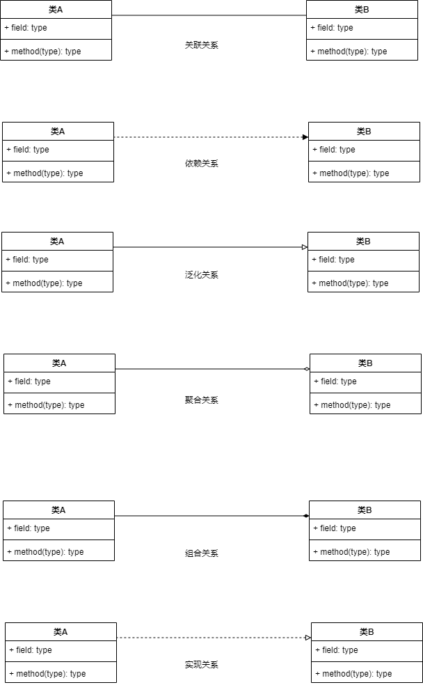
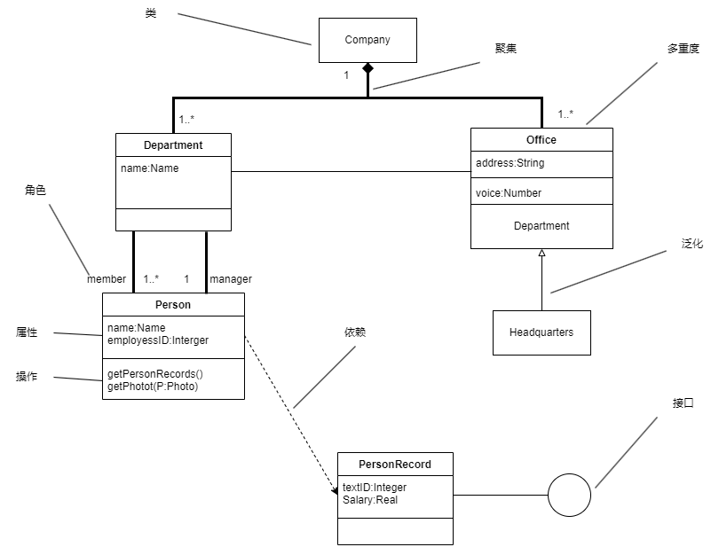
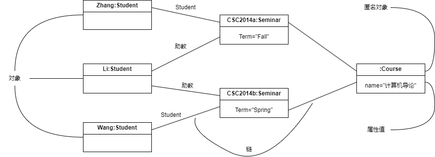
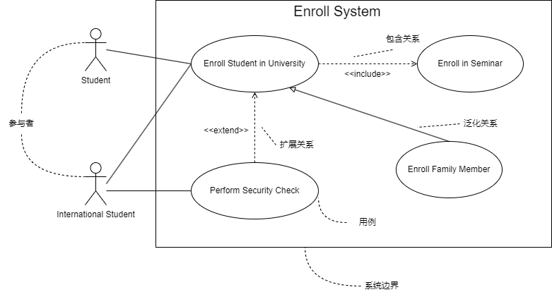

## 第9章 UML建模和设计模式
- 面向对象需求建模
	- 面向对象的需求建模主要建立用例模型和分析模型，具体过程如图所示：
	
- 面向对象设计
	- 面向对象的设计(Object-Oriented Design, OOD)是设计分析模型和实现相应源代码，设计问题域的解决方案，与技术相关。OOD同样应遵循抽象、信息隐藏、功能独立、模块化等设计准则。
	- 面向对象的分析模型主要由顶层架构图、用例与用例图、领域概念模型构成；
	- 面向对象的设计模型则包含
		- 以包图表示的软件体系结构图
		- 以交互图表示的用例实现图
		- 完整精确的类图
		- 针对复杂对象的状态图
		- 用以描述流程化处理过程的活动图
	- 面向对象的设计原则：
		- （1）**单一责任原则**。就一个类而言，应该仅有一个引起它变化的原因。即当需要修改某个类的时候原因有且只有一个，让一个类只做一种类型责任。
		- （2）**开放--封闭原则**。软件实体（类、模块、函数等）应该是可以扩展的，即开放的；但是不可修改的，即封闭的。
		- （3）**里氏替换原则**。子类型必须能够替换掉它们的基类型。即在任何父类可以出现的地方，都可以用子类的实例来赋值给父类型的引用。
		- （4）**依赖倒置原则**。抽象不应该依赖于细节，细节应该依赖于抽象。即高层模块不应该依赖于底层模块，二者都应该依赖于抽象。
		- （5）**接口分离原则**。不应该强迫客户依赖于它们不用的方法。接口属于客户，不属于它所在的类层次结构。即依赖大于抽象，不要依赖于具体，同事在抽象级别不应该有对于细节的依赖。这样的好处就在于可以最大限度地应对可能的变化。
		- （6）**重用发布等价原则**。重用的粒度就是发布的粒度。
		- （7）**共同封闭原则**。包中的所有类对于同一类性质的变化应该是共同封闭的。一个变化弱队一个包产生影响，则将对该报中的所有类产生影响，而对于其他的包不造成任何影响。
		- （8）**共同重用原则**。一个包中的所有类应该是共同重用的。如果重用了包中的一个类，就要重用包中的所有类。
		- （9）**无环依赖原则**。在包的依赖关系图中不允许存在环，即包之间的结构必须是一个直接的五环图形。
		- （10）**稳定依赖原则**。朝着稳定的方向进行依赖。
		- （11）**稳定抽象原则**。包的抽象程度应该和其他稳定程度一致。
- 面向对象的测试
	- 一般来说，对面向对象软件的测试可以分为下列四个层次进行。
		- （1）算法层。测试类中定义的每个方法，基本时相当于传统软件测试中的单元测试。
		- （2）类层。测试封装在同一个类中的所有方法与属性之间的相互作用。在面向对象软件中类是基本模块，因此可以认为这是面向对象测试中所特有的模块测试。
		- （3）模板层。测试一组协同工作的类之间的相互作用，大体上相当于传统软件测试中的集成测试，但是也有面向对象软件的特点（例如，对象之间通过发送消息相互作用）。
		- （4）系统层。把各个子系统组装成完整的面向对象软件系统，在组装过程中同时进行测试。
- UML（统一建模语言）
	- UML是一种可视化的建模语言，而非程序设计语言，支持从需求分析开始的软件开发的全过程。
	- 从总体上来看，UML的结构包括构造块、公共机制和规则三个部分。
		- **构造块**。UML有三种基本的构造块，分别是事物(thing)、关系(relationship)和图(diagram)。事物是UML的重要组成部分，关系把事物紧密联系在一起，图是多个相互关联的事物的集合。
		- **公共机制**。公共机制是指达到特点目标的公共UML方法。
		- **规则**。规则是构造块如何放在一起的规定。
	- 事务
		- **结构事务**：模型的静态部分，如类、接口、用例、构件等。
		- **行为事务**：模型的动态部分，如交互、活动、状态机。
		- **分组事务**：模型的组织部分，如包。
		- **注释事务**：模型的解释部分，依附一个元素或一组元素之上对其进行约束或解释的简单符号。
	- 关系
		- **依赖**：一个事务的语义依赖于另一个事务的语义的变化而变化。
		- **关联**：是一种结构关系，描述了一组链，链是对象之间的连接。分为组合和聚合，都是部分和整体的关系，其中组合事务之间的关系更强。两个类之间的关联，实际上是两个类所扮演角色的关联，因此，两个类之间可以有多个由不同角色标识的关联。
		- **泛化**：一般/特殊的关系，子类和父类之间的关系。
		- **实现**：一个类元指定了另一个类元保证执行的契约。
		
	- 图
		- （1）**类图**：静态图，为系统的静态设计视图，展现一组对象、接口、协作和它们之间的关系。
		
		- （2）**对象图**：静态图，展现某一时刻一组对象及它们之间的关系，为类图的某一快照。在没有类图的前提下，对象图就是静态设计视图。
		
		- （3）**用例图**：静态图，展现了一组用例、参与者以及它们之间的而关系。用例图中的参与者是人、硬件或其他系统可以扮演的角色；用例是参与者完成的一系列操作，用例之间的关系有扩展、包含、泛化。
		
		- （4）**序列图**：即顺序图，动态图，是场景的图形化表示，描述了以时间顺序组织的对象之间的交互活动。有同步消息（进行阻塞调用，调用者中止执行，等待控制权返回，需要等待返回消息，用实心三角箭头表示）、异步消息（发出消息后继续执行，不引起调用者阻塞，也不等待返回消息，用空心箭头表示）、返回消息（由从右到左的虚线箭头表示）三种。
		- （5）**通信图**：动态图，即协作图，强调参加交互的对象的组织。
		- （6）**状态图**：动态图，展现了一个状态机，描述单个对象在多个用例中的行为，包括简单状态和组合状态。转换可以通过事件触发器出发，事件出发后相应的监护条件会进行检查。状态图中的转换和状态是两个独立的概念。
		- （7）**活动图**：动态图，是一种特殊的状态图，展现了在系统内从一个活动到另一个活动的流程。活动的分岔和汇合线是一条水平粗线。每个分岔的分支数代表了可同时运行的线程数。活动图中能够并行执行的是在一个分岔粗线下的分支上的活动。
		- （8）**构件图（组件图）**：静态图，为系统静态实现视图，展现了一组构件之间的组织和依赖。
		- （9）**部署图**：静态图，为系统静态部署视图，部署图物理模块的节点分布。它与构件图相关，通常一个节点包括一个或多个构件。期以来关系类似于包依赖，因此部署组件之间的依赖是单向的，类似于包含关系。
	- UML 4+1 视图
		- （1）**逻辑视图**。逻辑视图也称为设计视图，它表示了设计模型中在架构方面具有重要意义的部分，即类、子系统、包和用例实现的子集。
		- （2）**进程视图**。进程视图是可执行线程和进程作为活动类的建模，它是逻辑视图中的一次执行实例，描述了并发与同步结构。
		- （3）**实现视图**：实现视图对组成基于系统的物理代码的文件和构件进行建模。
		- （4）**部署视图**。部署视图把构件部署到一组物理节点上，表示软件到硬件的映像和分布结构。
		- （5）**用例视图**。用例视图是最基本的需求分析模型。
- 设计模式
	- 层次结构
		- 架构模式：软件设计中的高层决策，例如C/S结构就属于架构模式，架构模式反映了开发软件系统过程中所作的基本设计决策。
		- 设计模式：每一个设计模式描述了一个在我们周围不断重复发生的问题，以及该问题的解决方案的核心。
		- 惯用法：是最低层的模式，关注软件系统的设计与实现，实现时通过某种特定的程序设计语言来描述构件与构件之间的关系。每种编程语言都有它自己特定的模式，即语言的惯用法。例如引用--计数就是C++语言中的一种惯用法。
	- 设计模式分类
		- 按设计模式的目的划分，可分为三类
			- 创建型模式（主要是处理创建对象）
			- 结构型模式（主要是处理类和对象的组合）
			- 行为型模式（主要是描述类或者对象的交互行为）
		- 按设计模式的范围划分，即根据设计模式是作用域类还是作用于对象来划分，可以把设计模式分为类设计模式和对象设计模式。
	- 设计模式总图