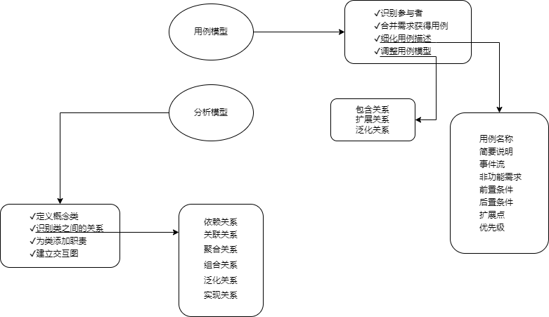

## 第9章 UML建模和设计模式
- 面向对象需求建模
	- 面向对象的需求建模主要建立用例模型和分析模型，具体过程如图所示：
	
- 面向对象设计
	- 面向对象的设计(Object-Oriented Design, OOD)是设计分析模型和实现相应源代码，设计问题域的解决方案，与技术相关。OOD同样应遵循抽象、信息隐藏、功能独立、模块化等设计准则。
	- 面向对象的分析模型主要由顶层架构图、用例与用例图、领域概念模型构成；
	- 面向对象的设计模型则包含
		- 以包图表示的软件体系结构图
		- 以交互图表示的用例实现图
		- 完整精确的类图
		- 针对复杂对象的状态图
		- 用以描述流程化处理过程的活动图