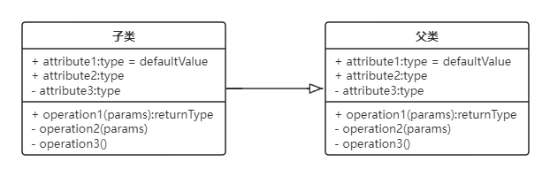
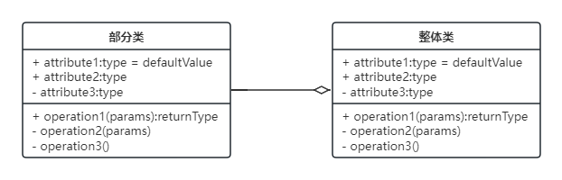
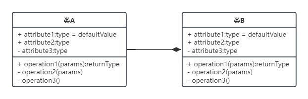
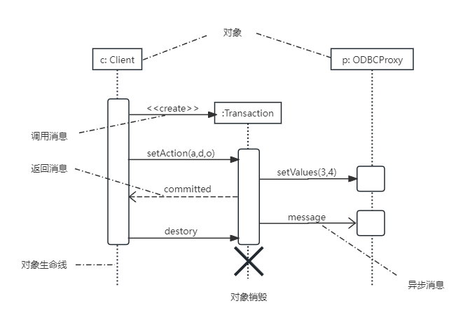
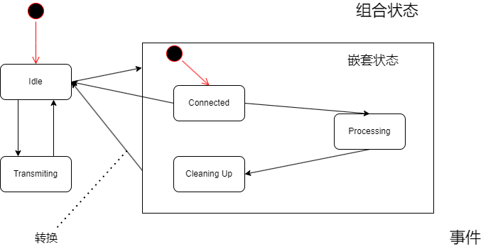
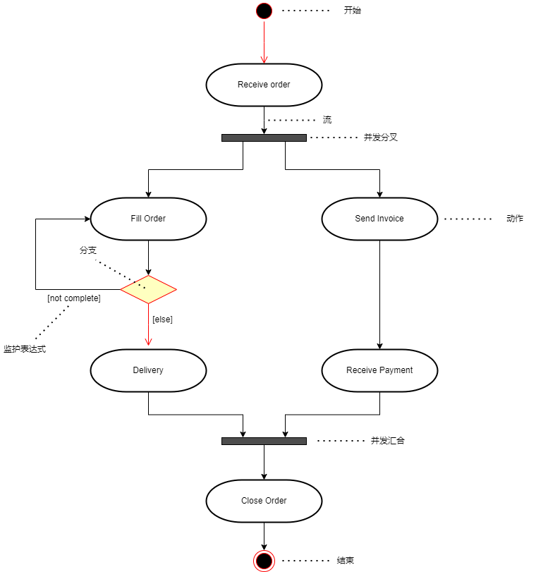
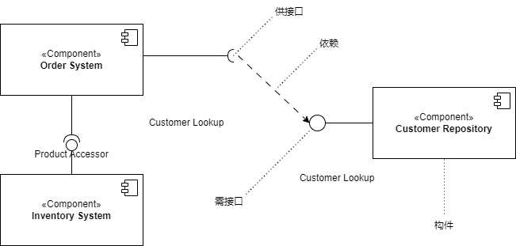
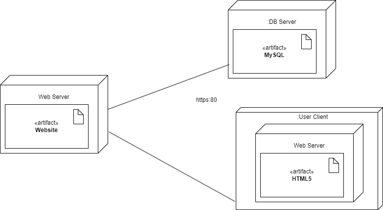

## 第9章 UML建模和设计模式
- 面向对象的分析是为了确定问题域，理解问题。
	- 包含5个活动：
		- 认定对象
		- 组织对象
		- 描述对象间的相互作用
		- 确定对象的的操作
		- 定义对象的内部信息。
- 面向对象需求建模
	- 面向对象的需求建模主要建立用例模型和分析模型，具体过程如图所示：
	
- 面向对象设计
	- 面向对象的设计(Object-Oriented Design, OOD)是设计分析模型和实现相应源代码，设计问题域的解决方案，与技术相关。OOD同样应遵循抽象、信息隐藏、功能独立、模块化等设计准则。
	- 面向对象的分析模型主要由顶层架构图、用例与用例图、领域概念模型构成；
	- 面向对象的设计模型则包含
		- 以包图表示的软件体系结构图
		- 以交互图表示的用例实现图
		- 完整精确的类图
		- 针对复杂对象的状态图
		- 用以描述流程化处理过程的活动图
	- 面向对象的设计原则：
		- （1）**单一责任原则**。就一个类而言，应该仅有一个引起它变化的原因。即当需要修改某个类的时候原因有且只有一个，让一个类只做一种类型责任。
		- （2）**开放--封闭原则**。软件实体（类、模块、函数等）应该是可以扩展的，即开放的；但是不可修改的，即封闭的。
		- （3）**里氏替换原则**。子类型必须能够替换掉它们的基类型。即在任何父类可以出现的地方，都可以用子类的实例来赋值给父类型的引用。
		- （4）**依赖倒置原则**。抽象不应该依赖于细节，细节应该依赖于抽象。即高层模块不应该依赖于底层模块，二者都应该依赖于抽象。
		- （5）**接口分离原则**。不应该强迫客户依赖于它们不用的方法。接口属于客户，不属于它所在的类层次结构。即依赖大于抽象，不要依赖于具体，同事在抽象级别不应该有对于细节的依赖。这样的好处就在于可以最大限度地应对可能的变化。
		- （6）**重用发布等价原则**。重用的粒度就是发布的粒度。
		- （7）**共同封闭原则**。包中的所有类对于同一类性质的变化应该是共同封闭的。一个变化弱队一个包产生影响，则将对该报中的所有类产生影响，而对于其他的包不造成任何影响。
		- （8）**共同重用原则**。一个包中的所有类应该是共同重用的。如果重用了包中的一个类，就要重用包中的所有类。
		- （9）**无环依赖原则**。在包的依赖关系图中不允许存在环，即包之间的结构必须是一个直接的五环图形。
		- （10）**稳定依赖原则**。朝着稳定的方向进行依赖。
		- （11）**稳定抽象原则**。包的抽象程度应该和其他稳定程度一致。
- 面向对象的测试
	- 一般来说，对面向对象软件的测试可以分为下列四个层次进行。
		- （1）算法层。测试类中定义的每个方法，基本时相当于传统软件测试中的单元测试。
		- （2）类层。测试封装在同一个类中的所有方法与属性之间的相互作用。在面向对象软件中类是基本模块，因此可以认为这是面向对象测试中所特有的模块测试。
		- （3）模板层。测试一组协同工作的类之间的相互作用，大体上相当于传统软件测试中的集成测试，但是也有面向对象软件的特点（例如，对象之间通过发送消息相互作用）。
		- （4）系统层。把各个子系统组装成完整的面向对象软件系统，在组装过程中同时进行测试。
- UML（统一建模语言）
	- UML是一种可视化的建模语言，而非程序设计语言，支持从需求分析开始的软件开发的全过程。
	- 从总体上来看，UML的结构包括构造块、公共机制和规则三个部分。
		- **构造块**。UML有三种基本的构造块，分别是事物(thing)、关系(relationship)和图(diagram)。事物是UML的重要组成部分，关系把事物紧密联系在一起，图是多个相互关联的事物的集合。
		- **公共机制**。公共机制是指达到特点目标的公共UML方法。
		- **规则**。规则是构造块如何放在一起的规定。
	- 事务
		- **结构事务**：模型的静态部分，如类、接口、用例、构件等。
		- **行为事务**：模型的动态部分，如交互、活动、状态机。
		- **分组事务**：模型的组织部分，如包。
		- **注释事务**：模型的解释部分，依附一个元素或一组元素之上对其进行约束或解释的简单符号。
	- 关系
		- 关联关系：是一种结构关系，描述了一组链，链是对象之间的连接。分为组合和聚合，都是部分和整体的关系，其中组合事务之间的关系更强。两个类之间的关联，实际上是两个类所扮演角色的关联，因此，两个类之间可以有多个由不同角色标识的关联。
			
			
		- 依赖关系：一个事务的语义依赖于另一个事务的语义的变化而变化。
		
			
		- 泛化关系：一般/特殊的关系，子类和父类之间的关系。
		
			
		- 聚合关系
		
			
		- 组合关系
		
			
		- 实现关系：一个类元指定了另一个类元保证执行的契约。
	
		

	- 图
		- （1）**类图**：静态图，为系统的静态设计视图，展现一组对象、接口、协作和它们之间的关系。
		
		- （2）**对象图**：静态图，展现某一时刻一组对象及它们之间的关系，为类图的某一快照。在没有类图的前提下，对象图就是静态设计视图。
		
		- （3）**用例图**：静态图，展现了一组用例、参与者以及它们之间的而关系。用例图中的参与者是人、硬件或其他系统可以扮演的角色；用例是参与者完成的一系列操作，用例之间的关系有扩展、包含、泛化。
		
		- （4）**序列图**：即顺序图，动态图，是场景的图形化表示，描述了以时间顺序组织的对象之间的交互活动。有同步消息（进行阻塞调用，调用者中止执行，等待控制权返回，需要等待返回消息，用实心三角箭头表示）、异步消息（发出消息后继续执行，不引起调用者阻塞，也不等待返回消息，用空心箭头表示）、返回消息（由从右到左的虚线箭头表示）三种。
		
		- （5）**通信图**：动态图，即协作图，强调参加交互的对象的组织。
		
		- （6）**状态图**：动态图，展现了一个状态机，描述单个对象在多个用例中的行为，包括简单状态和组合状态。转换可以通过事件触发器出发，事件出发后相应的监护条件会进行检查。状态图中的转换和状态是两个独立的概念。
		
		- （7）**活动图**：动态图，是一种特殊的状态图，展现了在系统内从一个活动到另一个活动的流程。活动的分岔和汇合线是一条水平粗线。每个分岔的分支数代表了可同时运行的线程数。活动图中能够并行执行的是在一个分岔粗线下的分支上的活动。
		
		- （8）**构件图（组件图）**：静态图，为系统静态实现视图，展现了一组构件之间的组织和依赖。
		
		- （9）**部署图**：静态图，为系统静态部署视图，部署图物理模块的节点分布。它与构件图相关，通常一个节点包括一个或多个构件。期以来关系类似于包依赖，因此部署组件之间的依赖是单向的，类似于包含关系。
		
	- UML 4+1 视图
		- （1）**逻辑视图**。逻辑视图也称为设计视图，它表示了设计模型中在架构方面具有重要意义的部分，即类、子系统、包和用例实现的子集。
		- （2）**进程视图**。进程视图是可执行线程和进程作为活动类的建模，它是逻辑视图中的一次执行实例，描述了并发与同步结构。
		- （3）**实现视图**：实现视图对组成基于系统的物理代码的文件和构件进行建模。
		- （4）**部署视图**。部署视图把构件部署到一组物理节点上，表示软件到硬件的映像和分布结构。
		- （5）**用例视图**。用例视图是最基本的需求分析模型。
- 设计模式
	- 层次结构
		- 架构模式：软件设计中的高层决策，例如C/S结构就属于架构模式，架构模式反映了开发软件系统过程中所作的基本设计决策。
		- 设计模式：每一个设计模式描述了一个在我们周围不断重复发生的问题，以及该问题的解决方案的核心。
		- 惯用法：是最低层的模式，关注软件系统的设计与实现，实现时通过某种特定的程序设计语言来描述构件与构件之间的关系。每种编程语言都有它自己特定的模式，即语言的惯用法。例如引用--计数就是C++语言中的一种惯用法。
	- 设计模式分类
		- 按设计模式的目的划分，可分为三类
			- 创建型模式（主要是处理创建对象）
			- 结构型模式（主要是处理类和对象的组合）
			- 行为型模式（主要是描述类或者对象的交互行为）
		- 按设计模式的范围划分，即根据设计模式是作用域类还是作用于对象来划分，可以把设计模式分为类设计模式和对象设计模式。
	- 创建型设计模式
		<table>
			<tr>
				<th>创建型设计模式</th>
				<th>定义</th>
				<th>记忆关键字</th>
			</tr>
			<tr>
				<td>Abstract Factory抽象工厂模式</td>
				<td>提供一个接口，可以创建一系列相关或相互依赖的对象，而无须指定它们具体的类</td>
				<td>抽象接口</td>
			</tr>
			<tr>
				<td>Builder 构建器模式</td>
				<td>将一个复杂类的表示与其构造相分离，使得相同的构建过程能够得出不同的表示。</td>
				<td>类和构造分离</td>
			</tr>
			<tr>
				<td>Factory Method 工厂方法模式</td>
				<td>定义一个创建对象的接口，但由子类决定需要实例化哪一个类。使得子类实例化推迟。</td>
				<td>子类决定实例化</td>
			</tr>
			<tr>
				<td>Prototype 原型模式</td>
				<td>用原型实例指定创建对象的类型，并且通过拷贝这个原型来创建新的对象。</td>
				<td>原型实例，拷贝</td>
			</tr>
			<tr>
				<td>Singleton 单例模式</td>
				<td>保证一个类只有一个实例，并提供一个访问它的全局访问点。</td>
				<td>唯一实例</td>
			</tr>
		</table>
	- 结构型设计模式
		<table>
		<tr>
			<th>结构型设计模式</th>
			<th>定义</th>
			<th>记忆关键字</th>
		</tr>
		<tr>
			<td>Adapter 适配器模式</td>
			<td>将一个类的接口转换成用户希望得到的另一种接口。它使原本不相容的接口得以协同工作。</td>
			<td>转换，兼容接口</td>
		</tr>
		<tr>
			<td>Bridge 桥接模式</td>
			<td>将类的抽象部分和它的实现部分分离开来，使它们可以独立地变化</td>
			<td>抽象和实现分离</td>
		</tr>
		<tr>
			<td>Composite 组合模式</td>
			<td>将对象组合成树型结构以表示“整体-部分”的层次结构，使得用户对单个对象和组合对象的使用具有一致性。</td>
			<td>整体-部分，树型结构</td>
		</tr>
		<tr>
			<td>Decorator 装饰模式</td>
			<td>动态地给一个对象添加一些额外的职责。它提供了用子类扩展功能的一个灵活替代，比派生一个子类更加灵活。</td>
			<td>附加职责</td>
		</tr>
		<tr>
			<td>Facade 外观模式</td>
			<td>定义一个高层接口，为子系统中的一组接口提供一个一致的外观，从而简化了该子系统的使用</td>
			<td>对外统一接口</td>
		</tr>
		<tr>
			<td>Flyweight 享元模式</td>
			<td>提供支持大量细粒度对象共享的有效方法</td>
			<td>细粒度，共享</td>
		</tr>
		<tr>
			<td>Proxy 代理模式</td>
			<td>为其他对象提供一种代理以控制这个对象的访问</td>
			<td>代理控制</td>
		</tr>
	</table>
	- 行为型设计模式
		<table>
		<tr>
			<th>行为型设计模式</th>
			<th>定义</th>
			<th>记忆关键字</th>
		</tr>
		<tr>
			<td>Chain of Responsibility 职责链模式</td>
			<td>通过给多个对象处理请求的机会，减少请求的发送者与接收者之间的耦合，将接受对象链接起来，在链中传递请求，直到有一个对象处理这个请求。</td>
			<td>传递请求、职责、链接</td>
		</tr>
		<tr>
			<td>Command 命令模式</td>
			<td>将一个请求封装为一个对象，从而可用不同的请求对客户进行参数化，将请求排队或记录请求日志，支持可撤销的操作</td>
			<td>日志记录、可撤销</td>
		</tr>
		<tr>
			<td>Interpreter 解释器模式</td>
			<td>给定一种语言，定义它的文法表示，并定义一个解释器，该解释器用来根据文法表示来解释语言中的句子</td>
			<td>解释器，虚拟机</td>
		</tr>
		<tr>
			<td>Iterator 迭代器模式</td>
			<td>提供一种方法来顺序访问一个聚合对象中的各个元素而不需要暴露对该对象的内部表示</td>
			<td>顺序访问，不暴露内部</td>
		</tr>
		<tr>
			<td>Mediator 中介者模式</td>
			<td>用一个中介对象来封装一系列的对象交互。它使各对象不需要显式地相互调用，从而达到低耦合，还可以独立地改变对象间的交互</td>
			<td>不直接引用</td>
		</tr>
		<tr>
			<td>Memento 备忘录模式</td>
			<td>在不破坏封装性的前提下，捕获一个对象的内部状态，并在该对象之外保存这个状态，从而可以在以后将该对象恢复到原先保存的状态。</td>
			<td>保存、恢复</td>
		</tr>
		<tr>
			<td>Observer 观察者模式</td>
			<td>定义对象间一种一对多的依赖关系，当一个对象的状态发生改变时，所有的依赖于它的对象都得到通知并自动更新</td>
			<td>通知、自动更新</td>
		</tr>
		<tr>
			<td>State 状态模式</td>
			<td>允许一个对象在其内部状态改变时改变它的行为</td>
			<td>状态变成类</td>
		</tr>
		<tr>
			<td>Strategy 策略模式</td>
			<td>定义一系列算法，把它们一个个封装起来，并且使他们之间可互相替换，从而让算法可独立于使用它的用户而变化</td>
			<td>算法替换</td>
		</tr>
		<tr>
			<td>Template Method 模板方法模式</td>
			<td>定义一个操作中的算法骨架，而将一些步骤延迟到子类中，使得子类可以不改变一个算法的结构即可重新定义算法的某些特定步骤</td>
			<td>定义算法骨架，然后再细化</td>
		</tr>
		<tr>
			<td>Visitor访问者模式</td>
			<td>表示一个作用于某对象结构中的各元素的操作，使得在不改变各元素的类的前提下定义作用于这些元素的新操作</td>
			<td>数据和操作分离</td>
		</tr>
	</table>