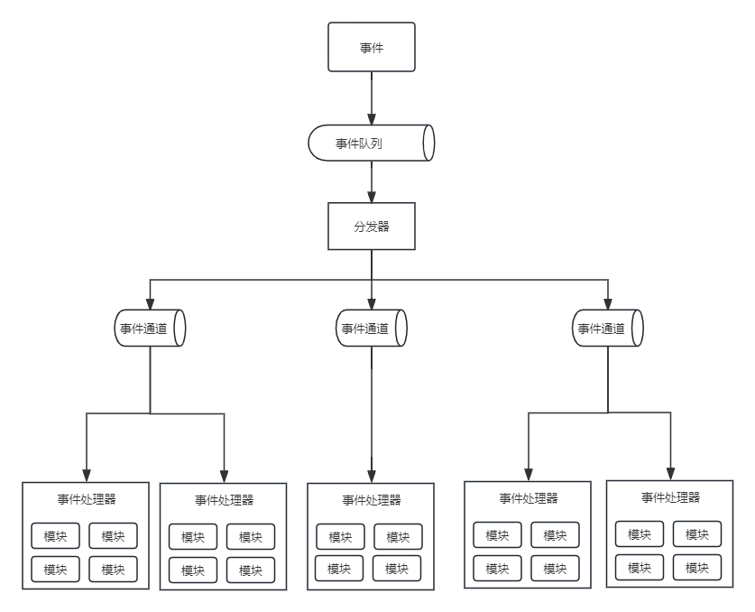

## 第1章 绪论
#### 1.1 系统架构概述
- 1.1.1 系统架构的定义及发展历程
	- 系统架构是系统的一种整体的高层次的机构表示，是系统的骨架和根基，也决定了系统的健壮性和生命周期的长短。
	- **架构**是体现在**组件**中的一个系统的基本组织、它们彼此的**关系**与**环境**的关机及指导他的设计和发展的**原则**。
	- **系统**是组织起来完成某一特定功能或一组功能的组件集。系统这个术语包括了单独的应用程序、传统意义上的系统、子系统、系统之系统。产品线、整个企业及感兴趣的其他集合。系统用于完成其环境中的一个或多个任务。
	- **环境**或者上下文决定了对这个系统开发、运作、政策以及会对系统造成的其他影响的环境和设置。
	- **任务**是一个或多个利益相关者通过系统达到一些目标的系统的一个用途或操作。
	- 通俗地说。系统架构是系统的一种整体的高层次的结构表示，是系统的骨架和根基，支撑和链接各个部分，包括组件、连接件、约束规范以及指导这些内容涉及与演化的原理，它是刻画系统整体抽象结构的一种手段。
	- 系统架构涉及的目的是对需要开发的系统进行一系列相关的抽象，用于指导系统各个方面的设计与实现，架构设计在系统开发过程中起着关键性作用，架构涉及的优劣决定了系统的健壮性和生命周期的长短。
	- 架构设计的作用主要包括以下几点：
		- 解决相对复杂的需求分析问题；
		- 解决非功能属性在系统占据重要位置的设计问题；
		- 解决声明周期长、扩展性要求高的系统整体结构问题；
		- 解决系统基于组件需要的吉成问题；
		- 解决业务流程再造难的问题。
	- 基于模块化思想，业界提出了面向对象服务架构（Service-Oriented Architecture，SOA）思想，它提供一组基于标准的方法和技术，通过有效整合和重用现有的应用系统和各种咨询实现服务组件化，并基于服务组件实现各种新业务应用的快速组装，帮助企业更好地应用业务的灵活性要求。
	- 随着基础软件架构理论的建立，与之相关的一些研究方向逐渐成为软件工程领域的研究重点，主要包括：
		- 软件架构描述与表示
		- 软件架构分析
		- 设计与测试
		- 软件架构发现
		- 演化与重用
		- 基于软件架构开发方法
		- 软件架构风格
		- 动态软件架构
	- 架构分析的内容可分为结构分析、功能分析和非功能分析。分析的目的是系统被实际构造之前预测其质量属性。
	- 架构分析常用的方法有：
		- 软件架构分析方法SAAM
		- 架构权衡分析法ATAM
		- 成本效益分析法CBAM
		- 基于场景的架构再工程SBAR
		- 架构层次的软件可维护性预测ALPSM
		- 软件架构评估模型SAEM等。
	- 架构设计是指生成一个满足用户需求的软件架构过程。架构设计常用的方法有：
		- 从工件描述中提取架构描述的工件驱动（artifact-driven）方法
		- 从用例导出机构抽象的用例驱动(case-driven)方法
		- 从模式导出架构抽象的模式驱动(pattern-driven)方法
		- 从领域模型导出架构抽象的域驱动(domain-driven)方法
		- 从设计过程中获得架构质量属性要求的属性驱动设计(attribute-driven design)方法
	- 通常软件开发模型可分为三种：
		- 以软件需求完全确认为前提的**瀑布模型**
		- 在软件开发初期只能提供基本需求为前提的**渐进式开发模型**（如**螺旋模型**等）
		- 以形式化开发方法为基础的**变换模型**
	- 通常，将软件架构风格分成主要五类（David Garland和Mary Shaw划分方式）
		- 数据流风格
		- 调用/返回风格
		- 独立组件风格
		- 虚拟机风格
		- 仓库风格
	- 软件架构是软件声明周期中的重要产物，它影响软件开发的各个阶段
		- 需求阶段：把软件架构有的概念引入需求分析阶段，有助于保证需求规约和系统设计之间的可追踪性和一致性。
		- 设计阶段：设计阶段是软件架构研究关注最早、最多的阶段，这一阶段的软件架构主要包括软件架构的描述、软件架构模型的设计与分析以及对软件架构设计经验的总结与复用等。
		- 实现阶段：将设计阶段设计的算法及数据类型用程序设计语言进行表示，满足设计、架构和需求分析的要求，从而得到满足设计需求的目标系统。
		- 维护阶段：为了保证软件具有良好的维护性，在软件架构中针对维护性目标进行分析时，需要对一些有关维护性的属性（如可扩展性、可替换性）进行规定，当架构经过一定的开发过程实现和形成软件系统时，这些属性也相应地反映了软件的维护性。
- 1.1.2 软件架构的常用分类及建模方法
	- 比较典型的架构模型包括
		- 分层架构(Layered Architecture)
			- 最常见的软件架构，也是事实上的标准架构。这种架构将软件分为若干个水平层，每一层都有清晰的角色和分工，不需要知道其他层的细节。层与层之间通过接口通信。
			- 最常见的四层结构
				- 表现层(Presentation Layer):用户界面，负责视觉和用户互动;
				- 业务层(Business Layer):实现业务逻辑；
				- 持久层(Persistence Layer):提供数据，SQL语句就放在这一层；
				- 数据库(Database Layer):保存数据。
		- 事件驱动架构(Event-driven Architecture)
			- 事件(Event)是状态发生变化时软件发出的通知。事件驱动架构(Event-drivent Architecture)是通过事件进行通信的软件架构。
			
			- 它分为四个部分：
				- 事件队列(Event Queue):接收事件的入口；
				- 分发器(Event Queue):将不同的事件分发到不同的业务逻辑单元；
				- 事件通道(Event Channel):分发器与处理器之间的联系渠道；
				- 事件处理器(Event Processor):实现业务逻辑，处理完成后会发出事件，触发下一步操作。
		- 微核架构(Microkernel Architecture)
			- 又称为插件架构(Plug-in Architecture)，是指软件的内核相对较小，主要功能和业务逻辑都是通过插件实现。
			- 内核(Core)通常只包含系统运行的最小功能。
			- 插件则是互相独立的，插件之间的通信应该减少到最低，避免出现互相依赖的问题。
		- 微服务架构(Microservices Architectire)
			- 是服务导向架构(Service-Oriented Architecture,SOA)的升级、
			- 每个服务就是一个独立的部署单元(Separately Deployed Unit)。这些单元都是分布式的，互相解耦，通过远程通信协议(比如REST、SOAP)联系。
			- 微服务架构分成三种实现模式
				- RESTful API模式：服务通过API提供，云服务就属于这一类；
				- RESTful应用模式：服务通过传统的网络协议或者应用协议提供，背后通常是一个多功能的应用程序，常见于企业内部。
				- 集中消息模式：采用消息代理(Message Broker)可以实现消息队列、负载均衡、统一日志和异常处理，确定是会出现单点失败，消息代理可能要做成集群。
		- 云架构(Cloud Architecture)
			- 主要解决扩展性和并发的问题，是最容易扩展的架构。
			- 它的高扩展性体现在将数据都复制到内存中，变成可复制的内存数据单元，然后将业务处理能力封装成一个个处理单元(Processing Unit)。若访问量增加，就新建处理单元；若访问量减少，就关闭处理单元。由于没有中央数据库，所以扩展性的最大瓶颈消失了。由于每个处理单元的数据都在内存里，需要进行数据持久化。
			- 云架构主要分成两部分：
				- 处理单元(Processing Unit):实现业务逻辑。
				- 虚拟中间件(Virtualized Middleware):负责通信、保持会话控制(sessions)、数据复制、分布式处理和处理单元的部署。
					- 消息中间件(Messaging Grid):管理用户请求和会话控制(sessions)，当一个请求进来后，它决定分配给哪一个处理单元。
					- 数据中间件(Data Frid):将数据复制到每一个处理单元，即数据同步。保证某个处理单元都得到同样的数据。
					- 处理中间件(Processing Grid):可选，如果一个请求涉及不同类型的处理单元，该中间件负责协调处理单元。
					- 部署中间件(Deployment Manager):负责处理单元的启动和关闭，监控负载和响应时间，当负责增加，就新启动柜处理单元，负载减少没救关闭处理单元。
	- 软件架构的模型分为4种：
		- 结构模型：这是一个最直观、最普遍的建模方法。此方法以架构的构件、连接件和其他概念来刻画结构、并力图通过结构来反应系统的重要语义内容，包括系统的配置、约束、隐含的假设条件、风格和性质。研究架构模型的核心是架构描述语言。
		- 框架模型：框架模型与结构模型类似，但它不太侧重描述结构的细节，而更侧重整体的结构。框架模型主要以一些特殊的问题为目标建立只针对和适应问题的结构。
		- 动态模型：动态模型是对结构或框架模型的补充，主要研究系统的“大颗粒”行为的性质。例如描述系统的重新配置或演化。这里的动态可以是指系统总体结构的配置、建立或拆除统信或计算的过程，这类系统模型常是激励型的。
		- 过程模型：过程模型是研究构造系统的步骤和过程，其结构是遵循某些过程脚本的结果。
	- 上述介绍的4中模型并不是完全独立的，通过有机结合才可形成一个完整的模型来刻画软件架构，也将能更加准确、全面地反应软件架构。
	- “4+1”模型从5个不同的视角来描述软件架构
		- 逻辑(Logical)视角
		- 过程(Process)视角
		- 物理(Physical)视角
		- 开发(Development)视角
		- 场景(Scenarios)视角
	- 每一个视角只关系系统的一个侧面，5个视角结合在一起才能反映系统的软件架构的全部内容。
- 1.1.3 软件架构的应用场景
	- **管道-过滤器风格**适用于将系统分成若干独立的步骤；
	- **主程序/子系统和面向对象的架构风格**可用于对组件内部进行设计；
	- **虚拟机风格**经常用于构造解释器或专家系统；
	- **C/S和B/S风格**适合于数据和处理分布在一定范围，通过网络连接构成系统；
	- **平台/插件风格**适用于具有插件扩展功能的应用程序；
	- **MVC风格**被广泛地应用与用户交互程序的设计；
	- **SOA风格**应用在企业吉成等方面；
	- **C2风格**适用于GUI软件开发，用以构件灵活和可扩展的应用系统等。
	- 对于现代大型软件，很少使用单一的架构风格进行设计与开发，而是混合多种风格，从不同视角描述大型软件系统的能力，并可保证软件系统的可靠性、可扩展性、可维护性等非功能属性的正确描述。
- 1.1.4 软件架构的发展未来
#### 1.2 系统架构设计师概述
- 1.2.1 架构设计师的定义、职责和任务
	- 架构设计师是系统开发的主体角色，他们通过执行一系列活动来实施架构设计。
	- 架构设计通过生成过程形成最终的产品架构，架构设计师的成果是创建架构。
	- 架构设计师是负责系统架构的人、团队或组织。
	- 架构设计师是系统或产品线设计责任人，是一个负责理解和管理并最终确认和评估非功能行系统需求（如软件的可维护性、性能、复用性、可靠性、有效性和可测试性等），给出开发规范，搭建系统实现的核心架构，对整个软件架构、关键构建和接口进行总体设计并澄清关键技术细节的高级技术人员。
	- 架构师的职责应该是技术领导，这意味着架构设计师除了拥有专门技能外，还必须拥有领导能力。
	- 架构设计师的任务与组成
		- （1）领导与协调整个项目中的技术活动（分析、设计和实施等）。
		- （2）推动主要的技术决策并最终表达为系统架构。
		- （3）确定系统架构，并促使其架构设计的文档化，这里的文档化应包括需求、设计、实施和部署等“视图”。
- 1.2.2 架构设计师应具备的专业素质
	- 1.掌握业务领域知识
	- 2.掌握技术知识
	- 3.掌握设计技能
	- 4.具备编程技能
	- 5.具备沟通能力
	- 6.具备决策能力
	- 7.知道组织策略
	- 8.应是谈判专家
- 1.2.3 架构设计师的知识结构
	- 1.战略规划能力
	- 2.业务流程建模能力
	- 3.信息数据架构能力
	- 4.技术架构设计和实现能力
	- 5.应用系统架构的解决和实现能力
	- 6.基础IT知识及基础设施、资源调配的能力
	- 7.信息安全技术支持与管理保证能力。
	- 8.IT审计、治理与基本需求的分析和获取能力。
	- 9.面向软件系统可靠性与系统生命周期的质量保障服务能力。
	- 10.对新技术与新概念的理解、掌握和分析能力。
#### 1.3 如何成为一名好的系统架构设计师
- 1.3.1 如何衡量一名优秀架构设计师
	- 1.作为技术领导者
	- 2.作为开发人员
	- 3.聚焦系统
	- 4.具备企业家思维
	- 5.权衡策略思维与战术思维
	- 6.良好的沟通
- 1.3.2 从工程师到系统架构设计师的演化