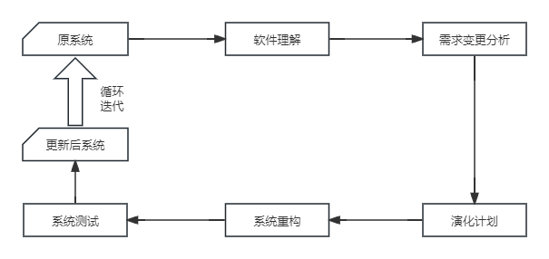
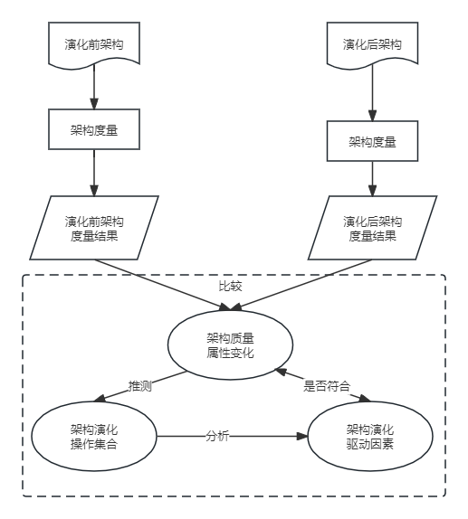

## 第10章 软件架构的演化和维护
#### 10.1 软件架构演化和定义的关系
- 本质上讲，软件架构的演化就是软件整体结构的演化，演化过程涵盖软件架构的全生命周期，包括软件架构需求的获取、软件架构建模、软件架构文档、软件架构实现以及软件架构维护等阶段。
#### 10.2 面向对象软件架构演化过程
- 对象演化
- 消息演化
- 复合片段演化
- 约束演化
#### 10.3 软件架构演化方式的分类
- 针对软件架构的演化过程是否处于系统运行时期，可以将软件架构演化分为
	- 静态演化(Static Evolution)
	- 动态演化(Dynamic Evolution)
- 软件架构静态演化
	- 软件的静态演化是系统停止运行期间的修改和更新，即一般意义上的软件修复和升级。
	- 软件的静态演化一般包括如下5个步骤
		- 软件理解：查阅软件文档，分析软件架构，识别系统组成元素及其之间的相互关系，提取系统的抽象表示形式。
		- 需求变更分析：静态演化往往是由于用户需求变化、系统运行出错和运行环境发生改变等原因所引起的，需要找出新的软件需求和原有的差异。
		- 演化计划：分析原系统，确定演化范围和成本，选择合适的演化计划。
		- 系统重构：根据演化计划对系统进行重构，使之适应当前的需求。
		- 系统测试：对演化后的系统进行测试，查找其中的错误和不足之处。
	- 静态演化过程模型
	
		
- 软件架构动态演化
	- 架构的动态演化主要来自两类需求
		- 软件内部执行所导致的体系结构改变
		- 软件系统外部的请求对软件进行的重配置
	- 软件的动态演化主要包括以下4个方面
		- 属性改名
		- 行为变化
		- 拓扑结构改变
		- 风格变化
	- 实现软件架构动态演化的技术主要有两种
		- 动态软件架构(Dynamic SOftware Architecture, DSA)
		- 进行动态重配置(Dynamic Reconfiguration, DR)
#### 10.4 软件架构演化原则
- 演化成本控制原则
- 进度可控原则
- 风险可控原则
- 主体维持原则
- 系统总体结构优化原则
- 平滑演化原则
- 目标一致原则
- 模块独立演化原则
- 影响可控原则
- 复杂性可控原则
- 有利于重构原则
- 有利于重用原则
- 设计原则遵从性原则
- 适应新技术原则
- 环境适应性原则
- 标准依从性原则
- 质量向好原则
- 适应新需求原则
#### 10.5 软件架构演化评估方法
- 演化过程未知时的架构演化评估过程示意图

	
#### 10.6 大型网站系统架构演化实例
- 第一阶段：单体架构
	- 只有一台服务器
- 第二阶段：垂直架构
	- 应用服务器
	- 数据库服务器
	- 文件服务器
- 第三阶段：使用缓存改善网站性能
	- 本地缓存
	- 专门的缓存服务器
- 第四阶段：使用服务集群改善网站并发处理能力
	- 负载均衡调度服务器
- 第五阶段：数据库读写分离
	- 配置两台数据库主从关系
- 第六阶段：使用反向代理和CDN加速网站响应
	- CDN部署在网络提供商的机房，使用户在请求网站服务时，可以从距离自己最近的网络提供商机房获取数据。
	- 反向代理则部署在网站的中心机房，当用户请求到达中心机房后，首先访问的服务器是反向代理服务器，如果反向代理服务器中缓存着用户请求的资源，就将其直接返回给用户。
- 第七阶段：使用分布式文件系统和分布式数据库系统
	- 分布式文件系统
	- 分布式数据库
- 第八阶段：使用NoSQL和搜索引擎
	- 非关系数据库技术如NoSQL
	- 非数据库查询技术如搜索引擎
	- 应用服务器则通过一个统一数据访问模块访问各种数据，减轻应用程序管理诸多数据源的麻烦。
- 第九阶段：业务拆分
	- 通过使用分而治之的手段将整个网站业务分成不同的产品线。
- 第十阶段：分布式服务
	- 通过分布式服务调用共用业务服务完成具体业务操作。
#### 10.7 软件架构维护
- 软件架构知识管理是对架构设计中所隐含的决策来源进行文档化表示，进而在架构维护过程中帮助维护人员对架构的修改进行完善的考虑，并能够为其他软件架构的相关活动提供参考。
- 在软件架构修改管理中，一个主要的做法就是建立一个隔离区域，保障该区域中任何修改对其他部分的影响比较小，甚至没有影响。为此，需要明确修改规则、修改类型，以及可能的影响范围和副作用等。