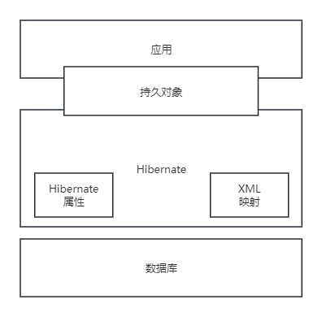

## 第13章 层次式架构设计理论与实践
#### 13.1 层次式体系结构概述
- 层次式体系结构设计是将系统组成一个层次结构，每一层为上层服务，并作为下层客户。
- 由于每一层最多只影响两层，同时只要给相邻层提供相同的接口，允许每层用不同的方法实现，同样为软件重用提供了强大的支持。
- 常用的层次式架构
	- 数据层
	- 中间层
	- 访问层
	- 数据层
#### 13.2 表现层框架设计
- MVC模式
- MVP模式
	- 在MVP中View并不直接使用Model，他们之间的通信是通过Presenter来进行的。
- MVVM模式
	- 模型--视图--视图模型(Model-View-ViewModel)
	- 在MVVM模式下View和Model不能直接通信，两者的通信只能通过ViewModel来实现。
#### 13.3 中间层架构设计
- 业务逻辑组件的实现类
- 业务逻辑组件的配置
#### 13、4 数据访问层设计
- 5中数据访问模式
	- 在线访问
	- DataAccess Object (DAO模式）
	- Data Transfer Object
	- 离线数据模式
	- 对象/关系映射
- Hibernate架构图
	
	
-  ACID原则
	-  原子性(Atomicity)
	-  一致性(Consistency)
	-  隔离性(Isolation)
	-  持久性(Durability)
#### 13.5 数据架构规划与设计
- XML数据库是一组XML文档的集合，并且是持久的和可操作的。
#### 13.6 物联网层次架构设计
- 感知层
	- 感知层用于识别物体、采集信息。
- 网络层
	- 网络层用于传递信息和处理信息。
- 应用层
	- 应用层解决的是信息处理和人机交互的问题。
#### 13.7 层次式架构案例分析