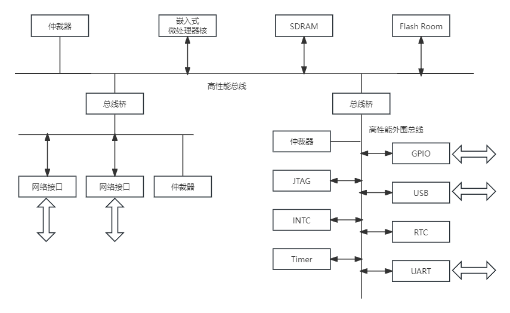
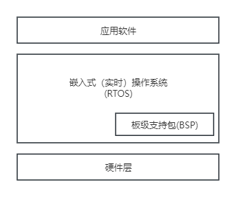
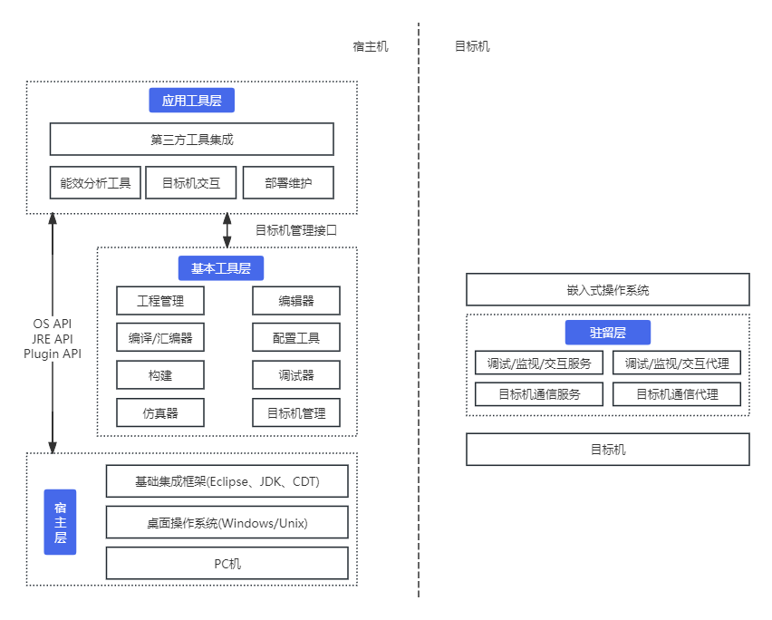
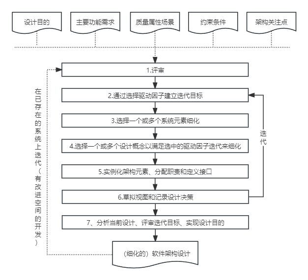

## 第16章 嵌入式系统架构设计理论与实践
#### 16.1 嵌入式系统概述
- 典型嵌入式系统硬件组成结构

- 简单的嵌入式软件架构

#### 16.2 嵌入式系统软件架构原理与特征
- 两种典型的嵌入式系统架构模式
	- 层次化模式架构
	- 递归模式架构
- 嵌入式操作系统与通用操作系统相比，具备以下主要特点：
	- 可裁剪性
	- 可移植性
	- 强实时性
	- 强紧凑性
	- 高质量代码
	- 强定制性
	- 标准接口
	- 强稳定性、弱交互性
	- 强确定性
	- 操作简洁、方便
	- 较强的硬件适应性
	- 可固化性
- 与传统数据库相比，嵌入式数据库系统有以下几个主要特点：
	- 嵌入式
	- 实时性
	- 移动性
	- 伸缩性
- 嵌入式数据库的分类
	- 基于内存的数据库系统
	- 基于文件的数据库系统
	- 基于网络的数据库系统
- 嵌入式数据库的主要功能
	- 足够高效的数据存储机制
	- 数据安全控制（锁机制）
	- 实时事物管理机制
	- 数据库恢复机制（历史数据存储）
- 嵌入式中间件具有以下共性特点
	- 通用性
	- 异构性
	- 分布性
	- 协议规范性
	- 接口标准化
	- 网络化
	- 支持流媒体应用，适应不断变化的访问流量和宽带约束
	- QoS质量品质
	- 适应性
- 基于Eclipse框架的嵌入式软件开发环境通用体系结构

#### 16.3 嵌入式系统软件架构设计方法
- 基于架构的软件设计开发方法的应用
	- 基于架构的软件设计（ABSD）方法强调由业务、质量和功能需求的组合驱动软件架构设计。
	- ABSD是一个自顶向下，递归细化的软件开发方法，它以系统功能的分解为基础，通过选择架构分割实现质量和业务需求，并强调在架构设计过程中使用软件架构模板。
- 属性驱动的软件设计方法
	- 属性驱动的软件设计(Attibute-Driven Design， ADD)是把一组质量属性场景作为输入，利用对质量属性实现与架构设计之间的关系的了解（如体系结构风格、质量战术等）对软件架构进行设计的一种方法。
	- ADD架构开发过程
	
	
- 实时系统设计方法
	- 实时系统设计方法(Design Approach for Real-Time System, DARTS)主要是将实时系统分解为多个并发任务，并定义这些任务之间的接口。
#### 16.4 嵌入式系统软件构架案例分析
- 鸿蒙操作系统架构具有4个技术特性
	- 分布式架构首次用于终端OS，实现跨终端无缝协同体验
	- 确定时延引擎和高性能IPC技术实现系统天生流畅
	- 基于微内核架构重塑终端设备可信安全
	- 通过统一IDE支撑一次开发，多端部署，实现跨终端生态共享
- 面向安全攸关系统的跨领域GENESYS系统架构案例分析
	- GENESYS架构的重要思想是分离计算与通信，将计算构件和通信设施作为独立构件进行设计。
- 物联网操作系统的主要特征包括
	- 内核尺寸伸缩性以及整体架构的可扩展性。
	- 内核的实时性。
	- 高可靠性。
	- 低功耗。