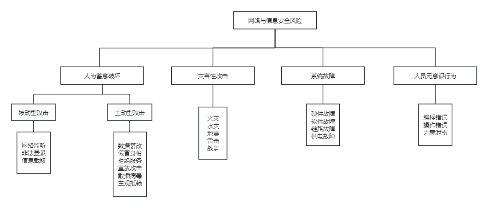

## 第18章 安全架构设计理论与实践
#### 18.1 安全架构概述
- 信息系统受到的安全威胁

- 三道安全防线
	- 产品安全架构
	- 安全技术体系架构
	- 审计架构
- 安全架构应具备可用性、完整性和机密性等特性。
	- 可用性(Availability)是指要防止系统的数据和资源丢失；
	- 完整性(Integrity)是指要防止系统的数据和资源在未经授权情况下被修改；
	- 机密性(Confidentiality)是指要防止系统的数据和资源在未授权的情况下被披露。
- 与信息安全相关的国内外标准及组织
	- 国内标准
		- GA：国家安全行业标准规范，由中国安全技术防范认证中心组织发布。
		- GB：国家标准规范，由中国国家标准化管理委员会组织发布。
		- GJB：国家军用标准规范。
	- 相关标准化组织
		- 国际标准化组织(ISO)
		- 国际电工委员会(IEC)
		- 中国国家标准化管理委员会(SAC)
		- 全国信息技术标准化技术委员
#### 18.2 安全模型
- 信息系统的安全目标是控制和管理主体（含用户和进程）对客体（含数据和程序）的访问。作为信息系统安全目标，就是要实现：
	- 保护信息系统的可用性；
	- 保护网络系统服务的连续性；
	- 防范资源的非法访问及非授权访问；
	- 防范入侵者的恶意攻击与破坏；
	- 保护信息通过网上传输过程中的机密性、完整性；
	- 防范病毒的侵害；
	- 实现安全管理。
- 状态机模型
	- 状态机模型描述了一种无论出于何种状态都是安全的系统。它是用状态语言将安全系统描述成抽象的状态机，用状态变量标书系统的状态，用转换规则描述变量变化的过程。
- Bell-LaPadula模型
	- 该模型属于强制访问控制模型，以敏感度来划分安全级别。将数据划分为多安全级别与敏感度的系统，即多级安全系统。
- Biba模型
	- Biba模型的安全策略是基于层次化的完整性级别。它将完整性威胁分为来源于子系统内部和外部的威胁。
- Clark-Wilson模型
	- 简称为CWM，这个模型实现了成型的事务处理机制，常用语银行系统中以保证数据完整性。
- Chinese Wall模型
	- 又名Brew and Nash模型
	- 是应用在多边安全系统中的安全模型。也就是说，是指通过行规定和划分、内部监控、IT系统等手段防止各部门之间出现有损客户利益的利益冲突事件。
#### 18.3 系统安全体系架构规划框架
- 信息系统安全规划依托企业信息化战略规划
- 信息系统安全规划需要围绕技术安全、管理安全、组织安全考虑
- 信息系统安全规划以信息系统与信息资源的安全保护为核心
#### 18.4 信息安全整体架构设计（WPDRRC模型）
- WPDRRC模型有6个环节和3大要素
	- 6个环节：预警、保护、监测、响应、恢复和反击。
	- 3大要素包括：人员、策略和技术。
#### 18.5 网络安全体系架构设计
- OSI开放系统互联安全体系的5类安全服务包括
	- 鉴别
	- 访问控制
	- 数据机密性
	- 数据完整性
	- 抗抵赖性
#### 18.6 数据库系统的安全设计
- 数据库完整性设计原则
	- (1)根据数据库的完整性约束的类型确定其实现的系统层次和方式，并提前考虑对系统性能的影响。一般情况下，静态约束应尽量包含在数据库模式中，而动态约束由应用程序实现。
	- (2)实体完整性约束、引用完整性约束是关系数据库最重要的完整性约束，在不影响系统关键性能的前提下需要尽量应用。用一定的时间和空天来换取系统的易用性是值得的。
	- (3)要慎用目前主流DBMS都支持的触发器功能，一方面由于触发器的性能开销较大；另一方面，触发器的多级触发难以控制，容易发生错误，非用不可时，最好使用Before型语句级触发器。
	- (4)在需求分析阶段就必须制定完整性约束的命名规范，尽量使用有意义的英文单词、缩写词、表名、列名以及下划线等组合，使其易于识别和记忆。
	- (5)要根据业务规则对数据库完整性进行细致的测试，以尽早排除隐含的完整性约束间的冲突和对性能的影响。
	- (6)要有专职的数据库设计小组，自始至终负责数据的分析、设计、测试、实施及早期维护。
	- (7)应采用合适的CASE工具来降低数据库设计各阶段的工作量。
#### 18.7 系统架构的脆弱性分析
- 软件脆弱性分析可从三个方面考虑
	- 分析软件故障现象，分析故障的技术本质、总结脆弱性模式；
	- 分析软件开发，发现安全管理和技术的薄弱环节，提高软件安全性；
	- 分析软件使用，发现其脆弱性，采取相应措施，避免脆弱性转化为安全故障。
#### 18.8 安全架构设计案例分析
- 重点考虑5个方面的安全问题
	- 设备安全
	- 网络安全
	- 控制安全
	- 应用安全
	- 数据安全
