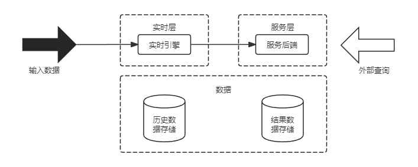
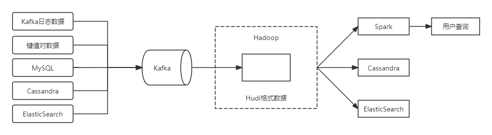

## 第19章 大数据架构设计理论与实践
#### 19.1 传统数据处理系统存在的问题
#### 19.2 大数据处理系统架构分析
- 大数据处理系统架构特征
	- 鲁棒性和容错性(Robust and Fault-tolerant)
	- 低延迟读取和更新能力(Low Latency Reads and Updates)
	- 横向扩容(Scalable)
	- 通用性(General)
	- 延展性(Extensible)
	- 即席查询能力(Allow Ad Hoc Queries)
	- 最少维护能力(Minimal Maintenance)
	- 可调试性(Debuggable)
#### 19.3 Lambda架构
- Lambda架构图

	

- Lambda架构的实现
	- Hadoop(HDFS)用于存储主数据集
	- Spark(或Storm)可构成加速层
	- HBase(或Cassandra)作为服务层
	- 由Hive创建可查询的视图
- Lambda架构优缺点
	- 优点
		- 容错性好。Lambda架构为大数据系统提供了更友好的容错能力，一旦发生错误，我们可以修复算法或从头开始重新计算视图。
		- 查询灵活度高。批处理层允许针对任何数据进行临时查询。
		- 易伸缩。所有的批处理层、加速层和服务层都很容易扩展。因为它们都是完全分布式的系统，我们可以通过增加新机器来轻松地扩大规模。
		- 易扩展。添加视图是容易的，只是给主数据集添加几个新的函数。
	- 缺点
		- 全场景覆盖带来的编码开销。
		- 针对具体场景重新离线训练一遍益处不大。
		- 重新部署和迁移成本很高。
#### 19.4 Kappa架构
- Kappa架构的原理
	- 在Lambda的基础上进行了优化，删除了Batch Layer的架构，将数据通道以消息队列进行替代。
	- 因此对于Kappa架构来说，依旧以流处理为主，但是数据却在数据湖层面进行了存储，当需要进行离线分析或者再次计算的时候，则将数据湖的数据再次经过消息队列重播一次则可。
- Kappa架构图

	

- Kappa架构的优缺点
	- 优点
		- 将实时和离线代码统一起来，方便维护而且统一了数据口径的问题，避免了Lambda架构中与离线数据合并的问题，查询历史数据的时候只需要重放存储的历史数据即可。
	- 缺点
		- 消息中间件缓存的数据量和回溯数据有性能瓶颈。通常算法需要过去180天的数据，如果都存在消息中间件，无疑有非常大的压力。同时，一次性回溯订正180天级别的数据，对实时计算的资源消耗也非常大。
		- 在实时数据处理时，遇到大量不同的实时流进行关联时，非常依赖实时计算系统的能力，很可能因为数据流先后顺序问题，导致数据丢失。
		- Kappa在抛弃了离线数据处理模块的时候，同时抛弃了离线计算更加稳定可靠的特点。
- 常见Kappa架构变形
	- Kappa+架构
	
		
	- 混合分析系统的Kappa架构
		- 在基于使用Kafka+Flink构建Kappa流计算数据架构，针对Kappa架构分析能力不足的问题，再利用Kafka对接组合ElasticSearch实时分析引擎，部分弥补其数据分析能力。
#### 19.5 Lambda架构与Kappa架构的对比和设计选择
- 特性对比
	<table>
		<tr>
			<th>对比内容</th>
			<th>Lambda架构</th>
			<th>Kappa架构</th>
		</tr>
		<tr>
			<td>复杂度与开发、维护成本</td>
			<td>需要维护两套系统（引擎），复杂度高，开发、维护成本高</td>
			<td>只需要维护一套系统（引擎），复杂度低，开发、维护成本低</td>
		</tr>
		<tr>
			<td>计算开销</td>
			<td>需要一直运行批处理和实时计算，计算开销大</td>
			<td>必要时进行全量计算，计算开销相对较小</td>
		</tr>
		<tr>
			<td>实时性</td>
			<td>满足实时性</td>
			<td>满足实时性</td>
		</tr>
		<tr>
			<td>历史数据处理能力</td>
			<td>批式全量处理，吞吐量大，历史数据处理能力强</td>
			<td>流式全量处理，吞吐量相对较低，历史数据处理能力相对较弱</td>
		</tr>
	</table>
- Lambda架构与Kappa架构的设计选择
	- 业务需求与技术要求
		- 用户根据自己的业务需求来选择架构，如果业务对Hadoop、Spark、Strom等关键技术有强制性依赖，选择Lambda架构可能较为合适；如果处理数据偏好于流式计算，又依赖Flink计算引擎，那么选择Kappa架构可能更为合适。
	- 复杂度
		- 如果项目中需要频繁地对算法模型参数进行修改，Lambda架构需要反复修改两套代码，则显然不如Kappa架构简单方便。
		- 同时，如果算法模型支持同时执行批处理和流式计算，或者希望用一份代码进行数据处理，那么可以选择Kappa架构。
		- 在某些复杂的案例中，其实时处理和离线处理的结果不能统一，比如某些机器学习的预测模型，需要先通过离线批处理得到训练模型，再交由实时流式处理进行验证测试，那么这种情况下，批处理层和流处理层不能进行合并，因此应该选择Lambda架构。
	- 开发维护成本
		- Lambda架构需要有一定程度的开发维护成本，包括两套系统的开发、部署、测试、维护，适合有足够经济、技术和人力资源的开发者。而Kappa架构只需要维护一套系统，适合不希望在开发维护上投入过多成本的开发者。
	- 历史数据处理能力
		- 有些情况下，项目会频繁接触海量数据集进行分析，比如过往十年内的地区降水数据等，这种数据适合批处理系统进行分析，应该选择Lambda架构。如果始终使用小规模数据集，流处理系统完全可以使用，则应该选择Kappa架构。
#### 大数据架构设计案例分析
