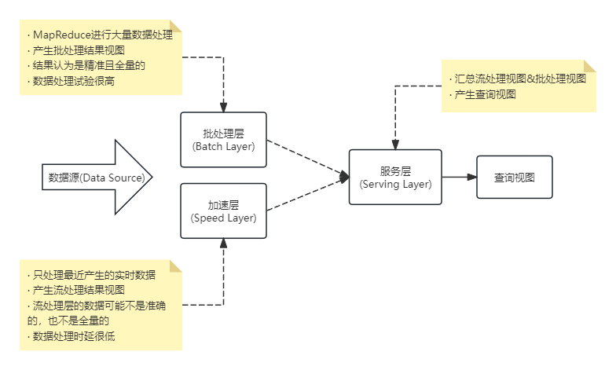
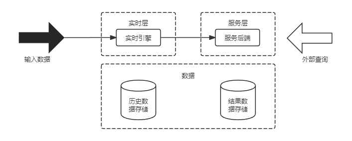

## 第19章 大数据架构设计理论与实践
#### 19.1 传统数据处理系统存在的问题
#### 19.2 大数据处理系统架构分析
- 大数据处理系统架构特征
	- 鲁棒性和容错性(Robust and Fault-tolerant)
	- 低延迟读取和更新能力(Low Latency Reads and Updates)
	- 横向扩容(Scalable)
	- 通用性(General)
	- 延展性(Extensible)
	- 即席查询能力(Allow Ad Hoc Queries)
	- 最少维护能力(Minimal Maintenance)
	- 可调试性(Debuggable)
#### 19.3 Lambda架构
- Lambda架构图

- Lambda架构的实现
	- Hadoop(HDFS)用于存储主数据集
	- Spark(或Storm)可构成加速层
	- HBase(或Cassandra)作为服务层
	- 由Hive创建可查询的视图
- Lambda架构优缺点
	- 优点
		- 容错性好。Lambda架构为大数据系统提供了更友好的容错能力，一旦发生错误，我们可以修复算法或从头开始重新计算视图。
		- 查询灵活度高。批处理层允许针对任何数据进行临时查询。
		- 易伸缩。所有的批处理层、加速层和服务层都很容易扩展。因为它们都是完全分布式的系统，我们可以通过增加新机器来轻松地扩大规模。
		- 易扩展。添加视图是容易的，知识给主数据集添加几个新的函数。
	- 缺点
		- 全场景覆盖带来的编码开销。
		- 针对具体场景重新离线训练一遍益处不大。
		- 重新部署和迁移成本很高。
#### 19.4 Kappa架构
- Kappa架构的原理
	- 在Lambda的基础上进行了优化，删除了Batch Layer的架构，将数据通道以消息队列进行替代。
	- 因此对于Kappa架构来说，依旧以流处理为主，但是数据却在数据湖层面进行了存储，当需要进行离线分析或者再次计算的时候，则将数据湖的数据再次经过消息队列重播一次则可。
- Kappa架构图

- Kappa架构的优缺点
	- 优点
		- 将实时和离线代码统一起来，方便维护而且统一了数据口径的问题，避免了Lambda架构中与离线数据合并的问题，查询历史数据的时候只需要重放存储的历史数据即可。
	- 缺点
		- 消息中间件缓存的数据量和回溯数据有性能瓶颈。通常算法需要过去180天的数据，如果都存在消息中间件，无疑有非常大的压力。同时，一次性回溯订正180天级别的数据，对实时计算的资源消耗也非常大。
		- 在实时数据处理时，遇到大量不同的实时流进行关联时，非常依赖实时计算系统的能力，很可能因为数据流先后顺序问题，导致数据丢失。
		- Kappa在抛弃了离线出具处理模块的时候，同事抛弃了离线计算更加稳定可靠的特点。
- 常见Kappa架构变形