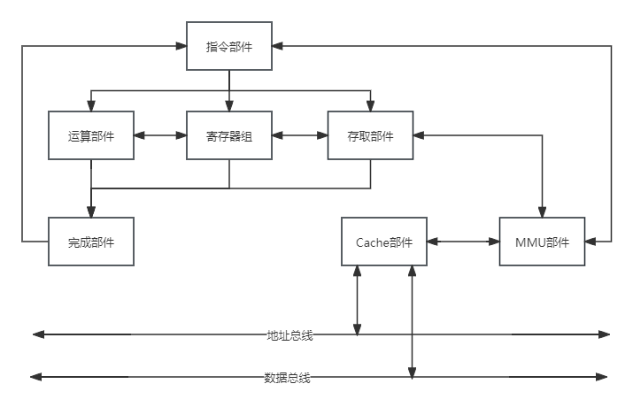
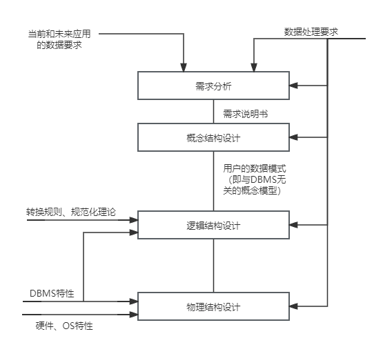
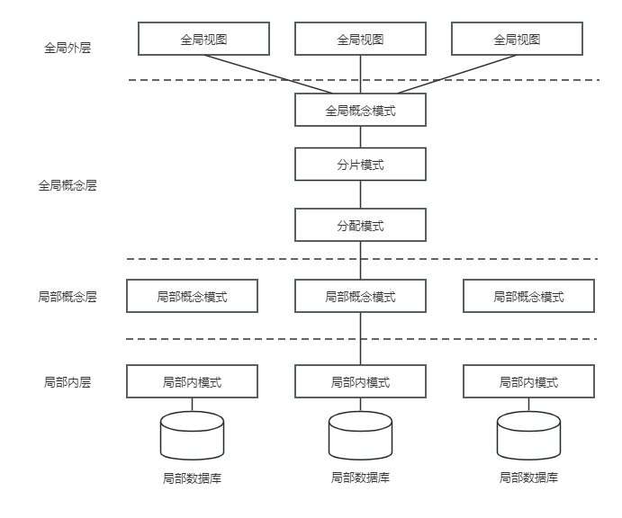
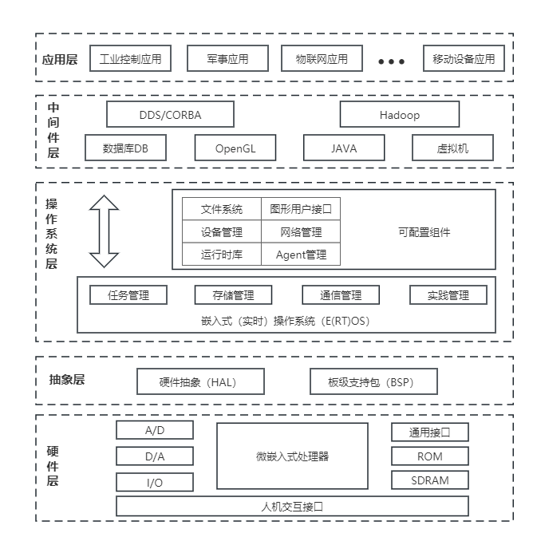

## 第2章 计算机系统基础知识
#### 2.1 计算机系统概述
- 计算机系统是指用于数据管理的计算机硬件、软件及网络组成的系统。
#### 2.2 计算机硬件
- 2.2.1 计算机硬件组成
	- 计算机组成结构(Computer Architecture)源于冯.诺依曼计算机结构，该结构成为现代计算机系统发展的基础。
- 2.2.2 处理器
	- 处理器的指令集按照其复杂程度可分为
		- 复杂指令集(Complex Instruction Set Computers, CISC)
			- CISC以Intel、AMD的x86 CPU为代表
		- 精简指令集(Reduced Instruction Set Computers, RISC)
			- RISC以ARM和Power为代表。
	- 除了由于历史原因而仍存在的CISC结构外，RISC已经成为计算机指令集发展的趋势，几乎所有后期出现的指令集均为RISC架构。
	- 典型的处理器体系结构示意图
	
		- 指令部件通过MMU-Cache的存储结构，从内存等存储设备中取得相应的软件代码指令并完成译码和控制操作，控制存取部件从存储设备中取得新的数据，控制寄存器组为运算器准备有关寄存器数据，并准备好结果寄存器，控制整型、浮点、向量等运算部件开展运算。
		- 运算部件、寄存器单元、存取部件将执行结果通知完成部件，并在完成部件中完成结果排队，由完成部件向指令部件反馈执行结果，控制指令的顺序执行、跳转等时序。
	- 专用目的处理器芯片不断涌现
		- 图形处理器(Graphics Processing Unit, GPU)
			- GPU是一种特殊类型的处理器，具有数百或数千内核，经过优化可并行运行大量计算，因此近些年在深度学习和机器学习领域得到了广泛应用。
		- 信号处理器(Digital Signal Processor, DSP)
			- DSP专用于实时的数字信号处理，通过采用饱和算法处理溢出问题，通过乘积累加运算提高矩阵运算的效率，以及为傅里叶变换设计专用指令等方法，在各类高速信号采集的设备中得到广泛应用。
		- 现场可编程逻辑门阵列(Field Programmable Gate Array, FPGA)
			-  FPGA 是在 PAL、 GAL、 CPLD 等可编程器件的基础上进一步发展的产物， 是作为专用集成电路（ ASIC）领域中的一种半定制电路而出现的，既解决了定制电路的不足，又克服了原有可编程器件门电路数有限的缺点。 简而言之， FPGA 就是一个可以通过编程来改变内部结构的芯片。
			-  FPGA 功能实现：需要通过编程即设计硬件描述语言，经过 EDA 工具编译、综合、布局布线成后转换为可烧录的文件，最终加载到 FPGA 器件中去，改变 FPGA 内部的连线，最终完成所实现的功能。
- 2.2.3 存储器
	- 片上缓存
		- 在处理器核心中直接集成的缓存，一般为SRAM结构，实现数据的快速。
		- 它的容量较小，一般为16kB~512kB，按照不同的设计可能划分为一级或者二级。
	- 片外缓存
		- 在处理器核心外的缓存，需要经过交换互联开关访问，一般也是由SRAM构成，容量较片上缓存略大，可以为256kB~4MB，按照层级被称为L2 Cache或L3 Cache，或者称为平台Cache(Platform Cache)。
	- 主存（内存）
		- 通常采用DRAM结构，以独立的部件/芯片存在，通过总线与处理器连接。
		- DRAM依赖不断充电维持其中的数据，容量在数百MB至数十GB之间。
	- 外存
		- 可以是磁带、磁盘、光盘和各类Flash等介质器件，这类设备访问速度慢，但容量大，且在掉电后能够保持其数据。
- 2.2.4 总线
	- 总线(Bus)是指计算机部件间遵循某一特定协议实现数据交换的形式，即以一种特定格式按照规定的控制逻辑实现部件间的数据传输。
	- 按照总线在计算机中所处的位置划分为：
		- **内总线**：用于各类芯片内部互连，也可称为片上总线(On-Chip Bus)或片内总线。
		- **系统总线**是指计算机中CPU、主存、I/O接口的总线
			- 计算机发展为多总线结构后，系统总线的含义有所变化，狭义的系统总线仍为CPU与主存、通信桥连接的总线；广义上，还应包含计算机系统内，经由系统总线再次级联的总线，常被称为局部总线(Local Bus)。
		- **外部总线**是计算机板和外部设备之间，或者计算机系统之间互联的总线，又称为**通信总线**。
	- 总线之间通过桥(Bridge)实现连接，它是一种特殊的外设，主要实现总线协议间的转换。
	- 总线的性能指标常见的有
		- 总线带宽
		- 总线服务质量QoS
		- 总线时延
		- 总线抖动
	- 计算机总线存在许多种类
		- 并行总线：PCI、PCIe和ATA(IDE)等。
		- 串行总线：USB、SATA、CAN、RS-232、RS-485、RapidIO和以太网等。
- 2.2.5 接口
	- 接口指同一计算机不同功能层之间的通信规则。
- 2.2.6 外部设备
	- 包括所有的输入输出设备以及部分存储设备（即外存）。
#### 2.3 计算机软件
- 2.3.1 计算机软件概述
	- 系统软件
		- 为整个计算机系统配置的不依赖特定应用领域的通用软件。
		- 根据系统软件功能的不同，可将其划分为：操作系统、程序设计语言翻译系统、数据库管理系统和网络软件等。
	- 应用软件
		- 为某类应用需要或解决某个特定问题而设计的软件。
- 2.3.2 操作系统
	- 操作系统主要有一下3个方面的重要作用
		- 管理计算机中运行的程序和分配各种软硬件资源。
		- 为用户提供友善的人机界面。
		- 为应用程序的开发和运行提供一个高效率的平台。
	- 操作系统的特征
		- 并发性
		- 共享性
		- 虚拟性
		- 不确定性
	- 操作系统的分类
		- 批处理操作系统
		- 分时操作系统
		- 实时操作系统
		- 网络操作性
		- 分布式操作系统
		- 微型计算机操作系统
		- 嵌入式操作系统
			- 微型化
			- 可定制
			- 实时性
			- 可靠性
			- 易移植性
- 2.3.3 数据库
	- 数据库是指长期存储在计算机内、有组织的、统一管理的相关数据的集合。
	- 数据库的种类
		- 关系数据库
			- 关系数据库设计的基本步骤
			
			
		- 键值数据库
		- 列存储数据库
		- 文档数据库
		- 搜索引擎数据库
		- 分布式数据库
			- 分布式数据库结构模式
			
			
	- 常用的数据库设计方法有
		- 基于3NF的设计方法、
		- 基于实体联系（E-R）模型的数据库设计方法、
		- 基于视图概念的数据库设计方法、
		- 面向对象的关系数据库设计方法、
		- 计算机辅助数据库设计方法、敏捷数据库设计方法等。
	- 大型数据库管理系统的特点
		- 基于网络环境的数据库管理系统
		- 支持大规模的应用
		- 提供自动锁功能使得并发用户可以安全而高效地访问数据
		- 可以保证系统的高度安全性
		- 提供方便而灵活的数据备份和回复方法及设备镜像功能，还可以利用操作系统提供容错功能，确保设计良好的应用中的数据在发生意外的情况下可以最大限度地被恢复。
		- 提供多种维护数据完整性的手段。
		- 提供了方便易用的分布式处理功能。
- 2.3.4 文件系统
	- 文件类型：
		- 按文件的性质和用途分类
			- 系统文件
			- 库文件
			- 用户文件
		- 按信息保存期限分类
			- 临时文件
			- 档案文件
			- 永久文件
	- 文件的结构和组织
		- 文件的逻辑结构
			- 一是有结构的记录式文件，它是由一个以上的记录构成的文件
			- 二是无结构的流式文件，它是由一串顺序字符串流构成的文件
		- 文件的物理结构
			- 连续结构
			- 链接结构
			- 索引结构
			- 多个物理块的索引表
	- 文件存取的方法和存储空间的管理
		- 文件存储空间的管理
			- 空闲区表
			- 位示图
			- 空闲块链
			- 成组链接法
	- 文件共享和保护
		- 文件的保护
			- 存取控制矩阵
			- 存取控制表
			- 用户权限表
			- 密码
- 2.3.5 网络协议
	- 常用的网络协议包括
		- 局域网协议(LAN)
		- 广域网协议(WAN)
		- 无线网协议
		- 移动网协议
- 2.3.6 中间件
	- 中间件分类
		- 通信处理（消息）中间件
		- 事务处理（交易）中间件
		- 数据存取管理中间件
		- Web服务器中间件
		- 跨平台和架构的中间件
		- 专用平台中间件
		- 网络中间件
- 2.3.7 软件构件
	- 构件又称为组件，是一个自包容、可复用的程序集。
	- 构件组装模型的一般开发过程
		- 设计构件组装
		- 建立构件库
		- 构建应用软件
		- 测试与发布
	- 商用构件的标准规范
		- 公共对象请求代理架构(Common Objtect Request Broker Architecture, CORBA)
		- J2EE
		- DNA 2000
- 2.3.8 应用软件
	- 应用软件是为了利用计算机解决某类问题而设计的程序的集合，是为满足用户不同领域、不同问题的应用需求而提供的软件
		- 通用应用软件
		- 定制应用软件
#### 2.4 嵌入式系统及软件
- 2.4.1 嵌入式系统的组成及特点
	- 嵌入式系统是以应用为中心、以计算机技术为基础，并将可配置与可裁剪的软、硬件集成于一体的专用计算机系统，需要满足应用对功能、可靠性、成本、体积和功耗等方面的严格要求。
	- 一般嵌入式系统组成如下：
		- 嵌入式处理器
		- 相关支撑硬件
		- 嵌入式操作系统
		- 支撑软件
		- 应用软件
	- 嵌入式系统的特点
		- 专用性强
		- 技术融合
		- 软硬一体软件为主
		- 比通用计算机资源少
		- 程序代码固化在非易失存储器中
		- 需要专门开发工具和环境
		- 体积小、价格低、工艺先进、性能价格比高、系统配置要求低、实时性强
		- 对安全性和可靠性的要求高
- 2.4.2 嵌入式系统的分类
	- 实时系统(Real-Time System, RTS)
	- 安全攸关系统(Safety-Critical System)
- 2.4.3 嵌入式软件的组成及特点
	- 组成
		- 硬件层
		- 抽象层
		- 操作系统层
		- 中间件(Middleware)层
		- 应用层
	- 嵌入式系统软件组成架构
	
	- 嵌入式软件的主要特点如下：
		- 可裁剪性
		- 可配置性
		- 强实时性
		- 安全性
		- 可靠性
		- 高确定性
- 2.4.4 安全攸关软件的安全性设计
	- CMMI
	- DO-178
#### 2.5 计算机网络
- 2.5.1 网络的基本概念
	- 网络攸关指标
		- 性能指标
			- 速率
			- 带宽
			- 吞吐量
			- 时延
			- 往返时间
			- 利用率
		- 非性能指标
			- 费用 
			- 质量
			- 标准化
			- 可靠性
			- 可扩展性和可升级性
			- 易管理和维护性
- 2.5.2 通信技术
	- 信道
	- 信号变换
	- 复用技术和多址技术
	- 5G通信网络
		- 基于OFDM优化的波形和多址接入
		- 实现可扩展的OFDM间隔参数配置
		- OFDM加窗提高多路传输效率
		- 灵活框架设计
		- 大规模MIMO
		- 毫米波
		- 频谱共享
		- 先进的信道编码设计
- 2.5.3 网络技术
	- 网络通常按照网络的覆盖区域和通信介质等特征来分类
		- 局域网(LAN)
		- 无线局域网(WLAN)
		- 城域网(MAN)
		- 广域网(WAN)
		- 移动通信网
- 2.5.4 组网技术
	- 网络设备
		- 集线器
		- 中继器
		- 网桥
		- 交换机
		- 路由器
		- 防火墙
	- OSI/RM的网络体系
		- 物理层
		- 数据链路层
		- 网络层
		- 传输层
		- 会话层
		- 表示层
		- 应用层
	- IOS/OSI模型与TCP/IP模型的对比

	<table>
		<tr>
			<th>ISO/OSI模型</th>
			<th colspan="5">TCP/IP协议</th>
			<th colspan="2">TCP/IP模型</th>
		</tr>
		<tr>
			<td>应用层</td>
			<td rowspan="3">文件传输协议 FTP</td>
			<td rowspan="3">远程登录协议Telnet</td>
			<td rowspan="3">电子邮件协议 SMTP</td>
			<td rowspan="3">网络文件服务协议 NFS</td>
			<td rowspan="3">网络管理协议 SNMP</td>
			<td rowspan="3" colspan="2">应用层</td>
		</tr>
		<tr>
			<td>表示层</td>
		</tr>
		<tr>
			<td>会话应用层</td>
		</tr>
		<tr>
			<td>传输层</td>
			<td colspan="2">TCP</td>
			<td colspan="3">UDP</td>
			<td colspan="2">传输层</td>
		</tr>
		<tr>
			<td>网络层</td>
			<td colspan="2">IP</td>
			<td >ICMP</td>
			<td colspan="2">ARP RARP</td>
			<td colspan="2">网际层</td>
		</tr>
		<tr>
			<td>数据链路层</td>
			<td rowspan="2">Enternet IEEE 802.3</td>
			<td rowspan="2">FDDI</td>
			<td rowspan="2">Token-Ring/IEEE 802.3 硬件层</td>
			<td colspan="2" rowspan="2">ARCnet</td>
			<td rowspan="2">PPP/SLIP</td>
			<td>网络接口层</td>
		</tr>
		<tr>
			<td>物理层</td>
			<td>硬件层</td>
		</tr>
	</table>
- 2.5.5 网络工程
	- 网络规划
	- 网络设计
	- 网络实施
#### 2.6 计算机语言
- 2.6.1 计算机语言的组成
	- 计算机语言主要是由一套指令组成，而这种指令一般包括表达式、流程控制和集合三大部分内容。
- 2.6.2 计算机语言的分类
	- 机器语言
		- 机器语言指令是一种二进制代码，由操作码和操作数两部分组成。
	- 汇编语言
		- 汇编语言是机器语言的符号化描述，所以也是面向机器的程序设计语言。
	- 高级语言
		- 由于高级语言和计算机的架构、指令集无关，因此它具有良好的可移植性。
	- 建模语言
		- UML是一种定义良好、易于表达、功能强大且普遍适用的建模语言。
		- 它的作用不限于支持面向对象的分析与设计，还支持从需求分析开始的软件开发的全过程。
		- UML成为“标准”建模语言的原因之一在于与程序设计语言无关。而且，UML符号集知识一种语言而不是一种方法学，不需要任何正式的工作产品。
		- UML由3个要素构成：
			- UML的基本构造块（事务、关系）
			- 图（支配基本构造块如何放置在一起的规则）
			- 运用于整个语言的公用机制
		- UML中有4种事务
			- 结构事物
			- 行为事物
			- 分组事物
			- 注释事物
		- UML中有4种关系
			- 依赖
			- 关联
			- 泛化
			- 实现
		- UML5种视图
			- 用例视图：描述系统的功能需求，方便找出用例和执行者；它展示了一个外部用户能够观察到的系统功能模型
				- 主要包括用例图。
			- 逻辑视图：描述如何实现系统内部的功能；系统的静态结构和因发送消息而出现的动态协作关系。
				- 逻辑视图包含类图和对象图、状态图、顺序图、合作图和活动图。
			- 进程视图：描述系统的并发性，并处理这些线程间的通信和同步；它将系统分割成并发执行的控制线程及处理这些线程的通信和同步。
				- 进程视图主要包括状态图、顺序图、合作图、活动图、构件图和配置图。
			- 实现视图：描述系统代码构件组织和实现模块及它们之间的依赖关系。
				- 实现视图主要包括构件图
			- 部署视图：定义系统中软硬件的物理体系结构及连接、哪个程序或对象驻留在哪台计算机上执行
				- 主要包括配置图。
	- 形式化语言
#### 2.7 多媒体
- 2.7.1 多媒体概述
	- 分类
		- 感觉媒体
		- 表示媒体
		- 表现媒体
		- 存储媒体
		- 传输媒体
	- 多媒体的重要特征
		- 多维化
		- 集成性
		- 交互性
		- 实时性
- 2.7.2 多媒体系统的关键技术
#### 2.8 系统工程
- 2.8.1 系统工程概述
	- 采用系统工程方法的主要步骤包括：
		- 对系统提出要求
		- 根据要求设计系统，评价设计方案；
		- 修改要求，再设计。
	- 如此反复，经过若干循环，求导最佳方案，即最后综合成一个技术上合理、经济上合算、研制周期短并能协调运转的工程系统。
- 2.8.2 系统工程方法
	- 系统工程方法是一种现代的科学决策方法，也是一门基本的决策技术。
	- 系统工程方法的特点是整体性、综合性、协调性、科学性和实践性。
	- 霍尔的三维结构
		- 霍尔三维结构集中体现了系统工程方法的系统化、综合化、最优化、程序化和标准化等特点，是系统工程方法论的重要基础内容。
		- 时间维
			- 规划
			- 拟定方案
			- 研制
			- 生产
			- 安装
			- 运行
			- 更新
		- 逻辑维
			- 明确问题
			- 确定目标
			- 系统综合
			- 系统分析
			- 优化
			- 决策
			- 实施
		- 知识维
			- 工程
			- 医学
			- 建筑
			- 商业
			- 法律
			- 管理
			- 社会科学
			- 艺术等各种知识和技能
	- 切克兰德方法
		- 将工作过程分为7个步骤
			- 认识问题
			- 根底定义
			- 建立概念模型
			- 比较及探寻
			- 选择
			- 设计与实施
			- 评估与反馈
	- 并行工程方法
		- 并行工程强调以下3点
			- 在产品设计开发期间，将概念设计、结构设计、工艺设计、最终需求等结合起来，保证以最快的速度按要求的质量完成。
			- 各项工作由此相关的项目小组完成。进程中小组成员各自安排自身的工作，但可以随时或定期反馈信息，并对出现的问题协调解决。
			- 依据适当的信息系统工具，反馈与协调整个项目的进行。利用现代CIM技术，在产品的研制与开发期间，辅助项目进程的并行化。
	- 综合集成法
		- 综合集成方法的主要特点有
			- 定性研究与定量研究有机结合，贯穿全过程。
			- 科学理论与经验知识结合，把人们对客观事物的知识综合集成解决问题。
			- 应用系统思想把多种学科结合起来进行综合研究。
			- 根据复杂巨系统的层次结构，把宏观研究与微观研究统一起来。
			- 必须有大型计算机系统支持，不仅有管理信息系统、决策支持系统等功能，而且还要有综合集成的功能。
	- WSR系统方法
		- WSR是物理(Wuli)-事理(Shili)-人理(Renli)方法论的简称。
- 2.8.3 系统工程的生命周期
	- 系统工程流程的7个一般生命周期阶段
		- 探索性研究阶段
			- 目的是识别利益攸关者的需求，探索创意和技术。
		- 概念阶段
			- 细化利益攸关者的需求，探索可行概念，提出有望实现的解决方案。
		- 开发阶段
			- 细化系统需求，创建解决方案的描述，构建系统，验证并确认系统。
		- 生产阶段
			- 生产系统并进行检验和验证。
		- 使用阶段
			- 运行系统以满足用户需求。
		- 保障阶段
			- 提供持续的系统能力。
		- 退役阶段
			- 存储、归档或退出系统。
	- 生命周期方法
		- 计划驱动方法
			- 计划驱动方法的特征在于整个过程始终遵守规定流程的系统化方法。特别关注文档的完整性、需求的可追溯性以及每种表示的事后验证。
		- 渐进迭代开发(IID)
			- 当需求不清晰不确定或者客户希望在系统中引入新技术时，则使用IID方法。
			- 基于一系列最初的假设，开发候选的系统，然后对其进行评估以确定是否满足用户需求。若不满足，则启动另一轮演进，并重复该流程，直到交付的系统满足利益攸关者的要求或直到组织决定终止这项工作。
			- 一般而言，IID方法适用于较小的、不太复杂的系统。这种方法的重点在于灵活性，通过剪裁突出了产品开发的核心活动。
		- 精益开发
			- 精益思想是一个动态的，知识驱动的、以客户为中心的过程，通过这一过程使特定企业的所有人员以创造价值为目标不断地消除浪费。
			- 精益系统工程是将精益原则、实践和工具应用到系统工程，以提升系统利益攸关者的价值交付。
- 2.8.4 基于模型的系统工程
	- 基于模型的系统工程(Model-Based Systems Enginnering,MBSE)的定义：MBSE是建模方法的形式化应用，以使建模方法支持系统需求、分析、设计、验证和确认等活动，这些活动从概念性设计阶段开始，持续贯穿到设计开发以及后来的所有声明周期阶段。
	- MBSE的三大支柱
		- 建模语言
			- SysML的目的是统一系统工程中使用的建模语言。
		- 建模工具
		- 建模思路
#### 2.9 系统性能
- 系统性能是一个系统提供给用户的所有性能指标的集合。
	- 它既包括硬件性能（如处理器主频、存储器容量、通信带宽）和软件性能（如上下文切换、延迟、执行时间等），也包括部件性能指标和综合性能指标。
- 2.9.1 性能指标
	- 计算机的性能指标
		- 时钟频率（主频）
		- 运算速度
		- 运算精度
		- 内存的存储容量
		- 存储器的存取周期
		- 数据处理速率(Processing Data Rate, PDR)
		- 吞吐率
		- 各种响应时间
		- 各种利用率
		- RASIS特性
			- 可靠性(Reliability)
			- 可用性(Availability)
			- 可维护性(Serviceability)
			- 完整性(Integrity)
			- 安全性(Security)
		- 平均故障响应时间
		- 兼容性
		- 可扩充性
		- 性能价格比
	- 路由器的性能指标
	- 交换机的性能指标
	- 网络的性能指标
	- 操作系统的性能指标
		- 系统上下文切换
		- 系统响应时间
		- 系统的吞吐率（量）
		- 系统资源利用率
		- 可靠性
		- 可移植性
	- 数据库管理系统的性能指标
		- 数据库的大小
		- 数据库中表的数量
		- 单个表的大小
		- 表中允许的记录（行）数量
		- 单个记录（行）的大小
		- 表中所允许的索引数量
		- 数据库所允许的索引数量
		- 最大并发事物处理能力
		- 负载均衡能力
		- 最大连接数
	- Web服务器的性能指标
		- 最大并发连接数
		- 响应延迟
		- 吞吐量
- 2.9.2 性能计算
	- 性能指标计算的主要方法有
		- 定义法
		- 公式法
		- 程序检测法
		- 仪器检测法
- 2.9.3 性能设计
	- 性能调整
	- 阿姆达尔解决方案
- 2.9.4 性能评估
	- 基准测试程序
		- 它们评测的准确程度依次递减：真实的程序、核心程序、小型基准程序和合成基准程序。
	- Web服务器的性能评估
		- 压力测试
		- 可靠性测试
	- 系统监视