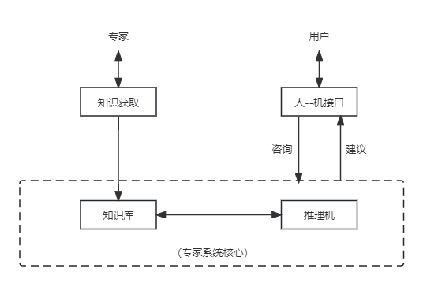

## 第3章 信息系统基础知识
#### 3.1 信息系统概述
- 3.1.1 信息系统的定义
	- 信息系统是由计算硬件、网络和通信设备、计算机软件、信息资源、信息用户和规章制度组成的以处理信息流为目的的人机一体化系统。
	- 信息系统的5个基本功能：输入、存储、处理、输出和控制
		- 输入功能。输入功能决定于系统所要达到目的及系统的能力和信息环境的许可。
		- 存储功能。存储功能指的是系统存储各种信息资料和数据的能力。
		- 处理功能。它是数据处理工具。处理功能基于数据仓库技术的联机分析处理（OLAP）和数据挖掘（DM）技术。
		- 输出功能。信息系统的各种功能都是为了保证最终实现最佳的输出功能。
		- 控制功能。控制功能对构成系统的各种信息处理设备进行控制和管理，对整个信息加工、处理、传输、输出等环节通过各种程序进行控制。
- 3.1.2 信息系统的发展
	- 诺兰将计算机信息系统的发展道路划分为6个阶段，
		- 初始阶段
		- 传播阶段
		- 控制阶段
		- 集成阶段
		- 数据管理阶段
		- 成熟阶段
- 3.1.3 信息系统的分类
	- 业务（数据）处理系统
	- 管理信息系统
	- 决策支持系统
		- DSS是能帮助决策者利用数据和模型去解决半结构化决策问题和非结构化决策问题的交互系统。
	- 专家系统
		- 是一个智能计算机程序系统，其内部含有某个领域具有专家水平的大量知识与经验，能够利用人类专家的知识和解决问题的方法来处理该领域的问题。
	- 办公自动化系统
		- 是一个人机结合的综合性的办公事务管理系统。
	- 综合性信息系统
- 3.1.4 信息系统的生命周期
	- 信息系统的生命周期分为4个阶段
		- 产生阶段
		- 开发阶段
		- 运行阶段
		- 消亡阶段
- 3.1.5 信息系统建设原则
	- 高层管理人员介入原则
	- 用户参与开发原则
	- 自顶向下规划原则
	- 工程化原则
- 3.1.6 信息系统开发方法
	- 结构化方法
		- 结构化生命周期法主要特点如下：
			- 开发目标清晰化
			- 工作阶段程式化
			- 开发文档规范化
			- 设计方法结构化
	- 原型法
		- 应用快速原型法开发过程包括
			- 系统需求分析
			- 系统初步设计
			- 系统调试
			- 系统检测
	- 面向对象方法
		- 面向对象的分析方法是利用面向对象的信息建模概念，如实体、关系、属性等，同时运用封装、继承、多态等机制来构造模拟现实系统的方法。
	- 面向服务的方法
		- 对于跨构件的功能调用，则采用接口的形式暴露出来。进一步将接口的定义与实现进行解耦，则催生了服务和面向服务的开发方法。
#### 3.2 业务处理系统（TPS）
- 3.2.1 业务处理系统的概念
	- TPS是服务于组织管理层次中最低层、最基础的信息系统。
- 3.2.2 业务处理系统的功能
	- TPS的数据处理周期由以下5个阶段构成
		- 数据输入
		- 数据处理
		- 数据库的维护
		- 文件报表的生成
		- 查询处理
- 3.2.3 业务处理系统的特点
#### 3.3 管理信息系统（MIS）
- 3.3.1 管理信息系统的概念
	- 从管理信息系统概念出发，管理信息系统由四大部件组成
		- 信息源
		- 信息处理器
		- 信息用户
		- 信息管理者
- 3.3.2 管理信息系统的功能
- 3.3.3 管理信息系统的组成
#### 3.4 决策支持系统（DSS）
- 3.4.1 决策支持系统的概念
- 3.4.2 决策支持系统的功能
- 3.4.3 决策支持系统的特点
- 3.4.4 决策支持系统的组成
	- 数据的重组和确认
	- 数据字典的简历
	- 数据挖掘和智能体
	- 模型建立
#### 3.5 专家系统（ES）
- 3.5.1  专家系统的概念
- 3.5.2 专家系统的特点
- 3.5.3 专家系统的组成
	- 知识库
	- 综合数据库
	- 推理机
	- 知识获取
	- 解释程序
	- 人--机接口
	- 
#### 3.6 办公自动化系统（OAS）
- 3.6.1 办公自动化系统的概念
- 3.6.2 办公自动化系统的功能
	- 事务处理
	- 信息管理
	- 辅助决策
- 3.6.3 办公自动化系统的组成
#### 3.7 企业资源规划（ERP）
- 3.7.1 企业资源规划的概念
- 3.7.2 企业资源规划的结构
- 3.7.3 企业资源规划的功能
#### 3.8 典型信息系统架构模型
- 3.8.1 政府信息化与电子政务
- 3.8.2 企业信息化与电子商务