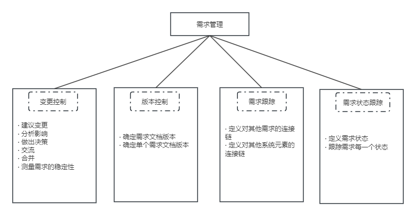
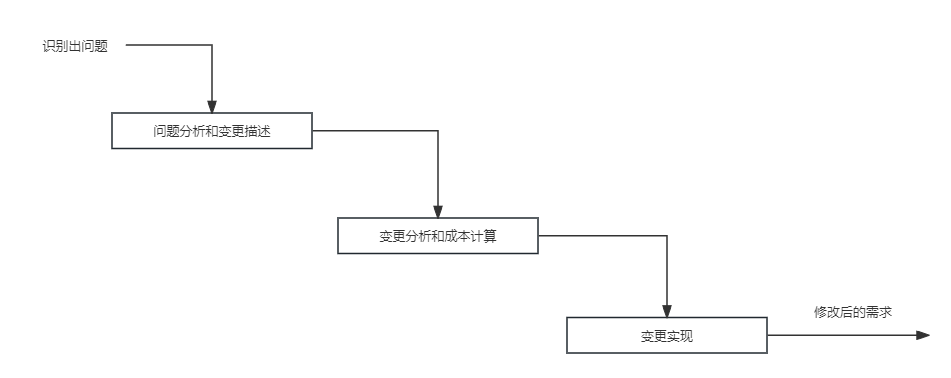

## 第5章 软件工程基础知识
#### 5.1 软件工程
- 5.1.1 软件工程定义
- 5.1.2 软件过程模型
	- 瀑布模型
		- 是最早使用的软件过程模型之一，包含一系列活动。这些活动从一个阶段到另一个阶段逐次下降，它的工作流程在形式上很像瀑布。
	- 原型化模型又称快速原型
		- 原型模型主要有一下两个阶段
			- 原型开发阶段。软件开发人员根据用户提出的软件系统的定义，快速地开发一个原型。
			- 目标软件开发阶段。在征求用户对原型的意见后多原型进行修改完善，确认软件系统的需求并达到一致的理解，进一步开发实际系统。
	- 螺旋模型
		- 是在快速原型的基础上扩展而成。
		- 这种模型把整个软件开发流程分成多个阶段，每个阶段都由4部分组成，它们是：
			- (1)目标设定。为该项目进行需求分析，定义和确定这一个阶段的专门目标，指定对过程和产品的约束，并且指定详细的管理计划。
			- (2)风险分析，对可选方案进行风险识别和详细分析，制定解决办法，采取有效措施避免这些风险。
			- (3)开发和有效性验证。风险评估后，可以为系统选择开发模型，并且进行原型开发，即开发软件产品。
			- (4)评审。对项目进行评审，以确定是否需求进入螺旋线的下一次回路，如果决定继续，就要制订下一阶段计划。
- 5.1.3 敏捷模型
	- 敏捷方法的核心思想
		- 是适应性，而非可预测型
		- 是以人为本，而非以过程为本。
		- 迭代增量式的开发过程。
	- 主要敏捷方法简介
		- 极限编程
			- 在所有的敏捷型方法中，XP是最引入瞩目的。极限编程是一个轻量级的、灵巧的软件开发方法；同时它也是一个非常严谨和周密的方法。
			- 它的基础和价值观是交流、朴素、反馈和勇气，即任何一个软件项目都可以从4个方面入手进行改善；
				- 加强交流
				- 从简单做起
				- 寻求反馈
				- 勇于实事求是
		- 水晶系列方法
			- 其目的是发展一种提倡“机动性的”方法，包含具有共性的核心元素，每个都含有独特的角色、过程模式、工作产品和实践。
			- Crystal家族实际上是一组经过证明、对不同类型项目非常有效的敏捷过程，它的发明使得敏捷团队可以根据其项目和环境选择最合适的Crystal家族成员。
		- Scrum
			- 该方法侧重于项目管理。
			- Scrum是迭代式增量软件开发过程，通常用于敏捷软件开发。
			- Scrum包括了一系列实践和预定义角色的过程骨架（是一种流程、计划、模式，用于有效率地开发软件）
		- 特征驱动开发方法(Feature Driven Development, FDD)
			- FDD是一个迭代的开发模型。
			- FDD认为有效的软件开发需求3个要素：人、过程和技术。
- 5.1.4 统一过程模型（RUP）
	- 9个核心工作流
		- 业务建模
			- 李杰待开发系统所在机构及其商业运作，确保所有参与人员对待开发系统所在的机构有共同的认识，评估待开发系统对所在机构的影像。
		- 需求
			- 定义系统功能及用户界面，使客户知道系统的功能，使开发人员理解系统的需求，为项目预算及计划提供基础。
		- 分析与设计
			- 把需求分析的结果转换为分析与设计模型
		- 实现
			- 把设计模型转换为实现结果，对开发的代码做单元测试，将不同实现人员开发的模块集成为可执行系统。
		- 测试
			- 检查各子系统之间的交互、集成，验证所有需求是否均被正确实现，对发现的软件质量上的缺陷进行归档，对软件质量提出改进建议。
		- 部署
			- 打包、分发、安装软件，升级旧系统；培训用户及销售人员，并提供技术支持。
		- 配置与变更管理
			- 跟踪并维护系统开发过程中产生的所有制品的完整性和一致性。
		- 项目管理
			- 为软件开发项目提供计划、人员分配、执行、监控等方面的指导，为风险管理提供框架。
		- 环境
			- 为软件开发机构提供软件开发环境，即提供过程管理和工具支持。
	- RUP的特点
		- 用例驱动
		- 以体系结构为中心的
		- 迭代和增量
- 5.1.5 软件能力成熟度模型
	- CMMI
		- Level 1 初始级
		- Level 2 已管理级
		- Level 3 已定义级
		- Level 4 量化管理级
		- Level 5 优化级
#### 5.2 需求工程
- 软件需求包括3个不同的层次：业务需求、用户需求和功能需求（也包括非功能需求）。
- 需求工程的活动主要被划分为以下几个阶段
	- 需求获取
		- 通过与用户的交流，对现有系统的观察及对任务进行分析，从而开发、捕获和修订用户的需求。
	- 需求分析
		- 为系统建立一个概念模型，作为对需求的抽象描述，并尽可能多的捕获现实世界的语义。
	- 形成需求规格（或称之为需求文档化）
		- 按照相关标准，生成需求模型的文档描述，用户原始需求书作为用户和开发者之间的一个协约，往往被作为合同的附件；软件需求描述规约作为后续软件开发的指南。
	- 需求管理
		- 包括需求文档的追踪管理、变更控制、版本控制等管理性活动。
		- 需求管理的主要活动
		
- 5.2.1 需求获取
	- 需求获取的基本步骤
		- 开发高层的业务模型
		- 定义项目范围和高层需求
		- 识别用户角色和用户代表
		- 获取具体的需求
		- 确定目标系统的业务工作流
		- 需求整理与总结
	- 需求获取方法
		- 用户面谈
		- 需求专题讨论会
		- 问卷调查
		- 现场观察
		- 原型化方法
		- 头脑风暴法
- 5.2.2 需求变更
	- 为了使开发组织能够严格控制软件项目，应该确保以下事项：
		- 仔细评估已建议的变更。
		- 挑选合适的人选对变更做出判定。
		- 变更应及时通知所有相关人员。
		- 项目要按一定的程序来采纳需求变更，对表更的过程和状态进行控制。
	- 变更控制过程
		- 问题分析和变更描述
		- 变更分析和成本计算
		- 变更实现
		
	- 变更控制委员会
		- 制定决策
		- 交流情况
		- 重新协商约定
- 5.2.3 需求追踪
	- 需求跟踪包括编制每个需求同系统元素之间的联系文档，这些元素包括其他需求、体系结构、其他设计部件、源代码模块、测试、帮助文件和文档等，是要在整个项目的工作之间形成水平可追踪性。
	- 需求跟踪提供了由需求到产品实现整个过程范围的明确查阅的能力。
	- 需求跟踪的目的是建立与维护“需求-设计-编程-测试”之间的一致性，确保所有的工作成果符合用户需求。
	- 需求跟踪有两种方式
		- 正向跟踪。检查《产品需求规格说明书》中的每个需求是否都能在后继工作成果中找到对应点。
		- 逆向跟踪。检查设计文档、代码、测试用例等工作成果是否都能在《产品需求规格说明书》中找到出处。
#### 5.3 系统分析与设计
- 系统设计的目标是根据系统分析的结果，完成系统的构建过程。其主要目的是绘制系统的蓝图，权衡和比较各种技术和实施方法的利弊，合理分配各种资源，构建新系统的详细设计方案和相关模型，指导系统实施工作的顺利开展。
- 5.3.1 结构化方法SASD
	- 结构化分析
		- 给出一组帮助系统分析人员产生功能规约的原理与技术。
		- 它一般利用图形表达用户需求，使用的手段主要有数据流图、数据字典、结构化语言、判定表以及判定树等。
	- 结构化设计
		- 是一种面向数据流的设计方法，以数据流图和数据字典等文档为基础，是一个自顶向下、逐步求精和模块化的过程。
	- 结构化编程
		- 采用自顶向下、逐步求精的设计方法，各个模块通过“顺序、选择、循环”的控制结构进行连接，并且只有一个入口和一个出口。
	- 数据库设计
		- 概念结构设计
			- 是对用户要求描述的现实世界，通过对其中实体事物的分类、聚集和概括，建立抽象的概念数据模型。这个模型应反映现实世界各部门的信息结构、信息流动情况、信息间的互相制约关系以及各部门对信息储存、查询和加工的要求等。
- 5.3.2 面向对象方法
	- 面向对象分析
	- 面向对象设计
		- 类可以分为3种类型：
			- 实体类
			- 控制类
			- 边界类
	- 面向对象编程
	- 数据持久化与数据库
#### 5.4 软件测试
- 5.4.1 测试方法
	- 以测试活成中程序执行状态为依据可分为静态测试(Static Testing, ST)和动态测试(Dynamic Testing, DT)
	- 以具体实现算法细节和系统内部结构的香锅情况为根据可分为黑盒测试、白盒测试和灰盒测试。
	- 从程序执行的方式来分类，可分为人工测试（Manual Testing, MT）和自动化测试(Automatic Testing, AT)
- 5.4.2 测试阶段
	- 单元测试
	- 集成测试
	- 系统测试
	- 性能测试
	- 验收测试
	- 其他测试
#### 5.5 净室软件工程
- 5.5.1 理论基础
	- 净室软件工程是一种在软件开发过程中强调在软件中建立正确性的需要的方法。
	- 函数理论
	- 抽样理论
- 5.5.2 技术手段
	- 统计过程控制下的增量式开发
	- 基于函数的规范与设计
	- 正确性验证
	- 统计测试和软件认证
- 5.5.3 应用与缺点
#### 5.6 基于构件的软件工程
- 基于构件的软件工程(Component-Based Software Engineering, CBSE)是一种基于分布对象技术、强调通过可复用构件设计与构造软件系统的软件复用途径。
- 5.6.1 构件和构件模型
	- 构件应该具备以下特征
		- 可组装型
		- 可部署性
		- 文档化
		- 独立性
		- 标准化
- 5.6.2 CBSE过程
	- 系统需求概览
	- 识别候选构件
	- 根据发现的构件修改需求
	- 体系结构设计
	- 构件定制与适配
	- 组装构件，创建系统
- 5.6.3 构件组装
	- 顺序组装
	- 层次组装
	- 叠加组装
#### 5.7 软件项目管理
- 5.7.1 项目管理概述
	- 软件项目管理是为了使软件项目能够按照预定的成本、进度、质量顺利完成，而对人员、产品过程和项目进行分析和管理的活动。
- 5.7.2 软件进度管理
	- 在软件进度管理过程中，一般包括：
		- 活动定义
		- 活动排序
		- 活动资源估计
		- 活动历时估计
		- 指定进度计划
		- 进度控制
	- 工作分解结构
	- 任务活动图
- 5.7.3 软件配置管理
	- 版本控制
	- 变更控制
- 5.7.4 软件质量管理
	- 软件质量保证(SQA)
		- SQA审计与评审
		- SQA报告
		- 处理不符合问题
	- 软件质量认证
		- ISO 9000
		- CMM
- 5.7.5 软件风险管理