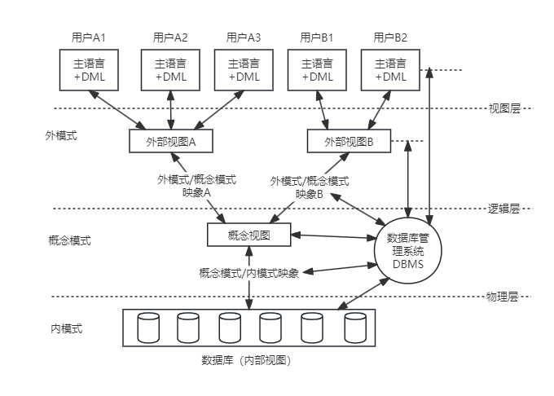

## 第6章 数据库设计基础知识
#### 6.1 数据库基本概念
- 6.1.1 数据库技术的发展
	- 人工管理阶段
	- 文件系统阶段
	- 数据库系统阶段
- 6.1.2 数据模型
	- 数据模型的三要素是
		- 数据结构
		- 数据操作
		- 数据的约束条件
- 6.1.3 数据库管理系统
	- DBMS实现了对共享数据有效地组织、管理和存取。
	- DBMS功能主要包括
		- 数据定义
			- DBMS提供数据定义语言(Data Definition Language, DDL),可以对数据库的结构进行描述，包括外模式、模式和内模式的定义；数据库的完整性定义；安全保密定义，如口令、级别和存取权限等。这些定义存储在数据字典中，是DBMS运行的基本依据。
		- 数据库操作
		- 数据库运行管理
		- 数据组织
		- 存储和管理
		- 数据库的建立和维护
	- DBMS的特点
		- 数据结构化且统一管理。
		- 有较高的数据独立性。
		- 数据控制功能
			- 包含对数据库中数据的安全性、完整性、并发和恢复的控制。
- 6.1.4 数据库三级模式
	- 数据库系统体系结构
	
#### 6.2 关系数据库
- 6.2.1 关系数据库基本概念
	- 关系的基本术语
		- 属性：在现实世界中，要描述一个事物常常取若干特征来表示。这些特征称为属性。
		- 域：每个属性的取值范围对应一个值的集合，称为该属性的域。
		- 目或度：目或度指的是一个关系中属性的个数。
		- 候选码：若关系中的某一属性或属性组的值能唯一的标识一个元组，则称该属性或属性组为候选码。
		- 主码，或称主键：若一个关系有多个候选码，则选定其中一个作为主码。
		- 主属性：包含在任何候选码中的属性称为主属性。不包含在任何候选码中的属性称为非主属性。
		- 外码：如果关系模型R中的属性或属性组不是该关系的码，但它是其他关系的码，那么该属性集对关系模式R而言是外码。
		- 全码：关系模型的所有属性组是这个关系模式的候选码，称为全码。
		- 笛卡尔积
	- 关系数据库模式
		- 【定义】关系的描述称为关系模式(Relation Schema)。可以形式化地表示为：

				R(U, D, dom, F)
			- 其中，R为关系名
			- U是组成该关系的属性名集合
			- D是属性的域
			- dom是属性向域的映像集合
			- F为属性间数据的依赖关系集合
		- 通常将关系模式简记为：
	
			R(U) 或 R(A1,A2,A3, ... An)
	- 关系的完整性约束
		- 实体完整性
			- 要求每个数据表必须有主键，而作为主键的所有字段，其属性必须是唯一且非空值。
		- 参照完整性（也称引用完整性）
			- 若F是基本关系R的外码，它与基本关系S的主码Ks相对应（基本关系R和S不一定是不通的关系），则对于R中每个元组在F上的值或者取空值（F的每个属性值均为空值），或者等于S中某个元组的主码值。
		- 用户定义完整性
			- 就是针对某一具体的关系数据库的约束条件，反映某一具体应用所涉及的数据必须满足的语义要求，由应用的环境决定。
- 6.2.2 关系运算
	- 关系代数运算符有4类：
		- 集合运算符
		- 专门的关系运算符
		- 算术比较符
		- 逻辑运算符
	- 并（Union）
	- 差（Difference）
	- 广义笛卡尔积（Extended Cartesian Product）(×)
	- 投影（Projection）(π)
		- 投影运算是从关系的垂直方向进行运算
	- 选择（Selection）(σ)
		- 选择远算是从关系的水平方向进行运算
	- 交（Intersection）
	- 连接（Join）（∞）
	- 除（Division）
	- 广义投影（Generalized Projection）
	- 外连接（Outer Jion）
	- 聚集函数
- 6.2.3 关系数据库设计基本理论
	- 函数依赖
		- 【定义】设R(U)是属性集U上的关系模式，X、Y是U的子集。若对R(U)的任何一个可能的关系r，r中不可能存在两个元组在X上的属性值相等，而在Y上的属性值不等，则称X函数决定Y或者Y函数依赖于X，记作：X→Y。
		- 注意：函数依赖X→Y的定义要求关系模型R的任何可能的r都满足上述条件。因此不能仅考察关系模式R在某一时刻的关系r，就断定牟函数依赖成立。
	- 多值依赖
		- 【定义】若关系模式R(U)中，X、Y、Z是U的子集，并且Z=U-X-Y。当且仅当对R(U)的任何一个关系r，给定一对(x,z)值，有一组Y的值，这组值只由x值决定而与z值无关，则称“**Y多值依赖于X**”或“**X多值决定Y**”成立。记为：X→→Y
	- 规范化
		- 1NF
			- 【定义】若关系模式R的每一个分量都是不可再分的数据项，则关系模式R属于第一范式。记为R∈1NF。
		- 2NF
			- 【定义】若关系模式R∈1NF，且每一个非主属性完全依赖于码，则关系模式R∈2NF。
			- 换句话说，当1NF消除了非主属性对码的部分函数依赖，则称为2NF。
		- 3NF
			- 【定义】若关系模式R(U, F)中不存在这样的码X，属性组Y及非主属性Z(Z∉Y)使得X→Y，(Y↛X) Y→Z成立，则关系模式R∈3NF。
			- 即当2NF消除了非主属性对码的传递函数依赖，则称为3NF。
		- BCNF
			- 【定义】关系模式R∈1NF，若X→Y且Y∉X时，X必含有码，则关系模式R∈BCNF。
			- 也就是说，当3NF消除了主属性对码的部分函数依赖和传递函数依赖，则称为BCNF。
#### 6.3 数据库设计
- 6.3.1 数据库设计的基本步骤
	- 用户需求分析
		- 数据库设计人员采用一定的辅助功能对应用对象的功能、性能、限制等要求进行科学分析。
	- 概念结构设计
		- 概念结构设计是信息分析和定义，如视图模型化、视图分析和汇总。对应用对象精确地抽象、概括而形成独立于计算机系统的企业信息模型。描述概念模型的较理想的工具是E-R图。
	- 逻辑结构设计
		- 将抽象的概念模型转换为选用的DBMS产品做支持的数据模型相符合的逻辑模型，它是物理结构设计的基础。包括模式初始设计、子模式设计、应用程序设计、模式评价以及模式求精。
	- 物理结构设计
		- 是逻辑模型在计算机中具体实现方案。
	- 数据库实施阶段
		- 数据设计人员根据逻辑设计和物理设计阶段的结果建立数据库，编制与调试应用程序，组织数据入库，并进行试运行。
	- 数据库运行和维护阶段
		- 数据库应用系统经过试运行即可投入运行，但该阶段需要不断地对系统进行评价、调整与修改。
- 6.3.2 数据需求分析
	- 综合各个用户的应用需求，对现实世界要处理的对象（组织、部门和企业等）进行详细调查，在了解现行系统的概况，确定新系统功能的过程中，收集支持系统目标的基础数据及处理方法。
- 6.3.3 概念结构设计
	- 概念结构设计的目标是产生反映系统信息要求的数据库概念结构，即概念模式。
	- 选择局部应用
	- 逐一设计分E-R图
	- E-R图合并
		- 注意分E-R图进行合并时，他们之间存在的冲突主要有以下3类：
			- 属性冲突。同一属性可能会存在于不同的分E-R图中，由于涉及人员不同或是出发点不同，对属性的类型、取值范围、数据单位等可能会不一致。这些属性数据将来只能以一种形式在计算机中存储，这就需要在设计阶段进行统一。
			- 命名冲突。相同意义的属性，在不同的分E-R图上有着不同的命名，或是名称相同的属性在不同的分E-R图中代表着不同的意义，这些也需要进行统一。
			- 结构冲突。同一实体在不同的分E-R图中有不同的属性，同一对象在某一分E-R图中被抽象为实体而在另一分E-R图中又被抽象为属性。对于这种结构冲突问题需要统一。
- 6.3.4 逻辑结构设计
	- 逻辑结构设计即是在概念结构设计的基础上进行数据模型设计，可以是层次模型、网状模型和关系模型。
	- 逻辑结构设计阶段的主要工作步骤包括
		- E-R图转换为关系模式
		- 关系模式规范化
		- 确定完整性约束
		- 确定用户视图
		- 反规范化
- 6.3.5 物理设计
	- 物理设计的主要工作步骤包括
		- 确定数据分布
		- 确定数据的存储结构
		- 确定数据的访问方式
- 6.3.6 数据库实施
	- 根据逻辑和物理设计的结果，在计算机上建立起实际的数据结构，数据加载（或称装入），进行试运行和评价的过程，叫作数据库的实施（或称实现）。
	- 步骤如下：
		- 建立实际的数据库结构
		- 数据加载
		- 数据库试运行和评价
- 6.3.7 数据库运行维护
	- 主要内容包括
		- 对数据库性能的监测和改善
		- 数据库的备份及故障恢复
		- 数据库重组和重构
#### 6.4 应用程序与数据库的交互
- 6.4.1 库函数级别访问接口
	- 库函数级别的数据访问接口往往是数据库提供的最底层的高级程序语言访问数据接口。
- 6.4.2 嵌入SQL访问接口
	- 是一种将SQL语句直接写入某些高级程序语言的源代码中的方法。
- 6.4.3 通用数据接口标准
	- 开放数据库连接（Open DataBase Connectivity， ODBC）是为解决异构数据库间的数据共享而产生的。ODBC为异构数据库访问提供统一接口，允许应用程序以SQL为数据存取标准，存取不同DBMS管理的数据；使应用程序直接操作数据库中的数据，免除随数据库的改变而改变。
- 6.4.4 ORM访问接口
	- 对象关系映射（Object Relational Mapping， ORM）是一种程序设计技术，用于实现面向对象编程语言里的不同类型系统数据之间的转换。
#### 6.5 NoSQL数据库
- NoSQL仅仅是一个概念，泛指非关系型的数据库，区别与关系数据库，它们不保证关系数据的ACID特性。
- 6.5.1 分类与特点
	- 分类
		- 列式存储数据库
			- Cassandra
			- HBase
			- Riak
		- 键值对存储数据库
			- Tokyo Cabinet/Tyrant
			- Redis
			- Voldemort
			- Oracle BDB
		- 文档型数据库
			- CouchBD
			- MongoDB
			- SequoiaDB
		- 图数据库	
			- Neo4J
			- InfoGrid
			- Infinite Graph
	- 共同特征
		- 易扩展
		- 大数据量、高性能
		- 灵活的数据模型
		- 高可用
- 6.5.2 体系框架
	- NoSQL整体框架分为4层，由下至上分为
		- 数据持久层（Data Persistence）
		- 数据分布层（Data Distribution Model）
		- 数据逻辑层模型（Data Logical Mode）
		- 接口层（Interface）