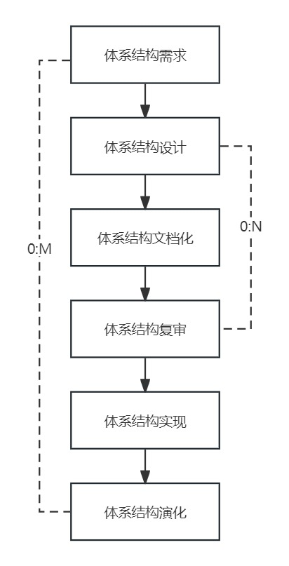
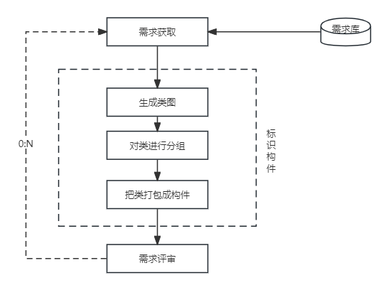
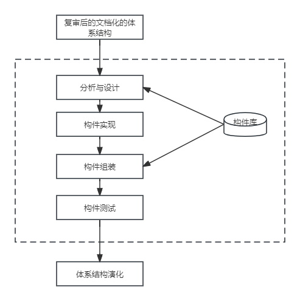
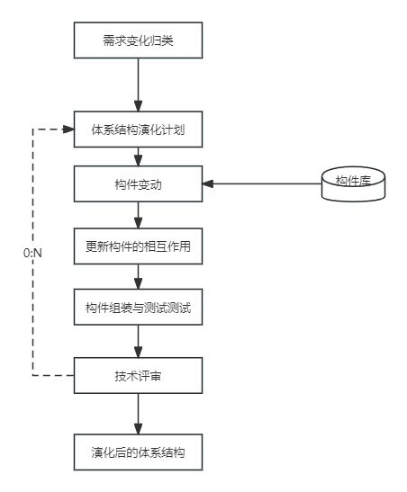

## 第7章 系统架构基础设计知识
#### 7.1 软件架构概念
- 7.1.1 软件架构的定义
	- 软件体系结构的设计通常考虑到设计金字塔中的两个层次--数据设计和体系结构设计。
		- 数据设计体现传统系统中体系结构的数据构件和面向对象系统中类的定义（封装了属性和操作）
		- 体系结构设计则主要关注软件构件的结构、属性和交互作用。
- 7.1.2 软件架构设计与生命周期
	- 需求分析阶段
	- 设计阶段
	- 实现阶段
	- 构件组装阶段
	- 部署阶段
	- 后开发阶段
- 7.1.3 软件架构的重要性
	- 软件架构设计是降低成本、改进质量、按时和按需交付产品的关键因素。
		- 架构设计能够满足系统的品质。
		- 结构设计使受益人达成一致的目标
		- 架构设计能够支持计划编制过程
		- 架构设计对系统开发的指导性
		- 架构设计能够有效地管理复杂性
		- 架构设计为复用奠定了基础
		- 架构设计能够降低维护费用
		- 架构设计能够支持冲突分析
#### 7.2 基于架构的软件开发方法
- 7.2.1 体系结构的设计方法概述
	- 基于体系结构的软件设计（ABSD）方法。
		- ABSD方法是由体系结构驱动的，即指由构成体系结构的商业、质量和功能需求的组合驱动的。
	- ABSD方法有3个基础
		- 第1个基础是功能的分解。在功能分解中，ABSD方法使用已有的基于模块的内聚和耦合技术。
		- 第2个基础是通过选择体系结构风格来实现质量和商业需求。
		- 第3个基础是软件模板的使用，软件模板利用了一些软件系统的结构。
	- ABSD方法是递归的，且迭代的每一个步骤都是清晰定义的。
- 7.2.2 概念与术语
	- 设计元素
	- 视角与视图
	- 用例和质量场景
- 7.2.3 基于体系结构的开发模型
	- 6个子过程
		- 体系结构需求
		- 设计
		- 文档化
		- 复审
		- 实现
		- 演化
	- 
- 7.2.4 体系结构需求
	> 需求是指用户对模板软件系统在功能、行为、性能、设计约束等方面的期望。

	- 需求获取
		- 系统的质量目标
		- 系统的商业目标
		- 系统开发人员的商业目标
	- 标识构件
	
	- 架构需求评审
- 7.2.5 体系结构设计
	- 1.提出软件系统结构模型
	- 2.把已标识的构件映射到软件体系结构中
	- 3.分析构件之间的相互作用
	- 4.产生软件体系结构
	- 5.设计评审
- 7.2.6 体系结构文档化
	- 体系结构文档化过程的主要输出结果是两个文档：
		- 体系结构规格说明
		- 测试体系结构需求的质量设计说明书
- 7.2.7 体系结构复审
	- 复审的目的是标识潜在的风险，及早发现体系结构设计中的缺陷和错误，包括体系结构能否满足需求、质量需求是否在设计中得到体现、层次是否清晰、构件的划分是否合理、文档表达是否明确、构件的设计能否满足功能与性能的要求等
- 7.2.8 体系结构实现
	- 体系结构实现过程
	
- 7.2.9 体系结构的演化
	- 体系结构演化过程
	
#### 7.3 软件架构风格