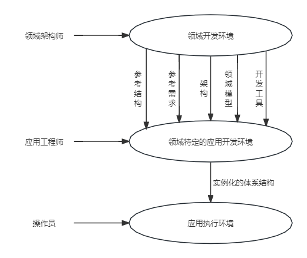

## 第7章 系统架构基础设计知识
#### 7.1 软件架构概念
- 7.1.1 软件架构的定义
	- 软件体系结构的设计通常考虑到设计金字塔中的两个层次--数据设计和体系结构设计。
		- 数据设计体现传统系统中体系结构的数据构件和面向对象系统中类的定义（封装了属性和操作）
		- 体系结构设计则主要关注软件构件的结构、属性和交互作用。
- 7.1.2 软件架构设计与生命周期
	- 需求分析阶段
	- 设计阶段
	- 实现阶段
	- 构件组装阶段
	- 部署阶段
	- 后开发阶段
- 7.1.3 软件架构的重要性
	- 软件架构设计是降低成本、改进质量、按时和按需交付产品的关键因素。
		- 架构设计能够满足系统的品质。
		- 结构设计使受益人达成一致的目标
		- 架构设计能够支持计划编制过程
		- 架构设计对系统开发的指导性
		- 架构设计能够有效地管理复杂性
		- 架构设计为复用奠定了基础
		- 架构设计能够降低维护费用
		- 架构设计能够支持冲突分析
#### 7.2 基于架构的软件开发方法
- 7.2.1 体系结构的设计方法概述
	- 基于体系结构的软件设计（ABSD）方法。
		- ABSD方法是由体系结构驱动的，即指由构成体系结构的商业、质量和功能需求的组合驱动的。
	- ABSD方法有3个基础
		- 第1个基础是功能的分解。在功能分解中，ABSD方法使用已有的基于模块的内聚和耦合技术。
		- 第2个基础是通过选择体系结构风格来实现质量和商业需求。
		- 第3个基础是软件模板的使用，软件模板利用了一些软件系统的结构。
	- ABSD方法是递归的，且迭代的每一个步骤都是清晰定义的。
- 7.2.2 概念与术语
	- 设计元素
	- 视角与视图
	- 用例和质量场景
- 7.2.3 基于体系结构的开发模型
	- 6个子过程
		- 体系结构需求
		- 设计
		- 文档化
		- 复审
		- 实现
		- 演化
	- 
- 7.2.4 体系结构需求
	> 需求是指用户对模板软件系统在功能、行为、性能、设计约束等方面的期望。

	- 需求获取
		- 系统的质量目标
		- 系统的商业目标
		- 系统开发人员的商业目标
	- 标识构件
	
	- 架构需求评审
- 7.2.5 体系结构设计
	- 1.提出软件系统结构模型
	- 2.把已标识的构件映射到软件体系结构中
	- 3.分析构件之间的相互作用
	- 4.产生软件体系结构
	- 5.设计评审
- 7.2.6 体系结构文档化
	- 体系结构文档化过程的主要输出结果是两个文档：
		- 体系结构规格说明
		- 测试体系结构需求的质量设计说明书
- 7.2.7 体系结构复审
	- 复审的目的是标识潜在的风险，及早发现体系结构设计中的缺陷和错误，包括体系结构能否满足需求、质量需求是否在设计中得到体现、层次是否清晰、构件的划分是否合理、文档表达是否明确、构件的设计能否满足功能与性能的要求等
- 7.2.8 体系结构实现
	- 体系结构实现过程
	
	
- 7.2.9 体系结构的演化
	- 体系结构演化过程
	
	
#### 7.3 软件架构风格
- 7.3.1 软件架构风格概述
	- 软件体系结构风格是描述某一特定应用领域中系统组织方式的惯用模式。
	- 体系结构风格定义一个系统家族，即一个体系结构定义一个词汇表和一组约束。
- 7.3.2 数据流体系结构风格
	- 1.批处理体系结构风格
		- 在批处理风格的软件体系结构中，每个处理步骤是一个单独的程序，每一步必须在前一步结束后才能开始，并且数据必须是完整的，以整体的方式传递。
	- 2.管道-过滤器体系结构风格
		- 把系统分解为几个序贯的处理步骤，这些步骤之间通过数据流连接，一个步骤的输出是另一个步骤的输入。
		- 每个处理步骤由一个过滤器实现，处理步骤之间的数据传输由管道负责。
		- 每个处理步骤（过滤器）都有一组输入和输出，过滤器从管道中读取输入的数据流，经过内部处理，然后产生输出数据流并写入管道中。
- 7.3.4 调用/返回体系结构风格
	- 1.主程序/子程序风格
		- 主程序/子程序风格一般采用单线程控制，把问题划分为若干处理步骤，构件即为主程序和子程序。
		- 子程序通常合称为模块，过程调用作为交互机制，即充当连接件。
		- 调用关系具有层次性，其语义逻辑表现为子程序的正确性取决于它调用的子程序的正确性。
	- 2.面向对象体系结构风格
		- 建立在数据抽象和面向对象的基础上，数据的表示方法和它们相应操作封装在一个抽象数据类型或对象中。
		- 这种风格的构件是对象，或者说是抽象数据类型的实例。
	- 3.层次型体系结构风格
		- 层次系统组成一个层次结构，每一层为上层提供服务，并作为下层的客户。
		- 由于每一层最多只影响两层，同时只要给相邻层提供相同的接口，允许每层用不同的方法实现，这同样为软件重用提供了强大的支持。
	- 4.客户端/服务器体系结构风格
		- 两层C/S体系结构有3个主要组成部分：数据库服务器、客户应用程序和网络。
			- 服务器（后台）负责数据管理，客户机（前台）完成与用户的交互任务，称为“胖客户机，瘦服务器”。
		- 三层C/S结构增加了一个应用服务器。整个应用逻辑驻留在应用服务器上，只有表示层存在客户机上，故称为“瘦客户机”。
			- 应用功能分为表示层、功能层和数据层三层。表示层是应用的用户接口部分，通常使用图形用户界面；功能层是应用的主体，实现具体的业务处理逻辑；数据层是数据库管理系统。以上三层逻辑上独立。
- 7.3.4 以数据为中心的体系结构风格
	- 1.仓库体系结构风格
		- 在仓库风格中，有两种不同的构件：中央数据结构说明当前数据的状态以及一组对中央数据进行操作的独立构件，仓库与独立构件间的相互作用在系统中会有大的变化。
	- 2.黑板体系结构风格
		- 黑板体系结构风格适用于解决复杂的非结构化的问题，能在求解过程中综合运用多种不同知识源，使得问题的表达、组织和求解变得比较容易。
		- 对于特定应用问题，黑板系统可通过选取各种黑板、知识源和控制模块的构件来设计，也可以利用预先定制的黑板体系结构的编程环境。
		- 黑板系统的传统应用是信号处理领域，如语音识别和模式识别。另一应用是松耦合代理数据共享存取。
- 7.3.5 虚拟机体系结构风格
	- 1.解释器体系结构风格
		- 具有解释器风格的软件中含有一个虚拟机，可以仿真硬件的执行过程和一些关键应用。
		- 解释器通常被用来建立一种虚拟机以弥合程序语义与硬件语义之间的差异。
		- 其缺点是执行效率较低。
		- 典型例子是专家系统。
	- 2.规则系统体系结构风格
		- 基于规则的系统包括规则集、规则解释器、规则/数据选择器及工作内存。
- 7.3.6 独立构件体系结构风格
	- 1.进程通信体系结构风格
		- 在进程通信结构体系风格中，构件是独立的过程，连接件是消息传递。
		- 这种风格的特点是构件通常是命名过程，消息传递的方式可以是点到点、异步或同步方式及远程过程调用等。
	- 2.事件系统体系结构风格
		- 事件系统风格基于事件的隐式调用风格的思想是构件不直接调用一个过程，而是触发或广播一个或多个事件。
		- 基于事件的隐式调用风格的主要特点是事件触发者并不知道哪些构件会被这些事件影响。这使得不能假定构件的处理顺序，甚至不知道哪些过程会被调用，因此，许多隐式调用的系统也包含显式调用作为构件交互的补充形式。
#### 7.4 软件架构复用
- 7.4.1 软件架构复用的定义及分类
	- 软件架构复用的类型包括机会复用和系统复用。
		- 机会复用是指开发过程中，只要发现有可复用的资产，就对其进行复用。
		- 系统复用是指在开发之前，就要进行规划，以决定哪些需要复用。
- 7.4.2 软件架构复用的原因
	- 软件架构复用可以减少开发工作、减少开发时间以及降低开发成本、提高生产力。
	- 不仅如此，它还可以提高产品质量使其具有更好的互操作性。
	- 同时，软件架构复用会使产品维护变得更加简单。
- 7.4.3 软件架构复用的对象及形式
	- 可复用的资产非常广，包括以下几个方面
		- 需求
		- 架构设计
		- 元素
		- 建模与分析
		- 测试
		- 项目规划
		- 过程、方法和工具
		- 人员
		- 样本系统
		- 缺陷消除
- 7.4.4 软件架构复用的基本过程
	- 1.复用的前提：获取可复用的软件资产
	- 2.管理可复用资产
	- 3.使用可复用资产
#### 7.5 特定领域软件体系结构
- 7.5.1 DSSA的定义
	- DSSA(Domain Specific Software Architecture)就是在一个特定应用领域中为一组应用提供组织结构参考的标准软件体系结构。
	- 特定领域软件体系结构的主要目的是在一组相关的应用中共享软件体系结构。
- 7.5.2 DSSA的基本获取
	- 1.领域分析
	- 2.领域设计
	- 3.领域实现
- 7.5.3 参与DSSA的人员
	- 1.领域专家
	- 2.领域分析人员
	- 3.领域设计人员
	- 4.领域实现人员
- 7.5.4 DSSA的建立过程
	- DSSA的建立过程分为5个阶段，每个阶段可以进一步划分为一些步骤或子阶段。每个阶段包括一组需要回答的问题，一组需要的输入，一组将产生的输出和验证标准。
	- 本过程是并发的、递归的、反复的。或者可以说，它是螺旋模型。
	- 完成本过程可能需要对每个阶段经历几遍，每次增加更多的细节。
		- 定义领域范围
		- 定义领域特定的元素
		- 定义领域特定的设计和实现需求约束
		- 定义领域模型和体系结构
		- 产生、搜集可重用的产品单元
	- DSSA的一个三层次系统模型
	