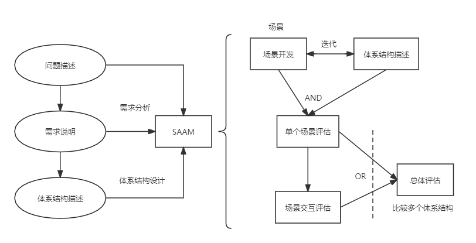

## 第8章 系统质量属性与架构评估
#### 8.1 软件系统质量属性
- 8.1.1 质量属性概念
	- 软件的质量属性是一个系统的可测量或者可测试的属性，用来描述系统满足利益相关者需求的程度。
	- 基于软件系统的生命周期，可以将软件系统的质量属性分为
		- 开发期质量属性
			- 易理解性
			- 可扩展性
			- 可重用性
			- 可测试性
			- 可维护性
			- 可移植性
		- 运行期质量属性
			- 性能
			- 安全性
			- 可伸缩性
			- 互操作性
			- 可靠性
			- 可用性
			- 鲁棒性
- 8.1.2 面向架构评估的质量属性
	- 评估方法普遍关注的质量属性由以下几种
		- 性能
		- 可靠性
			- 容错
			- 健壮性
		- 可用性
		- 安全性
		- 可修改性
			- 可维护性
			- 可扩展性
			- 结构重组
			- 可移植性
		- 功能性
		- 可变性
		- 互操作性
- 8.1.3 质量属性场景描述
	- 可用性质量属性场景
	- 可修改性质量属性场景
	- 性能质量属性场景
	- 可测试性质量属性场景
	- 易用性质量属性场景
	- 安全性质量属性场景
#### 8.2 系统架构评估
- 系统架构评估的方法通常可以分为3类：
	- 基于调查问卷或检查表的方式
	- 基于场景的方式
	- 基于度量的方式
- 8.2.1 系统架构评估中的重要概念
	- 敏感点和权衡点
	- 风险承担者或者称为利益相关人
	- 场景
- 8.2.2 系统架构评估方法
	- 1.SAAM方法
		- 一种非功能质量属性的架构分析方法，是最早形成文档并得到广泛使用的软件架构分析方法。
			- 特定目标
			- 评估技术
			- 质量属性
			- 风险承担者
			- 架构描述
			- 方法活动
			- 已有支持库的可重用性
			- 方法验证
		- SAAM输入与评估过程
		
	- 2.ATAM方法
		- 架构权衡分析法是在SAAM的基础上发展起来的，主要针对性能、实用性、安全性和可修改性，在系统开发之前，对这些质量属性进行评价和折中。
			- 特定模板
			- 质量属性
			- 风险承担者
			- 架构描述
			- 评估技术
			- 方法的活动
			- 领域知识库的可重用性方法验证
	- 3.CBAM方法
		- 成本效益分析法是在ATAM上构建，用来对架构设计决策的成本和收益进行建模，是优化此类决策的一种手段。
			- 