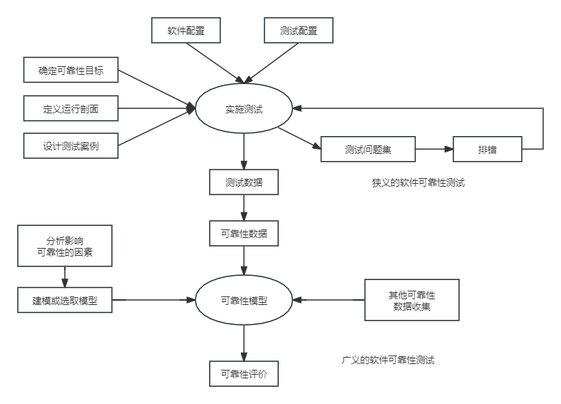

## 第9章 软件可靠性基础知识
#### 9.1 软件可靠性基本概念
- 软件可靠性是软件产品在规定的条件下和规定的时间区间完成规定功能的能力。
- MTBF(Mean Time Between Failures,评估故障间隔时间)定义为：失效或维护中所需的平均时间，包括故障时间以及检测和维护设备的时间。
- 可靠性测试

- 可靠性测试的目的可归纳为以下3个方面：
	- 发现软件系统在需求、设计、编码、测试和实施等方面的各种缺陷。
	- 为软件的使用和维护提供可靠性数据。
	- 确认软件是否达到可靠性的定量要求。
#### 9.2 软件可靠性建模