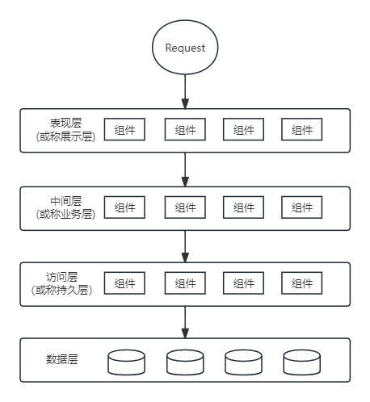
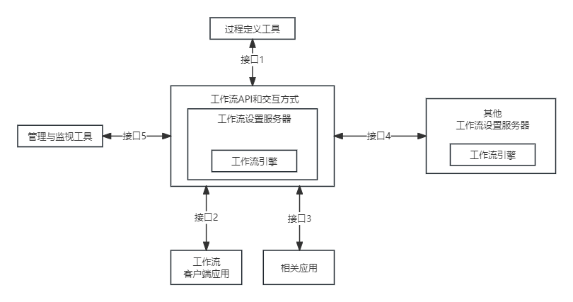

## 第16小时 层次式架构设计理论与实践
- 常用的层次式架构

	
- 表现层框架设计
	- MVC模式
		- 控制器(Controller):接收用户的输入，并调用模型和视图去完成用户的需求。
		- 模型(Model):应用程序的主体部分，表示业务数据和业务逻辑。
		- 视图(View):用户看到并与之交流的界面。
	- MVP模式
		- View负责显示
		- Controller/Presenter负责逻辑处理。
		- MPV不仅仅避免了View和Model之间的耦合，还进一步降低了Presenter对View的依赖。
	- MVVM模式
		- 在MVVM中，View与Model的交互通过ViewModel来实现，也就是View和Model不能直接通信，两者的通信只能通过ViewModel来实现。
		- ViewModel是MVVM的核心，通过DataBinding实现View与Model之间的双向绑定，其内容包括数据状态处理、数据绑定及数据转换。
- 工作流参考模型

	
- 物联网层次架构设计
	- 感知层：用于识别物体、采集信息。
	- 网络层：用于传递信息和处理信息。
	- 应用层：实现广泛智能化。